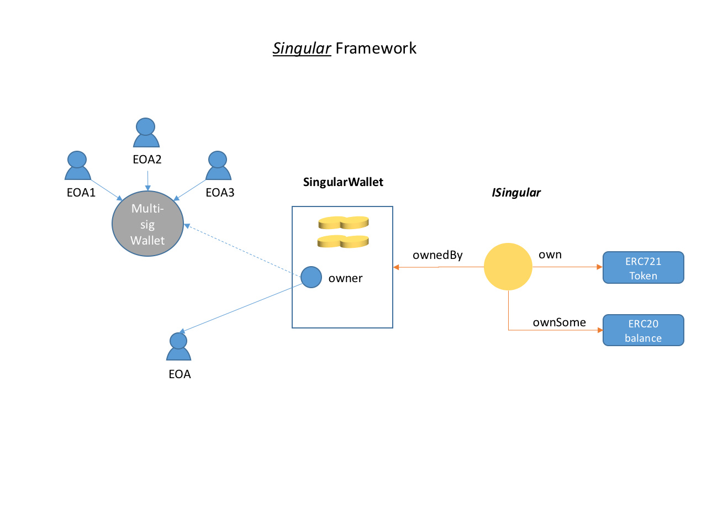
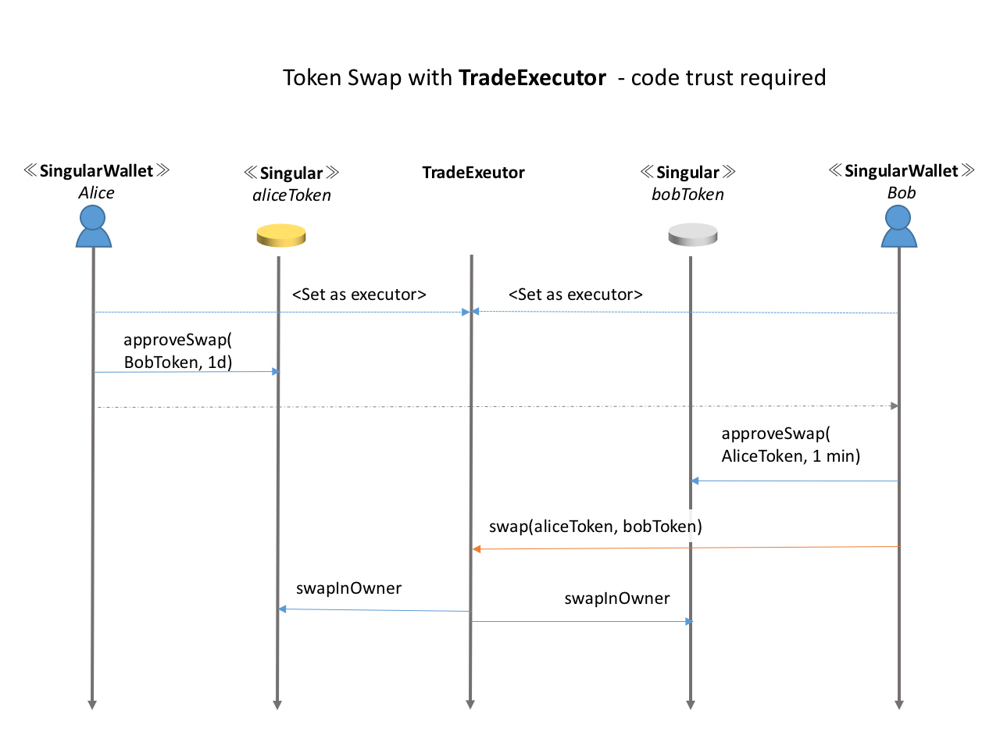
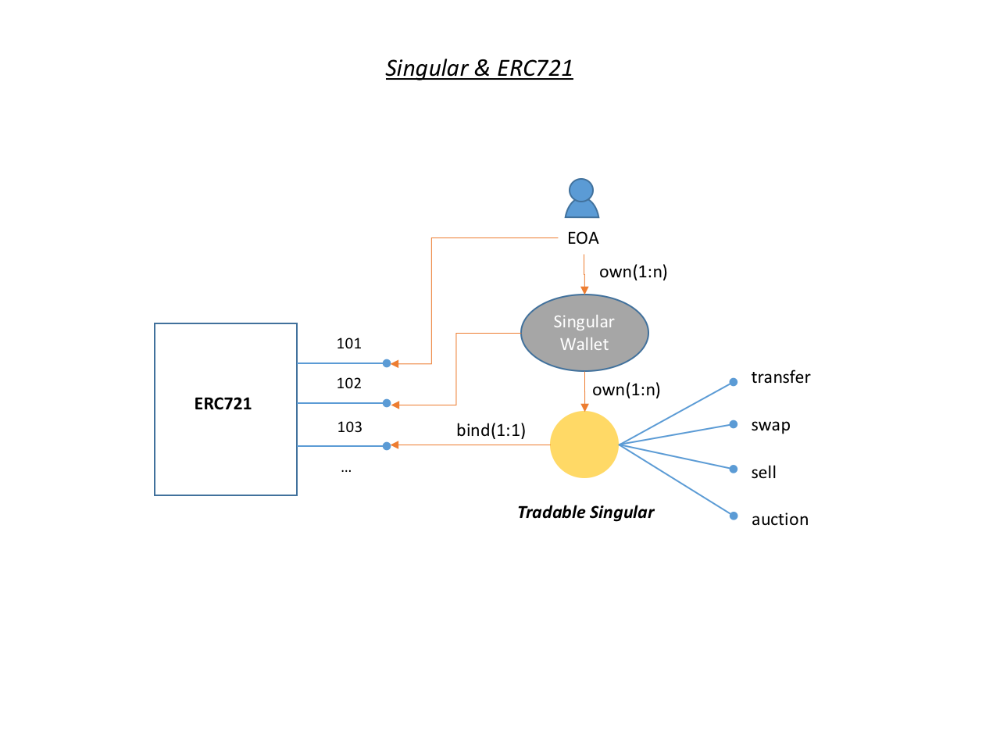
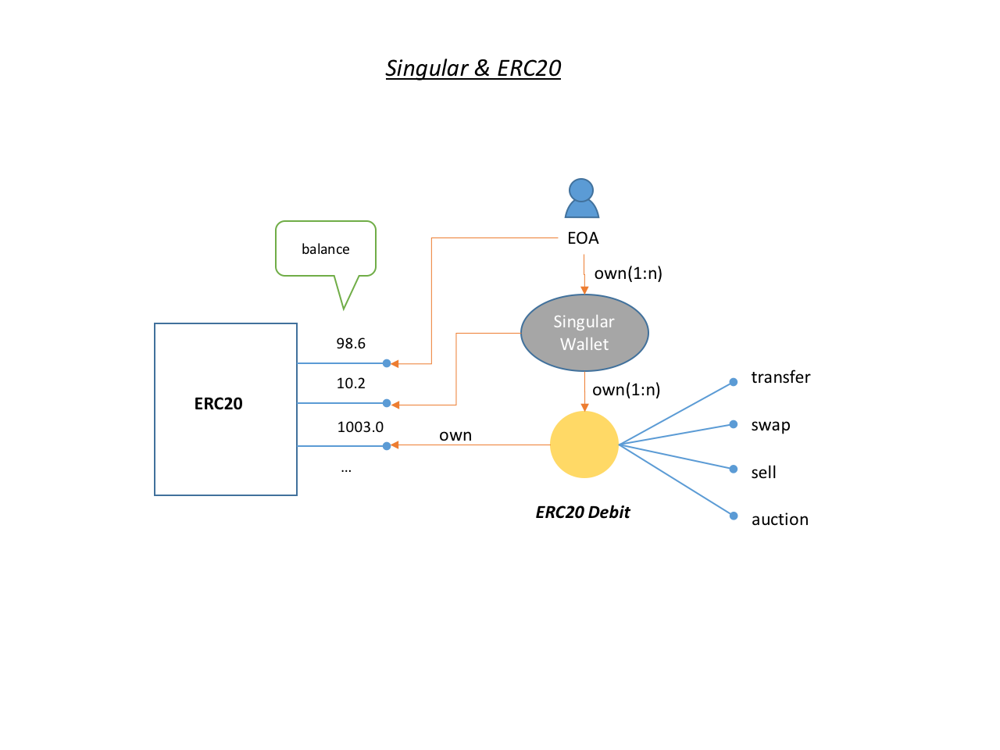

# The Singular Asset Account Model

The Singular asset model implements a concept: 

> One thing == One smart contract

*Singular* proposes to assign a unique blockchain account to each "thing" in the world. Such an account meets the following criteria:
 
1. It represents an unique being that has its own life cycle. 
1. It possesses properties that describe the represented thing.
1. Everythung must have an owner. It must be owned eventually and effectively by a definitive real person or an organizational entity; The owner can control the life cycle of this asset account and trade this identity for other identities or currencies.
1. It's autonomous by itself in terms of behavior. It has built-in intelligence for dealing with other intelligent contracts. Conceptually it's similar to the *Software Agents* described in many literatures. 

The Singular project is a natural development in the spirit of some of the earlier blockchain proponents who had envisioned what blockchain with smart contracts would achieve. 

Singular is a framework for "Tokenizing Everything". It defines how a thing is tokenized and how it deals with ownerships and tradings in a decentralized way. 

## About ERC721 and Such
The ERC721 has gained mild success in adoption, mainly for categorized none-fungible assets such as virtual assets in gaming.  

Some perspectives of ERC721:
1. It’s a token collection concept, with each element represented by an uint256 ID. A token in ERC721 is just an index into a hashed map. There is no independent existence for each of the element without the 721 contract. In contrast, Singular focuses on individuals, with each of them hosted by a unique contract. To make a metaphoric analogy, a token in a ERC721 is like a student living in a college dormitory with thousands of other students, while a Singular token owns a house.  
1. For sophisticated token that has unique set of attributes, one has to either maintain a collection of structure inside of the contract or push storing the attributes to an external URI, making the 721 contract a fat creature that is hard to maintain. 
1. The API looks complicated and more than often confusing (speaking all the different version of transfers and who can do what), because it needs to put everything in a single contract.
1. The addressing is one segment too long. The addressing of elements is a composition of the contract address and the index into the internal data structure, like : `{ethereum network id}.{contract address}.{token id}.`. 

## Goals of Singular


In UDAP we are proposing a new account model specifically to represent a single unique asset in a very expressive way. We want to achieve the following goals when designing the model:

1. It supports safe token transfers and swaps.
1. It supports direct purchasing of a singular wih cryto-currencies.
1. It supports decentralized trading.
1. It is compatible with existing protocols such as ERC20 and ERC721.  
1. The token should work with state channel mechanisms, which is very important for scalable applications.
1. Dealing with single asset token is intuitive. 
1. The API must be clean, simple without ambiguity.
1. There should be strong type safety. 
1. Wallet API should be made very simple.

## Designs

We call our basic asset contract `Singular` and the design decisions are:

1. A piece of asset is uniquely associated with a smart contract account. The account is the **home** for the asset. People can easily scan the information about this token through public services like [Etherscan](http://etherscan.io/).
1. The owner of the `Singular` token must be another smart contract account, named `ISingularWallet`. There is no direct way for EOAs to own `Singular` tokens. This design is largely in the same direction of Ethereum’s [account abstraction model](https://github.com/ethereum/EIPs/issues/859) ([discussion](https://ethresear.ch/t/tradeoffs-in-account-abstraction-proposals/263))that might be deployed in a future version of Ethereum. 
1. It should support `push` ownership transfer and `pull` ownership transfer patterns. In so called one-step transfer, the current owner can pass an offer of the token ownership to the receiver account and the receiver account can choose to accept or reject the offer *in the same transaction*. In a two-step ownership transfer, however, the current owner reserves the token for the next owner in a transaction. The address of the token is passed to the receiver out-of-band. The receiver issues a separate transaction to accept the offer, once it determines that the offer is in its interest. 
1. Operators. The `ISingularWallet` account can assign operators to help with ownership transfers. Having an operator to manage the asset token on the owner’s behalf is a pattern that has been accepted by some other proposals, such as ERC721 and ERC777.  People have found it convenient in handling token trading. The current token owner can appoint an operator for the *next* ownership change. But setting the operators on the token directly is polluting the token interface. 
1. Timelock. When an owner make an offer of ownership to someone else by calling the `approveReceiver()` function, there is a required argument for expiry time, during which period the receiver can take the ownership at will by invoking `accept(...)`on the token, which will in turn send a notification to the previous owner for it to any state update it wants, or even chain to another action. A critical design is that the owner cannot change his mind during the offer period. This is essentially a time-lock for the transaction. In contrast, neither ERC20 nor ERC721 or any of their derivatives offers built-in time-locks for ownership trading. 
1. Token swapping and token sale is implemented with an intermediate `TradeExecutor`, which is a stateless contract that deployed at a well-known address and be trusted by Singulars for ownership management. 
1. Adapters have been built to wrap tokens in ERC20 and ERC721 as tradable singulars. This enables building decentralized asset exchange in a very straightforward way. 


Here is the interface definition for Singular:

```javascript
pragma solidity ^0.4.24;
import "./OwnerOfSingulars.sol";
interface Singular {
    /**
     * When the current owner has approved someone else as the next owner, subject
     * to acceptance or rejection. 
     */
    event Approved(address from, address to, uint expiry);
    /**
     * the ownership has been successfully transfered from A to B.
     */
    event Transferred(address from, address to, uint when, bytes32 note);

    /** 
     * get the current owner
     */
    function currentOwner() view external returns (OwnerOfSingulars);
    
    /**
     * There can only be one approved receiver at a given time. This receiver cannot
     * be changed before the expiry time.
     * Can only be called by the token owner (in the form of OwnerOfSingulars account or 
     * the naked account address associated with the current owner) or an approved operator.
     * @param to address to be approved for the given token ID
     * @param expiry the deadline for the receiver to the take the ownership
     * @param reason the reason for the transfer
     */
    function approveReceiver(OwnerOfSingulars to, uint expiry, bytes32 reason) external;

    /**
     * The approved account takes the ownership of this token. The caller must have
     * been set as the next owner of this token previously in a call by the current 
     * owner to the approve() function. The expiry time must be in the future
     * as of now. This function MUST call the sent() method on the original owner. 
     */
    function accept() external;
  
    /**
     * reject an offer. Must be called by the approved next owner(from the address 
     * of the OwnerOfSingulars or OwnerOfSingulars.ownerAddress()). 
     */
    function reject() external;
  
    /**
     * to send this token synchronously to an AssetOwner. It must call approveReceiver
     * first and invoke the "offer" function on the other AssetOwner. Setting the
     * current owner directly is not allowed.
     */ 
    function sendTo(OwnerOfSingulars to, bytes32 reason) external;
  

/// ownership history enumeration

    /**
     * To get the number of ownership changes of this token. 
     * @return the number of ownership records. The first record is the token genesis
     * record. 
     */
    function numOfTransfers() view external returns (uint256);
    /**
     * To get a specific transfer record in the format defined by implementation.
     * @param index the index of the inquired record. It must in the range of 
     * [0, numberOfTransfers())
     */
    function getTransferAt(uint256 index) view external returns(string);
    
    /**
     * get all the transfer records in a serialized form that is defined by 
     * implementation.
     */
    function getTransferHistory() view external returns (string);

}

```
The following is the main part of the `ISingularWallet` interface

```javascript
interface ISingularWallet {
    /**
    * event emitted when approve target Singular to some another wallet
    */
    event SingularReceiverApproved(
        address to,
        address singular,
        uint256 when,
        string senderNote
    );

    /**
    * event emitted when get offered Singular
    */
    event SingularOffered(
        address from,
        address singular,
        uint256 when,
        string senderNote
    );
    /**
    * event emitted when target Singular transfer succeeds;
    */
    event SingularTransferred(
        address from,
        address to,
        address singular,
        uint256 when,
        string receiverNote
    );

    /**
    * event emitted when target Singular transfer fails;
    */
    event SingularTransferFailed(
        address from,
        address to,
        address singular,
        uint256 when,
        string receiverNote
    );


    /**
    to test if an address is the effective owner, directly or indirectly, of this wallet. Implementations
    can make decision by matching it with the current owner, or querying the owner recursively to determine the effective
    ownership.

    This function can be used for determining if a msg.sender is allow to call functions that require owner privilege.
    */
    function isEffectiveOwner(
        address addr
    )
    external
    view
    returns (
        bool
    );

    /**
     To receive an incoming transfer offer. The token has been assigned to this receiver as the next owner.
     The receiver SHOULD choose to take a synchronous action by calling `accept()`
     or `reject()` in the same transaction on the token in the method body,
     or take a note and return, followed by an asynchronous call to `accept/reject
     at a later time`.
     todo: consider changing the name to `receiveOwnership`
     */
    function offer(
        ITradable token,    ///< the offered token
        string note         ///< additional information
    )
    external;

    /**
    To notify this account that a token transfer offer is ready. The function should return
    without doing anything on the token. This account can accept/reject the offer in a
    separate transaction.
     todo: consider changing the name to `receiveOwnershipNotify`
    */
    function offerNotify(
        ITradable token,    ///< the offered token
        string note         ///< additional information
    )
    external;

    /**
    to notify the *sender* that the intended token transfer has completed and the token has been sent
    */
    function sent(
        ITradable token,        ///< the token that has been sent
        string note             ///< additional info
    )
    external;

    /**
    to notify the recipient that the intended token transfer has completed and the token is now owned by
    the recipient.
    */
    function received(
        ISingular token,        ///< the token that has become owned by the wallet
        string note             ///< additional info
    )
    external;


    //-------------- asset enumeration

    /// to test if an ISingular is owned by this wallet.
    function owns(ISingular token) external view returns (bool);

    /**
     retrieve all the Singular tokens, in no particular order.
     */
    function getAllTokens()
    view
    external
    returns (
        ISingular[],          ///< all the tokens owned by this account
        uint whenLastUpdated    ///< when the asset portfolio was changed
    );

    /**
     get the number of owned tokens
     */
    function numOfTokens() view external returns (
        uint256 totalNumber,    ///< the total number of tokens
        uint whenLastUpdated    ///< based on the lastly changed time
    );

    /**
     get the token at a specific index. revert if the timestamp is no the latest,
     */
    function getTokenAt(
        uint256 idx,          ///< the index of into the token array, must be in [0, numOfTokens())
        uint whenLastUpdated    ///< version number
    )
    view
    external
    returns (
        ISingular             ///< the n-th element in the token list
    );

}

```

The ISingular & ISingularWallet API gives great flexibility to create sophisticated permission schemes. 

The following diagram shows how the ownership can chain multiple contracts together to form an ownership chain:


 
The owner of the `ISingularWallet` can be an EOA, or any smart contracts such as a multi-sig wallet. Flexibility is all there for creative delegation schemes. 

As mentioned before, we don't want to squeeze all convenient things into the token API and make it bloated. The trading part of the API is in an interface named ITradable, which tracks transfer offers, swap offers and sale offers. 

The following is the code snippet of the ITradable interface.

```javascript
contract ITradable {
    struct SaleOffer {
        ISingularWallet owner;  ///< who owns the item
        address erc20;          ///< the currency type
        uint256 price;          ///< price
        uint256 validFrom;      ///< when an offer is valid from
        uint256 validTill;      ///< when the offer expires
    }

    // ? we might use a predicator to set the swap target, to make it compatible for sell and swap
    struct SwapOffer {
        ISingularWallet who;    ///< who makes the offer
        ITradable target;       ///< what to swap for
        uint256 validFrom;      ///< when an offer is valid from
        uint256 validTill;      ///< when the offer expires
    }

    struct TransferOffer {
        ISingularWallet nextOwner; /// next owner choice
        uint256 validFrom;
        uint256 validTill;
        string senderNote;
    }

    TransferOffer public transferOffer;
    SaleOffer public saleOffer;
    SwapOffer public swapOffer;


    /**
      There can only be one approved receiver at a given time. This receiver cannot
      be changed before the expiry time.

      approveReceiver must check if the current message sender can is authorized by
      the token owner to invoke this function.
     */
    function approveReceiver(
        ISingularWallet to,     ///< address to be approved as the next owner
        uint256 validFrom,      ///< the time lock start. in seconds since the epoch
        uint256 validTill,      ///< the time lock end. in seconds since the epoch
        string reason           ///< the reason for the transfer
    )
    external;

    /**
     The approved account takes the ownership of this token. The caller must have
     been set as the next owner of this token previously in a call by the current
     owner to the approve() function. The expiry time must be in the future
     This function MUST call the `ISingularWallet::transferred()` on both
     parties of the transaction for them to update the wallet.

     */
    function acceptTransfer(
        string note
    )
    external;


    /**
     * to send this token synchronously to a SingularWallet. It must call approveReceiver
     * first and invoke the "offer" function on the other SingularWallet. Setting the
     * current owner directly is not allowed.
     */
    function sendTo(
        ISingularWallet to,         ///< the recipient
        string note                 ///< additional information
    )
    external;

    /**
    to make an transfer approval and notify the other party
    */
    function sendToAsync(
        ISingularWallet to,
        string note,
        uint256 expiry
    )
    external;

    /**
    * for operator to set the new owner
    */
    function swapInOwner(
        ISingularWallet newOwner,
        string note
    )
    external;

    /**
        offer to sell this item for some number of tokens in specific erc20
     */
    function sellFor(
        address erc20,          ///< the currency type
        uint256 price,          ///< the units of tokens in the erc20
        uint256 validFrom,      ///< when an offer is valid from
        uint256 validTill,      ///< when the offer expires
        string note             ///< additional note
    )
    external;

    /**
    to cancel the current sale offer, if any
    */
    function cancelSaleOffer() public;


    /**
    set up a swap arrangement
    */
    function approveSwap(
        ITradable target,
        uint validFrom,
        uint validTill,
        string note
    )
    public;


}

```

The most important features are token swapping and token purchase. We would explain how token swapping and purchase in the folowing sections.

## Singular Swapping

Token swapping is the fundamental feature of Singular. Decentralized marketplace, trading, auctions and exchanges are based on token swapping. 

The current implementation is based on a single instance of a contract deployed at a well-known address. The contract is named `TradeExecutor`, which is trusted by all other Singulars for trading with each other. 

The following diagram shows how a token swap is arranged:

 

All tradable singulars are preconfigured with a `TradeExecutor`. The executor is trusted as an operator that is permitted to change the owner of the singular objects. For swap to work, both parties must have set up so that both sides have an `SwapOffer` that matches each other. Then either party can kick off the swapping process by invoking `TradeExecutor.swap()`, which swap the ownerships of both tokens.

## Inter-operability with ERC721

A Singular token can be linked to an element of ERC721 container. Conversely, a Singular can be used to wrap an ERC721 token. 

Once an ERC721 token is bound to a Singular contract, all the features of tradable tokens apply to the ERC721 token. The ownership management takes place at the singular contract level. The owner of the original ERC721 token will remain to be the Singular contract. 

The following diagram demonstrates the possible ways of Singular and Singular Wallet working together with an ERC721 contract. 

 

A simple contract to wrap an ERC721 "token" in a Singular and make it tradable:

```javascript
pragma solidity ^0.4.24;

import "./IERC721.sol";
import "../ISingularWallet.sol";
import "./IERC721Singular.sol";
import "../impl/Tradable.sol";

contract ERC721Tradable is IERC721Singular, Tradable {

    IERC721 erc721;
    uint theTokenId;
    /**
    initializer to construct a Tradable backed by an ERC721 token.
    */
    function init(
        string _name,
        string _description,
        string _tokenURI,
        bytes32 _tokenURIDigest,
        ISingularWallet _wallet,
        IERC721 _erc721,
        uint _tokenId
    )
    public
    {
        require(msg.sender == address(_wallet), "ERC721Tradable can only be initialized by the owning wallet");
        Tradable.init(
            _name,
            _erc721.symbol(),
            _description,
            _tokenURI,
            _tokenURIDigest,
            _erc721,
            _wallet
        );
        erc721 = _erc721;
        theTokenId = _tokenId;
    }

    function ERC721Address() external view returns (address) {
        return erc721;
    }

    function tokenID() external view returns(uint) {
        return theTokenId;
    }
    
   /**
    transfer the ownership to the caller, which must be the the holding wallet or the owner of the wallet
    */
    function unbind() public {
        ISingularWallet wal = theOwner;
        require(msg.sender == address(wal) || msg.sender == wal.ownerAddress(), "msg.sender were not allowed to unbind this ERC721 singular");
        erc721.transferFrom(this, msg.sender, theTokenId);
        emit ERC721SingularUnbound (
            erc721,
            theTokenId,
            this
        );
        selfdestruct(msg.sender);
    }
}
```

As shown above, the init method can only be called by a wallet, which is the current owner of the ERC721 token. 

Here is the code for the wallet to `activate` the ERC721 Singular from `SingularWalletWithE20E721.sol`

```javascript

    function activateTradable721(
        ERC721Tradable instance,    ///< an uninitialized contract
        IERC721 erc721,
        string _name,
        string _description,
        string _tokenURI,
        bytes32 _tokenURIDigest,     ///< the hash of any tokenURI content
        uint256 tokenId                 ///< the id of the token that is ownded by the caller.
    )
    public
    ownerOnly
    {
        instance.init(
            _name,
            _description,
            _tokenURI,
            _tokenURIDigest,
            this,
            erc721,
            tokenId
        );
        erc721.transferFrom(this, address(instance), tokenId);
    }

```

The most critical step is `erc721.transferFrom(this, address(instance), tokenId);` which sends the token owned by the wallet to the `ERC721Tradable` instance, which also means the wallet must have become the owner of the token previously. 


In case one would like to return the ownership of the ERC721 token to any account, including EOAs, the `ERC721Tradable.unbind()` or `SingularWalletWithE20E721.deactivateErc721Singular()` are available for transferring the ownership to the wallet or the owner of the wallet. Once the token is transferred out, the holding Singular contract is self-destructed. 

## Inter-operability with ERC20

Like ERC721, balances in ERC20 contracts can be bound to a singular contract to become a non-fungible token, which can immediately take advantage of tradable singulars for trading. Specifically, the sell/buy feature of `ITradable` requires the use of ERC20Debit as the payment method. 

This contract is metaphorically called `ERC20Debit`, like a debit card in ons's wallet that has some cash value for buying things.   

The following diagram illustrates the relationships of ERC20 and Singulars. 

 

An ERC20 Debit can break into two debit tokens with smaller denomination. Two debit tokens of the same currency type (a.k.a ERC20) and of the same owner can merge to form a debit token of larger denomination. 

An ERC20 Debit can even sell for some other ERC20 tokens just like any other tradable singulars, without depending on any intermediaries. Effectively we have a decentralized exchange based on Singular. 
    

## Summary

UDAP has the vision that 

> every single thing in the world should have a unique account on the blockchain.

Singular aspires to build a new type of "Internet of Things(IOT)". Traditionally IOT means each physical device is assigned an IPv6 address and can interact with the rest of the world autonomously. IOT is a network protocol level concept that ony applies to devices with adequate networking and computing capabilities. 

It goes further than physical devices and adds a layer of accountability to everything that can interact with each other logically. Consider it as a network of everything that are interconnected by their ownerships and genesis. 

Singular is powerful and expressive in representing real-world objects such as people, collectibles, certificates, high-valued goods and products.
 
By providing clever bridges toERC20 and ERC721 type of contract standards, Singular framework becomes a solid foundation for a truly decentralized asset exchange.

But....

Singular is not a light-weighted framework, however, since it binds properties with behavior in one smart contract, pushing the smart contract to the limit in terms of contract size. Trading of Singulars usually involves multiple contracts invoking each other's functions, which may turn out to be quite expensive on Ethereum. The cost with such ownership transfers are negligible for high-value assets, but may be prohibitively high for low valueed items. Developers must use discretion in using the Singular framework when dealing with low-value assets.

*State Channel* technology can work with Singular quites well. We're rolling out implementations in the future to make sure that proper arrangement of on-chain/off-chain architecture can achieve tremendous credibility and scalability with decent cost.     

Singular proposes a new type of wallet that is a collection of asset tokens that are owned by the sam entity. These asset tokens may have been generated by different sources, such as different wallet or contracts that are generative such as ERC20, ERC721 or their derivatives.  

One big issue that the Singular framework has not dealt with extensively is privacy. The current version does not provide built-in support for storing information on the chain privately. All the information in a smart contracts are considered in public domain. All data the the contract state variables is directly or indirectly open for everyone to check. This state of art actually lends the blockchains very well to supporting applications that focuses on sharing information with general public, but no so well to other applications that require discretion and confidentiality. Such applications need to build a layer of privacy preservation on top of Singular. State Channels can help with the privacy issue to some degree as long as the transactions are kept in the channels and not broadcast to the public chains. Other technologies such as ring signatures, proxy re-encryption(aka PRE), and zero-knowledge can help developers to build secure and private applications. PRE is probably the first technology we will integrate with Singular. 
