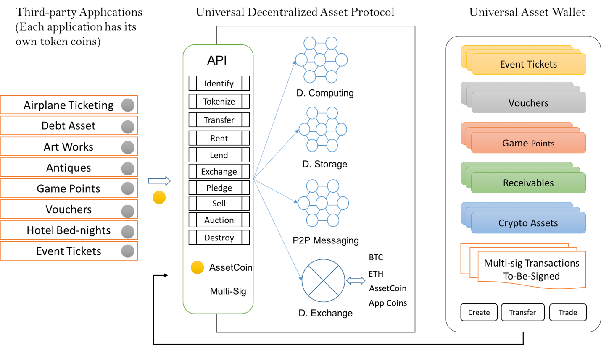
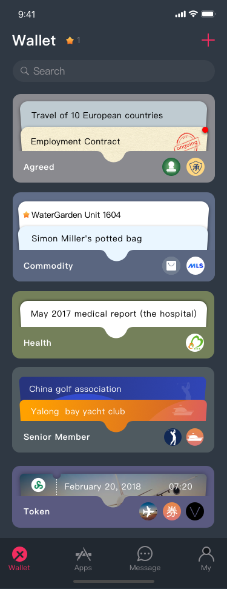

## UDAP - Power a Tokenized Life

Year 2018 is the year of tokenizing everything movement. Everything we have, everything we use will be digitized and uniquely secured and identified by a crypto-token, such that the personal assets becomes smart assets that can interact with the rest of the world, which has been impossible until now. 

### Assets to be tokenized
 
- Personal identifications, such our passport, identification card, our social insurance card
- Critical personal information, such as medical records, educational achievements (degree or diploma, training certificates)
- Tangible assets, such as Our houses, our cars, antiques, collectables, Jewelry. 
- Consumption records: checks, utility bills and receipts.
- Human capital: personal influence, promise, fan clubs.
- Concert tickets, coupons, membership cards. 
- Intellectual properties: such as articles, songs and photos, even creative ideas.
- people can issue their own personal tokens representing anything from a Promise to deliver some goods or services to your Family, your friends, or customers. 
- Essentially people can use blockchain technologies to create crypto currencies of their own brand to start a personal token economy. 

In one short statement, we are starting to see our life being tokenized, thanks to the blockchain technologies.

### Tokenizing everything is hard

* Difficult programming interface.
* Scalability: none of the public chains currently offer sufficient throughput.
* Confidentiality is hard to implement
* Crypto-Identity system is lacking
* User interface is miserable: even though you can tokenize everything, and there is no single place to contain those tokens, to show those asset to our customers.  

### Welcome to UDAP

This is why we have created UDAP platform, an integrated solution for all the critical block chain technologies and data storage cloud. 

**For programmers**
- UDAP provides a simplified asset oriented programming interface, so that they can easily migrate their own vertical applications to a block chain based architecture.
- UDAP also provides programmable asset wallet framework - the universal asset Wallet to save them from creating an mobile app of there own. 
- Each application will have its own configurable blockchain. 

**For consumers**
- The universal asset wallet provides the single streamlined unified user interfaces for all the assets that are being managed by all the applications. 
- we can browse,  organize, transfer, even creating our own crypto assets directly from the Wallet, or in simple terms, we can print money in the wallet. 

### Technically
- UDAP uses cosmos framework for a horizontally scalable architecture, which offers 4000TPS per zone.
- UDAP has a innovative account model to deal with asset natively on the Block chain.
- We create a vertical scalability solution called virtual private chains (Or VPC in abbreviation), to concurrently process all the transactions from All the applications. 
- The above multi-zone and the multi-chain architecture will be able to handle hundreds of thousands of transactions per second. 
- UDAP separates user accounts and asset accounts, and obfuscates the relationship between users and their assets, to achieve asset confidentiality.
-  In the meantime we use Proxy Re-encryption to to enable secure asset sharing at a massive scale. 

### To summarize

UDAP aspires to become the top player in the tokenizing everything movement by bringing Application developers and users together with a simple SDK and programmable unified asset wallet. 

