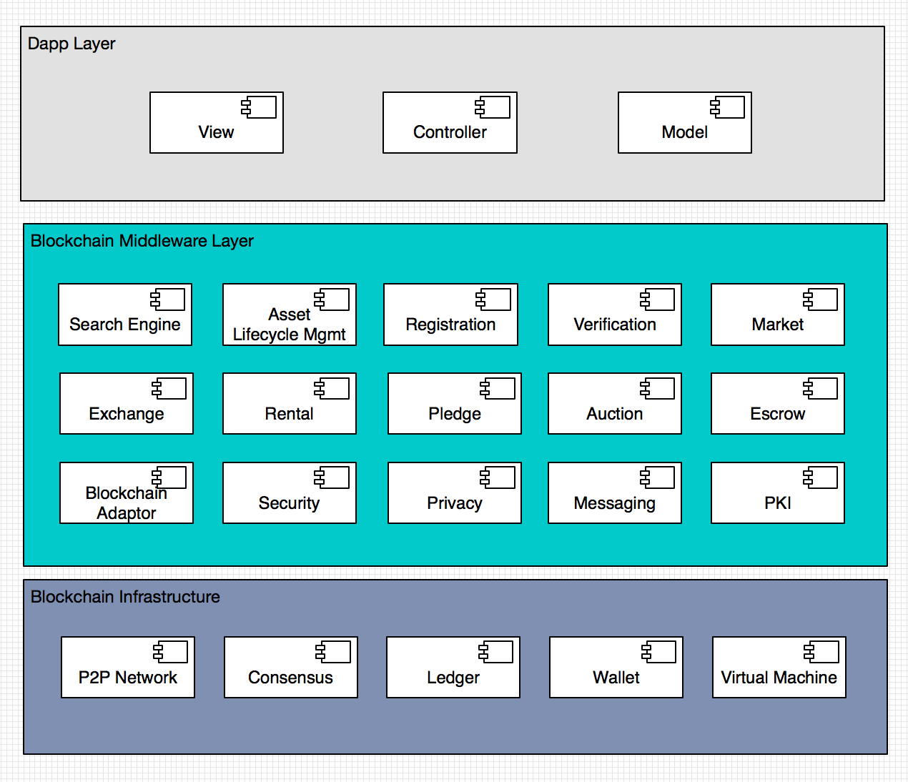
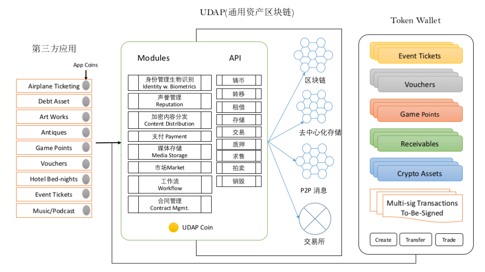
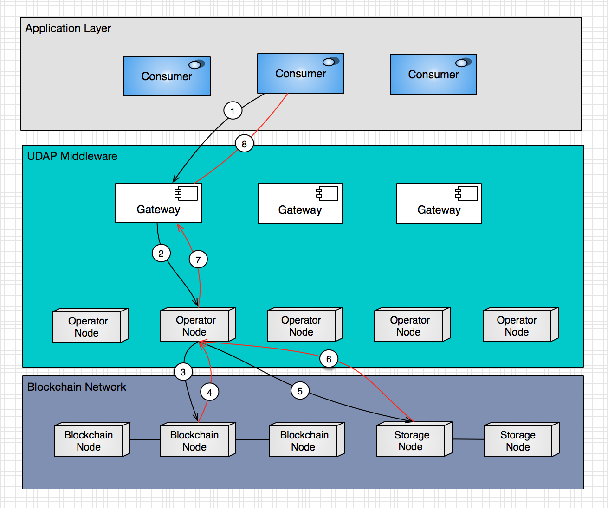
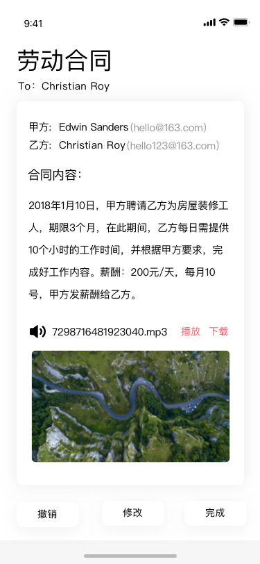
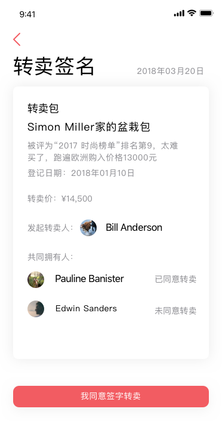

# UDAP - A Universal Decentralized Asset Protocol

一个通用的、去中心化的资产协议


A White Paper

白皮书

Working Draft (Ver 0.8.0)

**UDAP Foundation， 6/15/2018**

**注意**： 中文版本的白皮书经常性落后于英文版本的白皮书。 请参与最新版的[英文白皮书](https://github.com/udap/udap.github.io/blob/master/whitepapers/UDAP-Whitepaper-English.md) 


## 目录
	- 摘要
	- 1.  背景
	- 2.  目标和架构
	- 3.  设计理念
	- 4.  对应用开发者的价值陈述
	- 5.  协议
			- 5.1.  链上资产模型（On-Chain Asset Model)
					- 5.1.1 资产（Asset）
					- 5.1.2 资产元数据（MetaData）
					- 5.1.3 资产权属（Ownership）
					- 5.1.4 资产状态（State）与资产生命周期（Lifecycle）
					- 5.1.5 资产证明（Proof of Asset）
					- 5.1.6 资产标签（Tag）
					- 5.1.7 资产注册表（Asset Registry）
					- 5.1.8 账号（Account）、资产钱包（Wallet）及身份（Identity）
					- 5.1.9 交易（Transaction）及事务（Event）
			- 5.2.  资产服务
					- 5.2.1 用户注册
					- 5.2.2 应用注册
					- 5.2.3 资产注册
					- 5.2.4 代币发行
					- 5.2.5 资产重铸
					- 5.2.6 多重签名
					- 5.2.7 资产搜索
					- 5.2.8 交易服务
			- 5.3. UDAP中间件网络
			- 5.4. 资产的真实性与资产证明
			- 5.5. 身份管理
	- 6. 通用资产钱包(UAW)
			- 6.1. UPX代币
			- 6.2. 第三方发布的资产
			- 6.3. 个人发布的资产
			- 6.4. 负债：the Bills
			- 6.5.  UAW的其他功能
				- 6.5.1 多重签名（Multi-Sig）
				- 6.5.2. 插件式应用（Plugins）
				- 6.5.3. 应用商店（Plugin Store）
				- 6.5.4 总结
	- 7.  关键技术
		- 7.1 权限及存取控制
		- 7.2 安全与隐私
		- 7.3 数据存储策略
		- 7.4 性能和扩展性
			- 7.4.1 节点之间的竞争性重复计算
			- 7.4.2 交易处理缺乏充分的平行化
			- 7.4.3. 低性能的智能合同
	- 8.  和类似平台比较分析
	- 9.  应用案例分析
		- 9.1 活动与票务
		- 9.2 个人品牌"上市"
		- 9.3 供应链及供应链金融
		- 9.4 零售行业
		- 9.5 旅馆行业
		- 9.6 数字游戏中的虚拟资产交易
		- 9.7 艺术品资产
		- 9.8 权益代币化
	- 10. 总结
	- 参考文献

<!-- /TOC -->

## 摘要

区块链开发进入了“Tokenizing Everything”的时代：把所有物件和信息代币化和资产化。然而区块链的应用（广义的dApp）和区块链之间存在一个巨大复杂性的鸿沟，使得杀手级应用对开发者而言很难编写，对用户而言很难使用。

UDAP是一个区块链时代的“中间件”。 它为区块链应用开发人员提供了一层稳定而抽象的基于区块链的资产生命周期管理、交易和搜索的模块和应用开发API，以及一个面向终端用户的独一无二的插件式的区块链应用和资产管理手机终端平台，构建了一个落地应用的爆发模式。 其底层可以基于Ethereum，Cosmos，EOS等公链。

具体而言，对应用开发者而言，UDAP中间件提供：

1. 粗颗粒的资产在区块链上的全生命周期管理和交易服务，包括资产上链、确权、铸币、转让、质押、租赁、拍卖、托管、交易、兑现、销毁等服务，以及搜索、用户身份管理、资产安全和隐私保护等多种基础服务。
2. 对去中心化的计算、存储及消息服务的封装。
3. 可编程的“资产钱包”视觉框架和接口。
4. 隐藏区块链的Scalability、Confidentiality 的复杂性。
5. 资产区块链作为服务的一键式区块链云端部署。

对于个人用户：

1. 一个统一的区块链资产钱包和区块链应用入口。
2. 一个不受单一商业公司控制的的永久性的个人资料库。
3. 熟悉的移动互联网应用界面和性能， 区块链的创新、安全和资产拥有感。

## 1.  背景

一直以来，区块链被广泛认为是在互联网基础上构成的一个价值互联网（The Internet of Value），但是我们仔细考察了区块链目前所承载的价值转移的载体，实际上99%的应用还是局限在流动性最好的，也最容易解决的一类资产，那就是加密货币。所以对当前区块链更准确的描述是货币互联网("The Internet of Money")\[*The Internet of Money*, A.M. Antonopoulos\].

但是我们周边有着大量的、可触及的或者不可触及的，可以拥有、交换并产生价值的资产，例如，货物、服务、商标、证券、仓单、许可证、版权、活动门票、积分、游戏装备、债务、应收账款等。这些资产能否利用区块链技术或者相关的去中心化的记账技术，得到很好的价值，发现和价值确认以及价值转移呢？答案毫无疑问是肯定的。目前已经有一些基于区块链技术的项目，在试图解决现实生活中的非货币类的资产如何在去中心化的网络中得到表达、认可和交换[参考文献]。但是我们发现这些协议产品和平台，都是基于现有的区块链，以货币转移为基础的第二层级的结构。2014年左右，在比特币技术得到大多数人认可的时候，不少的项目提出了有颜色货币的概念，也就是在通行的可置换的价值对象--货币之上嫁接一层独特的识别技术，使得我们可以用货币的符号来代表现实生活中的可触及的资产以及不可触及的资产。

早期的"颜色货币"靠在比特币网络传输的协议中增加交易的顺序来进行特殊含义的赋予。这种方法，当然是对比特币协议的特殊扩展应用。当然因为比特币独特的简化协议，使得任何第三方的应用想对自己的资产进行数字化、加密以及货币化都需要比较大的工作量和一定的技术门槛。以太坊作为另外一个主流的区块链网络，一开始的初衷，就是希望能够把区块链的网络变成一个高度可编程的、可应用于对现实世界的价值节点进行确认、传输转移和交换的平台，它的目的是建立一个通用的、去中心化的计算平台，同时，也逐渐的加入了去中心化的存储功能（Swarm），虽然这两种功能尚未在以太坊主网上发布。

以太坊所体现的我们称之为颜色货币的概念，是通过智能合同来进行的，在常见的智能合同的应用场景中，外部世界的资产被智能合同中的电子对类型的数据库来进行存储，通过用户自定义的一些基本逻辑和安全机制来管理这些资产的登记、发布和流转。在一定程度上，以太坊的智能合约简化了对现实世界中资产在区块链上表达的实现，同时，一些在特定领域的资产相关的开源项目【参考文献】得到了以太坊社区的支持，包括一些拟议中的协议，例如，ERC721。然而，这些项目并没有提出一种通用的资产协议，来支持不同领域的资产在区块链上的发布、转移和交换。

我们也看到，以太坊这两年在逐渐成熟的过程中，已经产生了非常大的性能问题和安全隐私问题，例如，2017年底在以太坊主链上发布的加密猫（一种虚拟资产）游戏的流行导致了以太坊全面的网络拥堵，以至于以太坊上Ether的转移和确认时间急剧增长。因此，以太坊核心开发团队当前的主要工作方向并不在于提供一套便捷的可供任何现实世界的各种应用所利用的资产发布、管理和应用平台，而是把注意力集中在更底层的性能吞吐量和安全隐私等更为基础的环节，这些都是非常有必要的，因为如果没有这些最基础的非功能性需求指标，那么在链上建筑的任何具有真正意义上的杀手级的应用，都会导致整个系统的性能迟缓和用户体验的急剧下降。因此，目前区块链应用不得不各自提出不同的技术路线以解决本该属于区块链基础设施层（包括中间件）应该解决的问题，从而导致应用落地的困难。



区块链的技术栈通常分为三层结构（如图），最上层是Web或移动应用（称为Dapp或者广义的区块链应用），负责业务逻辑及用户体验；底层是区块链的基础设施层，负责分布式账本的维护、共识的建立、P2P网络、虚拟机及钱包等。而中间层我们称为中间件，封装了计算、消息、存储、安全、因素保护、搜索等服务，提供基础的面向专门领域的服务（例如，资产生命周期管理和交易、内容管理与安全分发以及存证服务等）。这样的架构有利于区块链应用的开发，让应用、中间件以及基础设施各司其职，简化并加速区块链应用的开发。然而目前的区块链应用开发模型是一种两层结构，每个应用不仅要开发出各自的前端App和特定的智能合约外，也需要完成80%共同的智能合约（例如，资产描述和上链、确权、不同类型的交易模式、搜索等对于大多数区块链应用都需要的智能合约），还需要在底层链的基础上对安全、隐私保护、消息服务、性能等进行增强。然而，智能合同的编程语言的成熟性远不如传统应用使用的编程语言的成熟和完备，在健壮性方面也还处于童年时期，尚未形成智能合约编写的最佳实践。对大多数没有多少智能合同编写经验的程序员而言，编写与资产管理、交易及搜索相关的智能合同可能是一个安全和性能上的"nightmare"。

同时，当前的区块链应用对底层区块链有极大的依赖，从软件工具到技术完全绑定到特定的区块链上，无法在不同区块链之间迁移。一旦选择错误，就可能让几个月的幸苦付诸东流。例如，当选定以太坊进行应用开发，然而在后期发现以太坊的性能不足以支持应用的要求，这时候除了推到重来就别无选择了。


<div class="page-break"></div>

## 2.  目标和架构

UDAP的目标是通过建立一个针对区块链上资产生命周期管理、交易和搜索的难题建设一个区块链中间件，推动各种资产相关的应用利用UDAP中间件构筑一个全球性的"资产互联网"（The Internet of Asset）。在这个资产互联网上，无论是企业还是个人，都可以方便地发布、转移和交易各种虚拟的以及实物的资产。因此，我们对拟议中的UDAP区块链中间件制定了一个明确且清楚的边界，包括以下目标：

1.  制定一个从区块链的角度理解和认识现实世界中的"资产"的概念，从中抽象出各种资产在区块链上的数字表达，以及各种资产的一些主要行为，从而制定出一种通用的、去中心化的资产协议，包括一个通用的资产模型以及一整套面向应用开发者的API。这样的API不要求应用开发者对区块链技术和去中心化的技术有较为深刻的认识和较为熟练的编程经验。同时，完成对底层区块链的抽象，设计出一个开放的区块链协议，使建立在UDAP中间件之上的应用不需要依赖特定的底层区块链技术，完成应用和区块链的解锁。

2.  提供一个对资产互联网协议以及开放区块链协议的高性能和安全性的参考实现（简称UDAP RI），让应用开发者能够在不改变现有应用架构的情况下，搭上去中心化的计算和去中心化存储的快车。我们把区块链上对资产的操作、去中心化的计算、去中心化的存储技术和去中心化的信息机制中最核心的部分，通过面向资产的模块化设计，以去中心化的微服务的方式提供给应用开发人员使用，这样可以大大缓解目前区块链技术和去中心化的一整套技术对应用开发者的巨大的技术障碍和挑战。

3.  提供一种“资产链作为服务”的生产级别的联盟资产链云服务，让用户像使用阿里云、亚马逊云服务一样使用UDAP中间件及区块链，降低企业建设区块链基础设施和中间件服务的门槛，简化企业对区块链平台的运维难度。

4.  提供一个面向终端用户的通用资产钱包的参考实现。在这个通用资产钱包中，个人用户可以及其方便地管理和交易自己所拥有的各种资产，包括数字资产、实物资产以及各种有形和无形资产。同时，资产钱包也运行应用开发商为其应用开发钱包插件。这样的插件类似于微信小程序以及脸书的插件式应用，第三方应用开发平台可以把应用的某些功能整合到这样的插件式应用里，从而使通用资产钱包成为区块链时代的流量入口。


下图体现了UDAP的架构概览：




<div class="page-break"></div>


## 3.  设计理念

资产互联网协议的基本理念是建设一个"厚协议层"，支撑"薄应用层" （Thick Protocol + Thin Application）。

应用层主要关心的问题应用的业务逻辑（包括工作流）和用户体验，而这种业务逻辑的许多方面，包括资产的上链、确权、质押、租赁、拍卖、典当、交易、铸币、重铸、兑现等这些通用的资产交易和管理部分，实际上是可以由中间件的一些基础模块和智能合约来帮助解决的，所以，我们给第三方应用开发者提供的一个愿景就是，第三方应用开发者只需要对自己所垂直的行业有足够的知识和认识，那么基于我们的厚协议层就可以迅速开发出自己客户所需要的功能，并且以最短的时间投入市场，产生自己想追求的商业效益。

用Ethereum区块链来作为参照的设计是我们的起点。 我们的设计思维和Ethereum 最大的差别就是"Feature"。也就是说，UDAP中间件将提供以太坊所缺乏的与资产管理、交易和搜索相关的各种基础服务。 Vitalik Buterin 认为Ethereum 的设计思想之一是Ethereum 是一个 "Feature-less" 的计算平台。

> **We Have No Features**: as a corollary to generalization, we often
refuse to build in even very common high-level use cases as intrinsic
parts of the protocol, with the understanding that if people really want
to do it they can always create a sub-protocol (e.g., ether-backed
subcurrency, bitcoin/litecoin/dogecoin sidechain, etc) inside of a
contract.  \[ <https://github.com/ethereum/wiki/wiki/Design-Rationale>\]


以太坊的主要目标是建设成一个通用的、支持智能合约的区块链平台。 任何有针对性的高层次的功能性抽象都被推给了用户自定义的智能合约中。这种理性的有节制的目标是令人赞同的， 它给予社区足够的空间去设计应用层面的协议，但是却不是我们构思的"资产互联网"协议以及参考实现追求的方向。 智能合同因为其"图灵完整"的计算能力为DAPP开发者提供了相对而言的极大的灵活性, 但是也带来明显的技术障碍和安全风险。智能合同的开发语言虽然支持“图灵完整"，但是提供的编程模型是目前很多开发人员所不熟悉的，对于普通应用开发者而言有很多"坑"需要绕过，用户自定义的智能合约可能会暴露出很大的受攻击面，就像以太坊近两年所发生的几起造成严重的经济损失的安全事故所展现的一样。而比特币网络拥有非常有限的智能合同能力，但是说到底，这并不一定是比特币网络的一个明显的局限性，实际上很多比特币网络的忠实粉丝认为这种有限的设计是一种非常好的措施来防止比特币网络受到各种各样的攻击。比特币网络引以为傲的一个非常重要的指标就是，一段时间来比特币网络经受了无数的冲击，然而，比特币网络从本质上来说，还没有出现一次真正的巨大的漏洞。


UDAP区块链中间件作为"资产互联网"的一个必要组件，从目标而言并不是一个区块链，而是一个专门从资产角度处理现实世界的资产和加密资产的功能平台，是一个"功能丰富的区块链中间件"。从协议的角度来看，它是一个更丰富和更专门化的资产管理、交易和搜索协议。这个协议内置支持资产的代币化和通用的资产交易行为，例如上链、确权、转移、交易和销毁等，面向的是一般应用开发者。并且我们希望在这个垂直领域中，我们能为我们第三方的客户提供一个健壮的、高性能的、持续有效的一个全资产（而不仅仅是虚拟货币）生命周期管理、搜索和交易平台。为了达到这个目的，更为了从安全和性能的角度实现这个目的，我们决定减少智能合约的受攻击面，通过形式验证和代码审查等多种方式保证UDAP中间件的健壮性，并在中间件层面增强区块链的安全模型和隐私保护能力，把资产安全性和交易性能作为平台最主要的发展方向。

我们的目标是通过中间件来实现区块链协议层的增厚，我们认为这种"Thick Protocol + Thin Application"的模式将是区块链应用的核心架构模式，它将极大地推动区块链新型应用的发展。这种模式从技术说有革新性的意义，UDAP是第一个提出用中间件来增强区块链协议层的项目，从而在区块链上搭建一个面向资产领域的服务层，向上连接区块链应用，向下连接底层区块链。从价值上分析，它会让价值从应用层方便地下沉到协议层，让协议层变成一个跨应用的大数据及资产沉积层。客观的结果是协议层变得更有战略价值和投资价值。


<div class="page-break"></div>

## 4. 对应用开发者的价值陈述

假设读者已经知道区块链的价值，那么UDAP连同其参照实现（简称 UDAP RI）提供如下价值：

---
- 减少甚至避免编写应用所需的智能合同
- 面向资产的微服务以及对开发者友好的API
- 去中心化的多媒体存储
- 所有信息和资料加密
- 可以与云服务级别相比的性能和扩展性，例如高效的去中心化资产搜索
- 多种交易模式的支持，例如市场模式、交易所模式、拍卖模式、租赁模式、质押模式等
- 提供可编程的统一用户界面

具体而言，UDAP的价值在于：

1.  提供对开发者友好的应用编程模型及面向资产的微服务，加速区块链应用的开发和落地，使应用能够充分利用区块链带来的坚不可摧的数据库能力。

2.  支持多种底层区块链，通过开放区块链协议和区块链适配器的开发，减少应用对底层区块链的依赖性，让应用能够在不能的底层区块链上运行和自由迁移。

3.  为第三方应用提供实现应用内经济 **代币化** 的手段，从而推动第三方应用成为一个独立的应用经济体。第三方应用可以把应用类的经济流动时所需要的手段使用加密货币的代币模型进行重新规划。应用内的市场营销手段，激励手段，用户付费的新模式，甚至包括利益分配的新模式。用以太坊的标准的手段来建立自己的经济货币的时候，需要较为熟练的智能合同的编程能力或者是雇佣具有这种编程能力的咨询团队来建立自己的应用内加密货币的智能合同提供的能力，我们的协议能够使用户只需要配置一些标准化的参数，就可以发行能够在自己的经济体系中使用的加密数字货币。这样的加密货币将立刻能够在我们提供的通用数字资产钱包中得以展现。不仅如此，通用资产协议本身还提供资产的分布是交易(Decentralized Exchange)的能力，这种能力能够把用户发行的自定义加密数字化资产和目前加密数字资产行业主流的加密货币建立交易对，能够让App内数字资产立刻产生流通性和流动性，极大地激活在应用内的经济体中较为复杂和多变的灵活的金融手段。这种应用内的代币满足ERC20协议，所以也能在绝大多数的兼容ERC20的钱包中存储。

4.  提供与资产相关的公共资产服务，包括高效的资产搜索、资产生命周期管理和交易等，提供了代码的复用，减少应用的重复开发。目前第三方应用使用最多的底层区块链就是以太坊，通过应用前端对区块链上的智能合约的操作来完成某些业务。然而Ethereum网络现在每天处理能力达到百万级，但是这个能力相对传统集中式的大型应用还是有极大的差距。 性能问题在未来2到3年里面，才有可能逐步地得到解决。[https://blog.ethereum.org/2018/01/02/ethereum-scalability-research-development-subsidy-programs] 对于立刻需要这种高吞吐能力的区块链技术的第三方应用来说，UDAP中间件将通过技术的创新提供这种能力。这是应用直接使用区块链智能合约模式所不能达到的。

5.  用户的管理。区块链技术是基于最主流的密码学技术，在很大程度上，为第三方的应用提供新的安全的标准。它要求所有用户的行为都是安全的，经过认证的，每一个用户都通过自己的密钥为自己的行为进行签字，承担相应的责任。但是管理自己的数字身份本身是一个相对较为复杂的过程和计划，需要缜密管理的一套编程的方法学。我们资产管理协议，能够把较为复杂的，在区块链上的身份管理的工作，提供一个简化的包装。第三方的应用程序使用这样在保证安全性的基础之上的第三方应用，能够充分享受到区块链加密技术提供的方便。身份管理，第三方应用内用户的身份，在过去的世界中往往都是只在自己的应用内的上下文中有意义。进入区块链事件以后，所有用户的资产行为必须和区块链中的一个或者多个账号产生绑定关系。

6.  提供了增强的安全模型和隐私保护机制。UDAP中间件将为使用UDAP协议的第三方用户所管理的各类资产提供加密和隐私保护。用户可以完全控制自己的资产在网络中的存储，去控制自己资产的信息向特定的人群或者应用开放。用户可以控制自己资产的转移路径是否公开，或者享有完全的隐私。在资产户联网的层面上，每一个应用内的用户和应用之间是互相隔离的，这样做的主要目的是为了保证用户的隐私。我们的通用数字钱包能够同时导入多个第三方的应用。因为每一个应用之间的互相隔离，实际上一一为着一个钱包可以同时导入用户所知道密码，多个第三方应用所对应的区块链账号。从用户的角度看来，这些账号都隶属于用户自己。能够从统一的资产钱包中，观察自己所拥有的所有的各类和现实世界绑定的加密化资产，以及那些纯粹的加密货币资产。

7.  工作流支持。工作流的支持，主要体现在多重签名的支持上。关键性的资产的动作，例如资产的转移，资产的交换和资产的销售，往往需要多重签名的保护。应用可以非常简单的设置对关键性动作的签名保护，策略和规则。一旦受到保护的动作被发现或者调用的时候，用户所持的通用资产钱包会自动提示用户进行签名的处理。我可以在自己的资产钱包中实时地对其他人发起的需要多重签名对资产的操作，进行签字或者拒绝的处理。这种工作流，不仅仅可以简单的在持有通用资产钱包的个人用户之间进行，也可以在第三方的应用的界面和拥护者通用钱包之间进行。这一类的多点信息的交流和沟通，是由资产网络底层的基于P2P的消息协议所支持的。

8.  立即的流动性。 协议和实现中将提供同类资产和跨类资产交易的能力， 特别是提供和成熟加密货币交易的能力。

<div class="page-break"></div>

<!-- -->

## 5.  协议

协议是去中心化信息系统数据交流和通讯的规范和指南。UDAP的去中心化资产协议规范了资产如何在区块链上获得表达、存储、通讯和交互，如何确认资产的真实性，以及去中心化节点之间的共识机制。

#### 5.1.  链上资产模型（On-Chain Asset Model)

传统的ERP系统建立了一套基于中心化存储和计算的资产模型<sup>\[9\]\[10\]</sup>，这个资产模型是资产发布者对其发布的各种资产的抽象，它规范了系统如何管理资产的属性、服务及安全。与传统ERP不同的是，UDAP资产模型需要规范资产在**区块链**上的表达、交互、安全、隐私及资产真实性。

> 为什么资产需要上链？加密资产相比数字资产（这里指传统的ERP管理的资产）有如下优势：
>
1）权属清晰：资产的发布者、拥有者以及交易的签署者的权益都可以被清晰地定义。资产拥有者可以方便地提供无可辩驳的证据证明自己的权益，而没有交易签署者的同意，资产是不能在区块链上交换和交易；同时，资产发布者可以确定资产的某些基本属性是否不可更改，例如资产发布者可以限制资产的转移和交易。
>
2）信息永久化：存储数字化资产需要一个永久的方式。区块链和去中心化存储经济的到来终于让我们有信心能长久保存信息。
>
3）防伪以及防篡改：资产一旦上链，那么相关的数据及交易记录可以得到有效地保护，实现防伪以及防篡改的目标，减少道德风险。
>
4）流动性需求：资产价值和流动性具有密不可分的联系，流动性越高的价值产品，越容易被人接受。一个价值对象的流动性越高，那么这个价值实际上就得到了更多的确认，能够被广泛的接受，所以流动性对于任何价值具有非常重要的作用。货币这一类价值载体，具有极高的流动性，所以货币毫无疑问是所有价值中最乐于被人接受的财产，另外具有高度流动性的还包括股票，债券等价值载体。而类似于房屋汽车，或者农场，工厂设备等这样的资产，流动性相对较差，它的定价和能够被市场所接受的价格，因为流动性的不足，使得可能具有较大的差异，所以拥有这一类资产，就面临着流动性不足，资产价值难以确认的局面。更多的我们周边所知道的资产，包括普通的物件等，实际上已经通过我们现在已经习以为常的网络平台，例如ebay，淘宝网，以及各种二手商品市场具有了流动性，因此能够产生价值的确认。
>
除了以上需求外，区块链上的加密资产同时还要保证用户的隐私。这是一种不言而喻的的需求。

目前区块链世界中的所谓加密资产大多数都是针对一种特殊的可置换资产，也就是加密货币。这一类应用协议或者平台主要是方便加密资产产生、分发及交换。规范这一类加密资产的协议包括ERC20以及一些简单的延伸协议。第三方的较为著名的可置换资产交易协议有0x协议。这个协议假设数字货币已经被完全的发布，分布到了不同的拥有者的手中，那么这个协议所解决的问题就是，成为一个去中心化的数字资产交易场所，尤其用于可置换的资产的数字化交易。

针对那些不可置换的数字化的资产目前开始出现一些标准化的努力和规范，例如ERC721协议，体现这个规范的是2017年12月在以太坊网络上流行的加密小猫，以及后来的各种各样的拷贝复制者。

UDAP的资产模型是通过对现实世界各种资产的分析和抽象，并结合[MediaChain](http://www.mediachain.io)、[Digix](https://digix.global)、[BankEx](https://bankex.com)等区块链项目而提出的概念性资产模型：

<p align="middle">

</p>

这个资产模型定义了资产以及相关的对象，并且定义了这些对象之间的关系。这个资产模型兼容了ERC721，同时提供了更加丰富的内容。

###### 5.1.1 资产（Asset）

任何可以拥有、交换并产生价值的东西都可以称为资产，例如，货物、服务、商标、证券、仓单、购买协议、许可证、版权、音乐、视频、游戏、积分、游戏装备、活动门票、收藏品等实物资产及数字资产。货币（包括加密货币）也是一种特殊的资产类型。资产的一些基本属性，例如，资产标示码、是否可置换、可转让、可再销售等，是由资产发布者决定的，这些属性在资产发布后就不可以被修改。而另外的一些资产属性在资产生命周期里是可以被修改的，例如资产的状态、资产的名称等。UDAP的资产层次结构可以用下图描述，其中包括一个标准接口类型(Asset)，一个提供基本属性和操作的抽象对象类型(AbstractAsset)，以及多个派生的资产类型。

<p align="middle">

</p>

UDAP协议本身并没有定义协议的实现方式，因此，下面的资产接口只是一个用Solidity定义的智能合约。在正式发布的协议里，我们会选择一种更加中性的描述语言来描述资产模型的各个组件，同时，我们保留在后续版本中对协议中的接口进行修改的可能性。

```
contract Asset is ERC721 {
  event AssetCreated(address indexed _asset, uint indexed _id);
  event AssetTransferred(address indexed _to, uint indexed _id);
  event AssetDestroyed(uint indexed _assetId);

  function id() public view returns (uint);
  function issuer() public view returns (address);
  function owner() public view returns (address);
  function namespace() public view returns (bytes32);
  function transferrable() public view returns (bool);
  function fungible() public view returns (bool);
  function metadataHash() public view returns (bytes);

  function transfer(address _to) public;
  function destroy() public;
}
```
上述接口定义了区块链上资产的一些共同属性和操作，详细说明如下：

* 资产发布者（issuer）

  资产发布者是指通过UDAP中间件把资产发布到底层链的区块链账号地址。

* 资产拥有者（owner）

  资产拥有者是指拥有某个加密资产的区块链账号地址。

* 可置换性

 资产的可置换性是指数量相同的同一类资产是否相互置换。根据资产的可置换性，我们通常把资产分为个体可置换的资产和个体不可置换的资产。在资产层次模型里这两者分别对应于FungibleAsset和StandardAsset。个体不可置换的资产是指，虽然两个个体的属性和外部感官都相似，但是因为他们有自己不同的身份，所以他们的拥有对于特定的拥有者而言是不可置换的。这类似于说，虽然两个人都拥有iPhone手机，但是一个iPhone和另外一个iPhone之间是不可替换的，因为每一个iPhone都有它独特的一些属性，使得如果iPhone交换以后用户的使用就消失了，每一个iPhone都有自己的独特的电话号码也有独特的购买时间，所以两个iPhone之间是无法做到自由交换的，至少在大多数情况下如此。

 在现实生活中存在大量的不可简单置换的资产，例如，大部分的不动产在交易的环节是不可置换的。现实生活中还有非常多的票券系统和对未来的服务的预期的信用债务资产以及股票债务期权等金融资产，在很多技术背景的场景下是不可置换的资产。

 而我们称之为可置换的资产中，最常见的就是货币或者代币（资产层次模型里被称为AssetToken，这是一种支持ERC20标准的资产代币）。我们说一百美元的货币和另外一张一百美元的货币，在大多数应用场景里，他们之间就是完全可置换的，因为人们使用这类资产的主要目的是使用它的一个极为突出的属性，也就是它的货币所代表的流通价值。而每一个货币所含有的某种特殊的属性，例如货币上印刷的独特的序列号，对于人们使用这个物品而言是并没有特定的意义和影响力的，所以，两张一百美元的纸币之间是完全可以置换的。可置换资产的另一个例子是产品，例如苹果，虽然苹果有其特殊的属性，例如，产地、品种、等级、大小、颜色等，但是，当我们说仓库里存放有烟台产红富士85毫米一级果600吨的时候，这600吨苹果在交易环节是作为可置换资产的，因为，这600吨苹果是按特定标准分类的，在交易环节对买家来说是没有差异的。

 还有一类特殊的不可置换资产，在资产层次模型里我们称之为CompositeAsset，即复合资产或资产包。这一类资产通常包括多种不同资产，例如金融领域的Asset Portofolio，或者供应链领域的仓单，以及很多需要把不同资产打包整体交易或定价的资产包。

 ```
 contract CompositeAsset is StandardAsset {
   function getAmount() public returns (uint);
   function getAsset(uint idx) public returns (address);
 }
 ```

* 可转让性（transferrable）

  资产的可转让性决定了资产在发布后是否可以转让给其他机构或个人。这种转让的方式可以是以出售的方式转让，也可以是无利益的直接转让。如果某个资产不可以转让，那么这个资产就只能属于资产发布者。大多数资产是可以转让的。

* 销售性（sellable）

  可销售性是一种特殊的属性，资产发布者可以用来限制资产的再销售。虽然大多数场景资产是可以再销售的，但是，在某些特殊应用场景里，例如，购物代金券，发行方可以限制代金券的再销售。这样，在发放代金券给某人后，代金券就不能再转让或者出售了，这样就限制了这种资产在二级市场的流通，确保只有发行方指定的接受人才能使用这样的资产。

* 命名空间（namespace）

  资产命名空间是指资产发布者为资产分类、分组所制定的命名规则，以方便区分不同的资产。

* 资产标识符（AID）

  资产标识符是由UDAP平台为资产设置的唯一标示码，是通过标准的算法自动为每个资产创建的。例如，参考实现里规定用如下公式技术资产标识符：
  ```
  AID = uint(keccak256(issuer_address, issuer_namespace, metadata_multihash))
  ```
  这样，通过发布者的账号地址、命名空间以及IPLD或者JSON-LD格式的资产元数据描述文件的Hash值就可以为资产生成一个唯一的AID。不同资产发行人发行的资产，或者同一个资产发行人发行的但是命名空间不同，或者资产元数据描述不同的资产将获得不同的AID。因为keccak256函数的效率问题，协议的实现方可以选择不同的函数。

* 元数据Hash值

  是指根据资产元数据所产生的按内容寻址的MultiHash值，用来唯一定位资产的元数据。详见5.1.2。

* 其他属性

 除了以上的一旦确定就不可更改的属性外，资产还有一些属性属于可更改属性，例如，可置换资产的数量（1公斤黄金，或者500吨苹果）、资产的状态（租赁中、闲置、上架等）、权属、资产证明、折旧等。其中一些公共的属性将在下面描述，另外一些应用相关的属性不属于协议讨论的范围。

###### 5.1.2 资产元数据（MetaData）

元数据一般被称为“关于数据的数据”。UDAP的资产元数据概念是指关于资产的描述性信息，包括资产的基本属性等由资产发布者定义的属性。这些元数据的结构以及数据的含义是由资产发布者及相关的应用来解释。在UDAP里，资产元数据是用一个存放在链外(off-chain)的P2P存储里的、以JSON-LD规范来描述的JSON数据来定义。在UDAP的资产模型里，区块链上(on-chain)的加密资产只包括链下元数据的一个Multihash值，智能合约可以通过metadataHash()接口来获取该Hash值，从而定位并取得相关的资产元数据。
````
  function metadataHash() public view returns (bytes);
````

>JSON-LD描述了如何通过JSON表示有向图，以及如何在一个文档中混合表示互联数据及非互联数据。例如，对于一个用JSON格式记录的食谱资产元数据（如下所示），UDAP通过IPFS把这些数据发布到IPFS上（通常，考虑到数据的隐私性，资产元数据可以先加密然后再发布到P2P存储空间。这里仅为示例）：
````
{
   "name": "Mojito",
   "ingredient": [
     "12 fresh mint leaves",
     "1/2 lime, juiced with pulp",
     "1 tablespoons white sugar",
     "1 cup ice cubes",
     "2 fluid ounces white rum",
     "1/2 cup club soda"
    ],
   "yield": "1 cocktail",
   "instructions": [
      {
        "step": 1,
        "description": "Crush lime juice, mint and sugar together in glass."
      },
      {
        "step": 2,
        "description": "Fill glass to top with ice cubes."
      },
      {
        "step": 3,
        "description": "Pour white rum over ice."
      },
      {
        "step": 4,
        "description": "Fill the rest of glass with club soda, stir."
      },
      {
        "step": 5,
        "description": "Garnish with a lime wedge."
      }
   ]
}
````
>上述资产元数据在区块链上可以记录为一个merkle-link，这样应用就可以通过merkle-link进行寻址，获得相关的资产元数据。
```
{"md",{"/","QmdnuRNwdmZzHfHVUMVHZFXKXAe6DjvBvPdKy27HpJUN9H"}}
```
>UDAP资产模型采用的是更简单的方法，只在链上记录hash值，由UDAP规范如何用hash值生成可寻址的网络地址:
```
{"metadataHash","QmdnuRNwdmZzHfHVUMVHZFXKXAe6DjvBvPdKy27HpJUN9H"}
```
>
通常应用需要对每一个元数据项进行寻址，获得相关数据的解析，那么，这时候就需要采用内容可寻址的网络数据模型通过merkle-path对资产元数据进行寻址，这时，可以通过IPFS DAG的javascript接口（ipfs.dag.put)把菜谱资产元数据描述上传到IPFS，这样，上述菜谱资产元数据的每一个元数据项都可以用"ipfs.dag.get"获取。
>
>
把元数据以DAG节点的方式记录到IPFS：
```javascript
  ipfs.dag.put(metadata, { format: 'dag-cbor', hashAlg: 'sha3-512' },
    (err, cid) => {
      console.log(cid.toBaseEncodedString())
    // zdpuAz4HbUHTKQbdpnn42Zo4GUsU7yrBpvb2W9BF2NwvBaLn6
  })；
```
>      
通过merkle-path获取DAG节点的数据       
```javascript
 ipfs.dag.get('zdpuAz4HbUHTKQbdpnn42Zo4GUsU7yrBpvb2W9BF2NwvBaLn6/name',
  (err,result)=>{
    if (err) {
      console.error('error:'+ err);
    }
    else {
      console.log(result.value);
    }
 });
```

###### 5.1.3 资产权属（Ownership）

资产的权属是资产元数据的一种类型，它记录了某个资产的拥有者信息。一个资产可以有多个拥有者。资产的权属在资产的生命周期里是可以改变的，例如，当资产被当前拥有人转让给其他人后，资产的权属就发生了改变。因此，虽然资产权属属于元数据的一种类型，但是，UDAP的资产模型把资产权属作为资产的一个独立属性，可以用一个独立的智能合约管理并追踪资产的权属。
```
contract Ownership {
  function ownerOf(address asset) public view returns (address);
  function ownerOf(address asset, uint asOf) public view returns (address);
}
```
以上接口用来获得某个资产在当前的拥有者以及在过往某个时候的拥有者区块链账号地址。

###### 5.1.4 资产状态（State）与资产生命周期（Lifecycle）

资产的状态代表着资产在生命周期的某个阶段。除了UDAP定义的资产状态（创建、转移、质押、租赁等）外，应用可以根据自己的需求定义资产的状态并通过UDAP记录在区块链上。

资产的生命周期是指资产在不同时间点的状态。UDAP的一个主要功能就是提供链上的资产生命周期管理API，允许应用追踪资产从发布到销毁的整个过程，从而满足特定应用领域的需求。

资产的生命周期也可以用一个独立的智能合约来管理，例如，下面是一种可能的接口定义：
```
contract Lifecycle {
  // returns current state of a given asset
  function stateOf(address asset) public view returns (bytes32);
  // returns the state of asset at given asOf time
  function stateOf(address asset, uint asOf) public view returns (bytes32);
}
```

###### 5.1.5 资产证明（Proof of Asset）

资产证明是UDAP资产模型的一个重要概念，是确定资产的真实性的关键要素之一。同时，资产证明也是UDAP资产模型里资产元数据的一种数据类型，在JSON-LD或者IPLD里表示为一个数组数据项(proofs)，每一个资产证明是一个一段自定义的JSON数据。name代表发布者给予资产证明的命名，而linkHash值代表可以定位这个证明的一个MultiHash值，它可能是一个数字签名的PDF文件，也可能是一张扫描的购物收据。资产证明也可以通过元数据的merkle-path来获得。
```
"proofs":[
  {
    "name":"Storage Contract",
    "description":"Storage contract for warehouse receipt #123456",
    "linkHash":"QmWwr4ZfeLJfbWNAuCQfefwo1aHtxC5yjyU8C5WG4DYrYe"
  }，
  {
    "name":"Purchase Receipt",
    "description": "Purchase receipt for warehouse receipt #123456",
    "linkHash" :"QmXF4LR4QkuRVh3WQbB56seTX2aPm3Tz7b4Y8heoLAiTkk"
  }
]
```

资产证明是加密资产的一个重要属性，但并不是资产的必要要素。即使没有资产证明，资产也仍然可以进行交易。资产证明的几种场景及解决方案见5.3。

在不同的应用场景里，资产证明可能有不同的形式，例如，在供应链仓储环境，仓单就是存货人所拥有资产的证明之一（其他相关的资产证明包括入库单、采购合同、仓储合同、第三方认证等），谁拥有仓单，谁就拥有仓单所代表的仓储货物的货权；在生产环节，生产商可以采用RFID标签或者二维码来唯一地标识它所生产出来的商品。这时候，RFID就是一种资产证明。因此，资产证明是由加密资产发布者来定义和提供的用于证明资产的真实性的数据，这些资产证明数据可以是数字，也可以是文件或者图片，但都是用JSON-LD的方式来进行描述。


###### 5.1.6 资产标签（Tag）

资产标签是为了方便资产的分类和检索而设定的关键字信息。一个资产可以由发布者或者拥有者定义多个标签。资产标签是一个可选的属性项。

###### 5.1.7 资产注册表（Asset Registry）

资产注册表维护了一个区块链上加密资产和现实世界资产之间的加密绑定。因为每一个资产合约管理的是某一类资产，所有通过UDAP中间件发布到底层区块链上的资产合约都需要记录在资产注册表里。同时，资产注册表也维护了多个不同的数据结构和索引方式来简化外部应用对资产的查询和检索。应用拥有各自独立的资产注册表，记录该应用所发布的资产合约。同时，资产发布者也可以对全网或者指定地址广播其发布的资产合约，这样，私有的资产注册表也可以通过Listener的方式来获得这些不同应用广播的资产合约信息，以此获得合约所管理的资产的信息。

###### 5.1.8 账号（Account）、资产钱包（Wallet）及身份（Identity）

账号是指用户在区块链上的地址。一个用户可以拥有多个账号，一个账号可以拥有多个资产，而一个资产也可以关联多个账号（即有多个共同拥有者）。例如资产可以有多个拥有者、一个发布者以及多个交易签署者。而一个账号在不同的交易场景也可以扮演不同的角色，例如资产发布者、资产拥有者或者交易签署者。资产发布者是指通过UDAP中间件发布资产到区块链上的账号，资产签署者是指资产通过UDAP中间件完成资产交易时所需要获得的签名账号，资产拥有者则是指资产拥有人的账号。

资产钱包类似于保险箱，是UDAP提供的方便用户管理自己资产的通用型资产钱包。资产钱包可以管理多个账户（或者钱包文件），而每个账户关联了区块链上的多个资产。

帐号和资产在基本模型里是直接关联的，但是，在扩展的资产模型里，帐号和资产是可以脱钩的，这样，通过帐号是不能直接找到帐号所拥有的资产，需要通过算法才能解析出帐号所关联的资产。

身份是指用户的个人或者社会信息，例如，身份证、脸书账号、电子邮件地址、手机号等可以代表用户身份的信息。区块链的账号是匿名的，然后某些应用场景需要用户提供相应的身份证明以完成监管对KYC和AML的要求。UDAP将结合可以自我管理的第三方身份管理系统（例如uPort），为相关应用提供身份与账号和资产钱包之间的映射。

###### 5.1.9 交易（Transaction）及事务（Event）

交易是指任何通过UDAP中间件发起的操作，例如，资产发布、交换、权属变更、铸币、重铸、质押、审批、搜索等都属于交易。当用户通过UDAP中间件在区块链上发起交易后，UDAP会生成相关的事务并发送给监听该事务的对象，由相关的对象负责完成对事务的处理。

#### 5.2.  资产服务

在资产模型的基础上，UDAP建立了资产的服务模型，把一些共同的服务通过微服务（REST API以及WebSocket）的方式开放给应用开发者。主要的微服务包括：

###### 5.2.1 用户注册
用户注册建立了应用的用户空间和底层区块链账户空间的映射关系。不同应用之间的用户账号完全隔离。用户注册并不是必须的，并且可以在应用端管理。更多描述见5.5.

###### 5.2.2 应用注册
应用注册的主要目的是开发者可以获取应用使用UDAP中间件的App Key以及App Secret，同时，注册的应用名也可以用来作为其发布的资产的命名空间的组成部分。

###### 5.2.3 资产注册
不同应用的资产需要通过UDAP中间件在底层区块链上完成注册，以方便应用在区块链上查询和管理其私有的资产。同时，应用也可以接受其他应用广播的资产注册信息，从而使跨应用的资产得以在联盟内或者整个公链上完成注册。资产注册也是资产发布者完成现实世界资产和加密世界资产的双向绑定，资产的元数据也是在这个阶段由资产发布者定义并上传到P2P存储网络，完成资产元数据和加密资产的绑定。这个过程中资产创建者需要对资产属性做细致的配置， 例如：

-   是否可以转让：一个资产如果不能转让，那么这个资产通常只能是权证资产，其唯一有意义的操作是"交割"，也就是权证拥有者向原始的签发方进行交割获得被许诺的产品或者服务。

-   是否可以公开销售：是指是否允许标价投放到公开市场销售。如果资产被配置为不可转让，那么这个资产本质上也就是不可销售。用户通过其他的手段和另外的用户达成交易，资产也无法在账本上过户。

-   配置资产操作所需要的多重签名规则。一个签名要求代表着调用资产操作时所附带的签名列表必须匹配的数字签名的清单。 一个特殊的签名要求是"prohibited"，其含义是资产发布者设置资产的某种操作被禁止。

###### 5.2.4 代币发行
资产代币化的目的是为了让资产可以更容易地转移和交易。这一步操作是颇为频繁的操作步骤，也就是资产发行方把隶属所在应用上下文的一个实际资产通过UDAP中间件登记到底层区块链后，完成从现实世界到加密资产世界的映射。代币发行的目的是为了让资产可以被分割交易。例如，一幅画可以通过这个有时被称之为 "代币化"，有时被称之为"铸币"的过程发行一定数量的代币，从而使这幅画可以分割出售，让多人拥有这幅画的权益。

从UDAP资产模型可以看出，代币是一种可置换资产。可置换资产通常在资产注册时完成代币的发行，而不可置换资产在大多数场景里是作为整体进行交易的，因此，并不需要发行代币。只有当资产拥有者希望把资产权益分割出售的时候才需要发行代币。

###### 5.2.5 资产重铸
重铸是指用代币重新生成加密资产的过程，为代币拥有者创建了新的资产证明。这个过程通常只针对实物资产，并且只是在特定的场景才会发生。这是因为代币本身并不一定拥有实物资产的相关属性，并且，代币是由资产拥有者为了加强流动性而发行的，当实物资产由第三方保管的时候，资产拥有者发行的代币并不一定被实物资产的保管方直接接受，所以很多时候代币不能用来直接提取实物资产，需要通过“重铸”资产的过程来生成新的加密资产。例如，当Alice把她的500吨仓储苹果登记到区块链上形成加密资产（加密仓单）后，Alice可以把仓单按每吨一个代币发行代币。然后，Alice转让100个代币（对应于100吨苹果）给Bob，Bob接收到100个代币后可以提交代币到UDAP资产重铸合约，生成新的加密资产（提货单），并销毁对应数量的代币，这样Bob就可以凭此提货单到仓库去提货了。当Bob提货后，相关的加密资产（仓单）就自动在区块链上销毁了，从而避免了实物资产的双花。

###### 5.2.6 多重签名
多重签名是资产交易过程中的一种附加的安全保护机制，是指多人对同一个交易进行数字签名的过程。只有当交易所需要的多个签名完成后，交易才会被广播到链上。在多种场景下需要多重签名才能完成特定的资产操作，例如：

- 资产登记：对于价值昂贵的资产，应用可以选择要求在做资产登记的时候需要提供指定账户的签名，以此证明资产的真实性。这些共同签名者可能是资产审查人以及见证人等。
- 属性修改：描述性属性的修改可能需要多方确认。
- 资产交易：共同拥有的资产转让或出售给第三方时需要多个拥有者的签名。
- 资产质押：质押通常需要多方见证或批准，以确保资产的真实性、价格的可靠性以及交易的安全性。
- 资产冻结：资产冻结可能需要法庭和相关方的签名。
- 资产核销：核销通常需要多个主管的批准，例如，财务业务流程里需要上级业务主管及CFO的签名才能完成费用的报销。

###### 5.2.7 资产搜索
资产搜索是资产相关应用的一个重要功能。目前，区块链上资产的搜索依赖与资产所在的智能合约以及合约所提供的特定的搜索接口，例如，按资产ID搜索资产。假如合约并为提供针对某个特性的搜索接口，那么应用是很难对资产进行相关搜索的。即使有相关的接口，对智能合约里资产的状态的搜索也是效率非常低，完全无法提供一个好的用户体验。因此，UDAP中间件将提供一个去中心化的搜索服务，满足应用各种复杂的搜索要求。与此相对应的是，资产发布人需要在发布资产时定义可以进行搜索的资产属性项，以方便搜索引擎对资产进行动态索引。

###### 5.2.8 交易服务
除了上述的基本服务，UDAP中间件还提供下面的与交易相关的服务：

- 资产转让 - 资产拥有者转让资产给其他人
- 出租 - 资产拥有者或者代理人出租资产给其他人以换取报酬
- 买和卖 - 交易所式的买单和卖单
- C2C交易 - 淘宝式点对点交易
- 质押 - 资产拥有人或代理人质押资产给他人以获得某种权益或服务
- 拍卖 - 特定形式的拍卖
- 托管 - 把资产交给智能合约托管
- 兑现和销毁

#### 5.3. UDAP中间件网络

与传统的中心化云服务模式不同，UDAP提供了一个去中心化的资产管理、交易与搜索服务网络。这个网络是建立在底层区块链网络的基础之上的一个P2P网络。在这个去中心化的服务架构里，UDAP协议定义了三种不同的角色：消费者（Consumer）、运营者（Operator）以及网关（Gateway）。下图描述了在UDAP中间件网络里，一个消费者发起的服务请求通过网关节点到运营者节点，再派送到区块链节点及去中心化存储节点完成服务的执行，并依次返回到消费者节点的过程。

<!-- 图 -->
<p align="center">

</p>

消费者是指需要调用UDAP中间件服务的节点或区块链应用。消费者必须向UDAP中间件的NodeRegistry智能合约完成注册并质押UPX代币后才能从UDAP中间件获得服务(UPX代币是UDAP中间件网络的重要部分，是整个UDAP经济体建立的基础。我们将对此另行描述)。同时，如果消费者在一定时间内的交易量（调用UDAP中间件服务的次数）超过规定的量级之后，消费者将支付一定的交易费用，但消费者并不需要为每一笔交易支付GAS费用。底层区块链所要求的GAS费用（例如ETH）或者一定数量的质押代币（例如EOS）将由UDAP中间件负责。这种收费模式和AWS的收费模式类似。

运营者是一类特殊的UDAP网络节点，这类节点部署并运行UDAP中间件并提供资产管理、交易和搜索服务。运营者同样需要向UDAP中间件的NodeRegistry智能合约完成注册，并质押一定的UPX代币以获得提供资产服务的资格，并且，通过提供资产服务，运营者可以获得UPX作为奖励。当运营者作恶的时候（例如，中断服务或提供虚假服务，例如刷单），UDAP网络将从其质押的代币中扣除部分或全部代币作为惩罚。

网关是另一类特殊的UDAP网络节点，这类节点负责接收来着消费者的服务请求，并路由到特定的运营者，完成消费者和运营者的绑定，建立Sticky Session，由运营者完成消费者所请求的资产服务。网关节点同样需要在NodeRegistry中注册，并质押一定数量的UPX代币，从而获得网关的身份，提供Routing和Load Balancing的职责，并通过提供服务获得相应的UPX奖励。消费者的服务请求是发送给网络上的网关节点，并由网关节点把消费者的请求记录在Metering智能合约里，据此向消费者收取交易费用或者要求增加质押代币数量。网关节点对提供资产服务的运营节点的选择依赖于OperatorMetrics智能合约里记录的关于运营节点的各种指标，各运营节点通过特定的共识算法（POP - Proof of Performance）竞争产生当前的服务节点。这些指标包括但不限于：运营节点所质押的UPX数量和时长(S)；节点响应请求的平均时长(L)；节点的在线时长(A)；距离上一次服务的时间(I)；节点的健康或负载的情况(H)。这个被选出来的服务节点被称为Prover（P），它需要根据POP算法以及消费者设置的随机数（R）计算出Proof，而其他运营节点作为验证者（V）可以方便地验证该Proof是否正确，以确定Prover是否提供了所要求的服务。


#### 5.4. 资产的真实性与资产证明


UDAP对于资产的可信性有几个基本的原则：

- 资产的真伪（authenticity）不是由UDAP协议层来进行保护。
- 任何资产的真实性必须在管理这种相关应用中的上下文里谈论才有意义。
- 资产的权威性和真实性可以由第三方的应用通过他们认为可靠的和足够的机制来确立。

UDAP中间件网络本身是一个分布式的体系，它并没有一个单一的运营实体来进行资产真伪的核查。虽然资产的核查工作也许可以通过一种分布式的、去中心化的方式来完成，但目前UDAP并不包括这样的机制。

如果某人在UDAP上声称他拥有现实世界的某种资产，那么他需要怎么证明他拥有这种资产？

1）资产证明

一般情况下任何人都可以在区块链上通过一个应用发布他拥有某种资产。在做这个资产发布的时候，他可以提交这个资产的详细描述，包括这个以文字、图片以及其他的媒体的形式表示的描述。他也可以在描述这个资产的时候，同时提交现实世界中第三方对这个资产的某种确认，例如，证明书、公正信、仓单、购买收据等。所有的这些辅助的文件并不能完全担保资产的真实性，但是，这些附加的属性在一定程度上增加了资产的真实性。

2）担保或保险

资产发布者或拥有者可以通过提供某种形式的担保或保险，以此来保证资产的真实性。

3）多重签名

资产发布者可以利用资产注册过程中的多重签名机制来增强一个资产的真实性。在这个过程中，通常也会要求相关方提供不同的资产证明。

资产的可信性加强的第一个环节就是当资产从现实世界映射到加密世界的时候，也就是我们所说的注册的时刻。在UDAP的支持下，应用可以要求用户做某类资产的声明的时候必须提供多方签名。这个签名一方面来自于当前资产的拥有者，另外的签名可能来自于这个资产的当前的保管人、公证人以及证明这个资产拥有权的第三方的审计人。当然这个前提是。我们对多重签名的签发者本身的身份信息有充分的认识。

如果一个第三方应用认为用户资产的登记过程非常重要，那么它可以利用UDAP所提供的多重签名机制，在资产登记过程中，让资产的相关担保人（包括资产保管人、公证人以及审计人）提交资产证明并签名。例如，某人在一个黄金资产管理的应用中声称他自己拥有一个金条，那么应用要求声明自己有黄金资产的用户在声明的同时必须提交能够证明这种拥有权的的保管机构的黄金资产证书和数字签名，以及第三方核查人员的数字签名及相关证书，缺少其中任何一个数字签名，都会导致资产登记被拒绝。

4）托管

资产最终的价值是通过资产的流通来实现的。托管机制是不信任个体之间进行资产交易的常见手段。 网络商店的店主可以声称自己拥有任何商品，平台并不对这种声明的可靠性进行确认， 但是提供托管担保机制，通常把交易双方中容易托管的资产在交易中暂时保管，例如在购买普通商品的电子商城中，买方支付的货币不是直接进入到货物拥有者的账户中，而是首先进入托管合同，然后必须等到买方收到商品后，由买方来确认商品的真实性。传统的电子商务平台基本上都是采用这种托管的方式，例如在类[localbitcoins.com](http://www.localbitcoins.com)平台上，被托管的对象则是交易的商品，也就是比特币，而购买比特币的资金是通过线下的方式支付。

而对于那些价值非常昂贵的产品。有可能需要多重保护机制，也就是上述几种机制的混合使用， 使得资产交换过程中可能出现的诈骗行为得到防范。UDAP提供API让第三方应用建立灵活的多层面的机制，来保证财产的真实性和保证财产转移过程的，可靠性。

#### 5.5. 身份管理


UDAP主要目的是管理现实生活中的资产，以及如何对这些资产使用加密技术增强它的流动性和增强它的永久的可保存性。同时，UDAP很重要的目标是允许这些通过加密代币来指向的现实资产，能够非常方便的在拥有者之间进行转移。

首当其冲的第一个问题就是资产转移交易中的参与者的身份问题。对于现实世界的资产转移而言，仅仅了解或者知道对方的一个在应用中的账号可能是不够的。因为这些资产的转换有可能牵涉到对真实身份的要求，例如，双方通过资产网络建立的一个合约关系，如果要产生任何可追溯的意义，那么对合约双方的身份具有非常明确的要求。合约的双方，需要非常清楚的知道对方，就是自己想要做交易的那个个体，一旦合约在执行中出现麻烦，那么总有办法应该让合约的一方能够在现实世界里追踪和确认出问题的另外一方。再考虑到如果第三方的法律执行机构能够参与到这个过程中， 那么对合约双方身份的确认，是他们能够参与的前提。

每一个应用会判断它们对用户的现实世界中的身份所需要掌握的程度。在比较严格的应用中，他们可能需要完全知道应用的用户在现实世界中的身份证明，他的地址，他的联系方式。 例如加密货币交易所可能需要用户提交自己在现实生活中的身份证明，例如身份证，护照的照片。以及要验证他们的，手机号码，和EMAIL地址。甚至要提供证明，对他们的居住地，要进行完全的确认。实际上目前世界上最主要的加密财产交易所对注册用户的要求一般要达到这样的程度。 另外的应用可能并不要求这一种程度的对用户的了解。也许他们只需要知道注册用户的EMAIL地址就完全能够达到使用应用的需求。对用户身份确认更为放松的应用，可能连一要求都不需要， 对于现实世界的可追踪性， 应用完全不提供这样的能力，也没有这样的兴趣。


在互联网上的用户身份系统存在一下的几种形式：

- 完全中心化的身份系统， 例如公民身份证系统。
- 完全独立的（siloed）身份验证系统， 例如每一个application拥有自己的身份验证体系。
- 联盟身份认证系统： 已经形成巨大规模的互联网应用通过 OpenID， OAuth 或者类似的机制为其他应用提供身份鉴定。提供的过程可以加入用户对身份和附加属性暴露的确认。
- 用户自我主权（Self-Sovereign）的身份管理。

考虑到UDAP是为第三方应用提供资产生命周期管理、搜索和交易的服务， 我们为UDAP安排了一个从Siloed身份体系向Self-Sovereign身份体系过渡的演化路径：

第一阶段UDAP身份原则如下：

- 一个人的身份由第三方的应用所确定。在应用之外没有抽象的身份。也就是每一个应用对应于一个 persona。 UDAP 不追求作为单一的identity provider。 应用身份的独立性能够提供隐私保护和账号的安全。
- 在应用级别的用户的创建是应用自身的工作， UDAP不参与。
- 应用用户需要注册到UDAP体系中也是通过相应的应用完成。
- identity认证过程和资产认证一样留给应用或第三方认证机构。identity认证对某些场景来说是必须的，但是不是UDAP的责任，应用只需要保证提交给UDAP存放的hash和提交给第三方认证的是一致的，这样一旦第三方认证机构认可了用户的identity，那么UDAP就可以确认这个用户是他所申明的身份。


第二阶段UDAP的身份原则是：
- UDAP提供去中心化的PKI体系(dPKI) 供第三方app使用。
- UDAP是一个Self-Sovereign 的身份体系， 用户可以有多个身份， 并且完全控制自己的身份在各个应用的使用和控制。
- 资产钱包UAW提供Hierarchical Deterministic 账户创建和管理机制。
- UDAP提供由用户授权的第三方提供的账户找回机制 （Account Recovery）以防用户丢失设备， 或者丢失自己的密码。

我们同时也在观察第三方专注于身份管理的体系的演化， 考虑利用其服务的可能性。 这些系统包括（不限于）：uPort, ShoCard, Civic, Mooti, 等等。


<div class="page-break"></div>

## 6. 通用资产钱包(UAW)

<!--  -->


作为平台的一个非常重要的部分，钱包扮演了一个整个协议和系统和用户之间交互的关键角色。一般加密货币的钱包是单一功能的钱包，展示的是某一种特定的加密货币的数量。多功能的钱包同时能够支持多种数字加密货币的结余展示和资金发送和收取。

UAW作为通用资产钱包，其职责被更加的扩大。我们可以把它想象成是一个个人的保险箱，其中不仅有各种各样的货币，同时还有各种各样的有价证券、文件、贵金属、珠宝以及任何被个人认为有价值的东西。通用资产钱包不仅仅是资产的“保险箱”，同时也可以用于支持对资产的一些基本的操作，例如资产的转移、销售、交易、拍卖、注销等。

UAW包含以下资产内容：

- UPX代币
- 个人拥有的、第三方发布的资产，例如各种票券、各种权证、各种契约、单据等。
- 个人发布的加密资产，例如个人契约、准备拍卖的商品等。
- 账单和债务： 例如各种应付账单、借债。


UAW 是一个生态系统。他提供可编程的接口让第三方的应用可以开发完整的用户体验。当然UAW本身提供内置的一系列的功能能够节省大量的第三方应用推向自己的用户群所需要的时间。

1.  简单资产转移：用户就像发送email一样， 或者像通常的转移Crypto Currency一样把加密资产从一个账户发送到另外一个账户。

2.  获得接受许可的转移： 为了防止垃圾资产充斥钱包，用户可以设置自己的账号要求发送方在获得许可的情况下才能发送资产。

3.  检票： 这是通用资产钱包中所自带的__交割__工具。
    所谓交割是指一些资产发行方提供的未来的服务的许诺，他们都需要在一定的时间内进行最终的产品或者服务的兑现。一个对未来的资产承诺书的兑现过程，实际上是承诺的回收的过程，我们简单称之\
为"检票"。一旦交割发生完毕以后。一个在"期货"形式资产就完成了它的生命周期。这样的场景，非常适用于例如演出会的门票电影票，餐馆的优惠券折扣券以及个人的债务。

    某种票证的持有人，在进行服务的兑现的时候，点击，对线或者验票的按钮，出示给服务厅工整，服务提供者使用验票或者验证的按钮，就完成了，对这笔债务的回收，然后他可以在线下提供，这笔债\
务的纸面所指定的服务，或者产品。也就是说，通用资产钱包也可以拿来作为演出会的门票，或者电影院工作人员使用的验票工具。

4.  售卖： UDAP自带市场工具，提供资产拥有者在市场销售资产。
    交易使用的货币可以是任意的加密货币，这是所谓的__场内交易__。市场同时提供线上交易和线下交易混合的模式，使用escrow服务来促成使用法币购买资产的交易，这和 localbitcoins 这样的__场\\
外交易__模式类似。

5.  多重签名：检测操作的签字需求，并且自动推送签字通知到相应签字人的钱包消息队列。


用户的购买行为统一发生在UAW中。 一个用户在某个App plugin中发现想购买的资产，点击详情后统一进入UAW提供的详情页面并且下单购买。

更多的API将分批提供， 包括各种auction方式，escrow方式的P2P交易。

#### 6.1. UPX代币

UPX代币是使用UDAP中间件服务所需要质押或支付的加密货币，可以通过交易所或者提供UDAP中间件网络服务节点的方式获得。钱包里记录了个人所拥有的UPX代币的数量。

#### 6.2. 第三方发布的资产

UAW沉淀的是用户在各种第三方应用中得到的资产。
各种第三方应用中都有独特的帐号， 账号之间没有关联。这被称之为账户隔离。
每一个应用自身有一个独特的用户管理体系，它所产生的用户账号对应于区块链上的一个独特的账号。账号在应用之间不会重用。
一个账号只在第三方应用的上下文环境中才有安全意义和身份，这样做的目的是保证，用户的隐私。在这样的前提下，一个钱包，实际上必须从每一个用户所使用到的第三方应用中导入自己的资产。导入资产的过程。和支持ERC20协议的Ethereum链上的发行的加密货币的原理是一样的。导入账号以后，在第三方应用中对应用户的资产会分门别类的呈现在通用资产钱包中。用户可以理解使用第三方应用资产发售者所许可的各种操作，例如转移，提交到市场销售，竞价拍卖，或者给第三方发送拷贝。

#### 6.3. 个人发布的资产

UAW不仅仅从第三方的应用导入各种用户的在第三方应用上下文中积淀的资产，同时它允许用户直接在钱包中创建个人化数字加密资产。

个人创建资产分为两类：

1)  一种场景是用户可以直接在通用资产钱包中创建__借条__或者__欠条__这一类的"__加密合同__"或者"加密契约"。借条和欠条在日常生活中的目的是表明A用户因为借贷的原因欠B用户某种特定的资产，并且相约在某个时间可以进行偿付。在现实生活中，可能人们会在一张纸上写下这种关于资产的约束和承诺。它的法律意义是由这种签名所决定的，一旦出现争执，需要进行权威机构的验证和仲裁。通用资产钱包是基于区块链的取证和仲裁，从钱包中开出的借条和欠条，因为其无法篡改和无法凭空捏造的能力，其证据能力实际上优于现实生活中的手写的欠条或者借条，字据的真实性一目了然，所以加密合同是更为方便和更有约束力的契约。



创建用户打开个人功能然后点击书写借条或者欠条。描述发生的借贷关系和偿还安排。然后就可以发送给债权人。债权人确认签名后就成为自己个人资产的一部分。等到未来的某个时刻交割，就完成了这个借条或者欠条的生命周期。

在个人打借条或者欠条的过程中，还可以利用钱包所提供的多重签名的属性。例如在做一张借条或欠条的时候，可能需要一个第三方的见证人见证这张欠条额内容有增强的，这个可靠性和有第三方的在场，那么在书写欠条借条的过程中，他可以把原始的欠条发送给见证人，然后见证人进行签收以后，最后发送给债权人。

甚至引入[担保人]的角色。和[见证人]不同，担保人和债务人要承担相应的担保的义务，如果债务人不能在约定的时间内偿还债务，那么担保人要负连带的偿还义务。这和通常的见证人的多方签名的流程相似，使用的都是相似的机制。从侧面表明了通用资产钱包所自带的多重签名的功能的强大性。

如果合同的资金交付方式选择系统支持的加密货币，那么合约的交割方式更为便捷，用户只需向合约汇入相应的款项，合约即可自动执行完毕，债务债权关系自动解除。基于加密货币的偿还安排还可以支持利息处理，合约会按照双方约定的利息在触发条件（例如，出现偿还逾期）满足以后， 自动开始计息。

加密契约可以是高度格式化的，也可以是用高度灵活形式，例如除了文字以外，可以使用图片，语音甚至视频。所有的这些媒体形式都会被签名加密，具有高度的隐私和高度的安全性。

仔细思考这个功能，这是一个极为强大的功能设计：

    a.  节省了公证的繁琐和成本
    b.  保存极为方便
    c.  个人债务可以转让流通
    d.  合约交割及其简单。

2)  个人物件资产代币化。 此种模式下，用户可以自己通过文字或者图片或者视频的描述，产生一个用户资产登记卡。完成以后可以把它进行转移，或者放到市场进行销售，就和普通的电子商务平台的产品上架的过程一样。个人用户完全可以把通用资产钱包当成一个电子商务平台来对待。

#### 6.4. 负债：the Bills

UAW除了管理财务意义上的资产，同时还管理负债， 或者称之为"负资产"。

通常我们所说的资产一般是指的对自己有价值的部分，但是在很多场景下。一个人不仅需要知道自己拥有多少资产，同时也需要拥有多少负债，以及这些负债的偿还要求和条件。从严格的意义上来说，UAW呈现的不仅仅财务记账中的体现"资产"的一半，而且体现了自己的整个财务状况，包括资产和负债。

当一个人向第三者开出一张借条，或者欠条的时候，对方作为债权人拥有的是正资产，而己方作为债务人拥有的是负资产。作为负资产，虽然你希望它消失，或者倾向于把它忘掉，但是实际上债务人需要经常提醒自己不能违约。

在UAW中，当使用者开出一张欠条或者借条的时候，他/她会在钱包中看到一个代表这个债务的负资产。

负资产最常见的例子就是每月如期到来的各种"utility bills": 水/电/气/电话账单。 电力公司， 电话公司，甚至信用卡公司通过我们标准的借口，可以把用户的各种账单直接投资到用户手中。用户可以利用钱包自带的支付能力（法币的或者加密货币的）直接在UAW中支付，或者可以转给其他人代为支付， 例如夫妻之间可以商量选择支付人，孩子可以让父母为自己的电话或者信用卡支付账单。

不仅如此，电子商务网站产生的支付账单也可以被导入到钱包进入支付流程，虽然可以想像法币的电子商务网站可能不愿意这么做，因为通常他们已经有自己的支付通道， 例如PayPal或者Alipay。

通用资产钱包，即使在没有第三方应用的上下文中，也是各人处理自己财务的一个非常强有力的工具。它不仅仅像刚才一样可以处理一些日常生活中的个人的借贷行为，同时也可以供小型企业，例如家庭旅馆或者家庭餐馆作为发送折扣券或者代金券的一种工具。



#### 6.5.  UAW的其他功能

##### 6.5.1 多重签名（Multi-Sig）

UAW内置多重签名所需要的用户界面的支持。

但一笔交易被提出并且需要多重签名，UAW 会发消息到相应的签名者的账号，提示相关的签名者审核交易细节，然后作出"同意"或者"拒绝"的动作。UAW消息队列中会呈现需要签字的交易清单。签字的历史也将被保留。

交易可以通过UAW发起，也可以由已经加入UDAP生态的第三方APP发起。 钱包内置对交易的审批对第三方APP来说是非常方便的功能，用户不需要进入第三方应用就可以对交易进行审批。

##### 6.5.2. 插件式应用（Plugins）

UAW是一个功能强大的可扩展的插件架构，实际上它的主要目的是支撑大量的由第三方开发者提供的插件式应用。它在UDAP为第三方App提供后台整合的功能上提供了一个统一的用户端体验的整合。这些用户端的插件构成了用户能体验到的整个资产互联网的生态。例如，一个度假公寓网站可以开发一个小巧的UAW插件，支持它的用户通过这样的插件去完成入住和退房的操作。

UAW为第三方的应用使用系统提供的标准plugin 的JavaScript API，主要函数如下（都在操作都在App沙盒上下文中保证应用之间绝对的隔离和安全性）：

1.  getCurrentUser: 获得当前用户的身份信息， 包括链上地址。
2.  getAssetCollection: 获得当前用户的资产列表。
3.  initTransfer：转移特定资产。激发UAW的多重签名机制，如果资产转移需要多重签名的话。
4.  offerToSellInMarket：在market中挂价销售，指定货币类型。
5.  offerToSellInExchange: 在exchange 中挂价销售。

##### 6.5.3. 应用商店（Plugin Store）

<!-- img align="right" width="350" src="media/image6.png"/ -->

所有的第三方应用集中地出现在UAW的Plugin Store中，用户可以通过应用商店安装插件式应用。

技术上UAW是一个分层的架构体系， 相当多的用户体验部分已经固化在UAW中，另外的可展示部分由第三方plugin 提供。 例如演出票务是一个plugin，个人资产管理是一个plugin，微合同是一个plugin，甚至个人所拥有的大宗商品资产是plugin。

并非所有的第三方开发者都会为其开发的应用提供一个UAW的插件，也并不是所有的插件都可以替代第三方的原生应用。一个原生应用可以是一个移动应用，或者是一个Web应用。这个在UAW的插件可以使用UDAP提供的API和UDAP的计算和存储发生关联，或者通过它的后端服务器和UDAP发生关联。

##### 6.5.4 总结

UAW是新一代区块链资产管理平台的统一浏览器，它完全超越了现在的各种以虚拟货币为主要内容的钱包的概念。 从这里开始，用户完全感觉不到所谓代币的存在， 而感受到的是自己在日常生活中真是积累的各种资产。这是让区块链技术走进普通人生活的关键概念， 是区块链的杀手级应用。

<div class="page-break"></div>

## 7.  关键技术

### 7.1 权限及存取控制

在UDAP中间件中，address分为账户地址和资产地址。其中账户代表现实中的用户、组织、服务方等的账户。一个账户可以拥有多个资产。

这些地址都具有具有一个versionHash和lastCommitTimestamp属性。 versionHash代表这一个地址的改动状态，一个地址的每一次改动都将产生一个新的随机且永不重复versionHash值。lastCommitTimestamp则记录一个地址最后一次接到交易处理后完成的时间点。

UDAP中间件的交易总是关联着规则(rule)。规则是寻求一系列满足给定地址的数字签名的逻辑。UDAP的各种操作都有着权限管控，权限的管控就是由规则来实现的。在UDAP中，需要对地址进行一系列的操作，等同与对地址发起一系列的交易。

一个交易，通常包括以下数据

-   交易的发起者
-   交易的接受者
-   交易的方法
-   交易方法的参数
-   满足条件的数字签名
-   可选的交易接受者的versionHash。

其中交易的发起者必须是账户地址，交易的接受者可以是账户地址或者资产地址。数字签名的签名人通常情况下有一个账户地址，但也可是是自己设置的虚拟签名地址。数字签名是针对包括交易的发起者，交易的接受者，交易的方法，交易方法的参数，签名时间，签名有效期和可选的交易接受者的versionHash在内但不限于其中的摘要的签名。

当UDAP接受到交易时，规则匹配器会校验签名是否是对该交易请求的签名，签名是否过期，签名时间是否晚于交易接受者的lastCommitTimestamp，若给出versionHash则交易接受者的versionHash是否满足给出条件，所有合法签名的签名人能否满足规则等等。如果满足，则接受这次交易请求，完成操作，交易接受者的lastCommitTimestamp改为该次交易结束的时间，并且产生新的versionHash。如果不满足，则驳回。

例如，某个资产的所有者O需要将该资产抵押给A，抵押资产这种操作的权限对应的规则是需要B，C，D这3个人物中至少2个人的签名。发起这个请求的是app应用。App将这个请求交易的发起者，接受者，以及所有方法参数设置完毕，然后将这段数据请求发送给B，C，D三人展示意图并请求审批。其中交易的发起者为O，交易的接受者为资产A，方法是抵押，参数依照方法而定。B，C，D三人审阅后决定是否就批准该交易请求的摘要进行数字签名。

签名里包括了签名的时间，签名的有效期，以及可能包含当前资产的versionHash。当App收集齐足够的签名后，就向UDAP发起交易，UDAP通过解读方法参数，验证列出的签名是否满足规则。若满足，改变资产的状态，将资产抵押出去，同时生成新的versionHash，所有签名时间里最晚的时间记录为新的lastCommitTimestamp。因为签名是针对交易方法参数，可选的versionHash，又有lastCommitTimestamp在时间上保证，故签名一次使用就作废，为Replay Attack做出了充分的保证。versionHash在交易请求和数字签名内是可选的，它的设计是为了保证资产数据不会被幻影读，是一种类似的乐观锁。是否需要验证versionHash的主动权掌握在交易的发起方，并需要批准人的认可。

我们的使用者要注意的是，作为我们的概念网络，我们第一期的产品推出的时候，将以Ethereum作为基础的依托架构。而我们的中期目标是把UDAP中间件移植到多个底层公链上。在我们第一期推出给用户使用的环境中，我们的运行环境将主要依赖于现有的以太坊网络环境所能给我们提供的能力，取决于和以太坊的智能合约环境相兼容的一些其他技术的发展和成熟的速度，我们也不排除我们第一期的目标考虑采用和以太坊兼容，或者相似的其他的平台技术。

### 7.2 安全与隐私

自区块链诞生起，数据安全与隐私保护一直是区块链技术普及的一大阻碍，传统的区块链技术，做的更多的是加密匿名技术，在保护交易的数据隐私上并未进行大量的研究。近些年，随着达世币、门罗币、ZCash的发展，区块链数据加密也一步步被开发人员重视且完善。但是，并不是所有公链都支持高强度的安全和隐私保护。

UDAP中间件为资产拥有者和资产数据本身进行隐私保护。

-   对于保护资产拥有者，UDAP中间件要求对交易内包含的资产操作权限规则进行数字签名。而规则是可以改变的，一个资产的拥有者完全可以产生任意对公私钥，将任意的公钥用于规则的创建。甚至公钥可以变成一次性的使用，让调用者在区块链的交易记录上无所跟踪。资产交易的调用者通常是资产原型的创建者，或者可以设定为不收任何性质的约束。这样起到了类似代理服务模的作用式，跟踪代理开放服务的代理节点是无法推断出资产真正的拥有者或是交易包含数字签名的签名者。UDAP中间件通过RESTFul来代理提交交易，隔绝了IP记录,使得传统的社会学分析难度也陡然加剧。

-   对于资产数据，UDAP中间件准备为不支持零知识证明的区块链移植零知识证明模块来对Merkle-trie进行整个资产的记录加密，进而加密资产的所有信息。零知识证明(zk-SNARK)是最近被证明的实现效果最优的方案，原理在此不做赘述。零知识证明不像之前的混币方案或是环签名方案，二者更多的是实现了数字资产拥有者的匿名性，而非数字资产本身属性的加密。利用零知识证明，UDAP中间件可以将资产所有的私密属性保护起来，除了仅必要的对外属性。在零知识证明和资产操作权限规则的配合下，加密的资产只有给出真正的数字签名才能对其进行后续操作。鉴于零知识证明的开销相对较大，不排除对资产隐私保护进行一定的限制，在隐私保护与性能速度上做出折中方案。

我们的使用者要注意的是，作为我们的概念网络，我们第一期的产品推出的时候，可能还未实现对资产的隐私保护，后期也有可能改变隐私保护的实现方案，但针对资产的隐私保护的设计初衷则不会改变。

### 7.3 数据存储策略

区块链上的每一笔交易都是会产生一定的费用。这一方面是因为公有的区块链是公共的资源，必须要有一定的激励机制才能鼓励大众的参与并自愿提供公有的区块链的计算和存储的设施；另一方面，也只有用经济手段才可以极大地限制任何对区块链网络的恶意攻击，因为这样的攻击在经济上是不合算和不现实的。因此，尽管我们相信，当区块链的性能和扩容问题解决后，区块链上的交易费用会极大地降低，但是，作为去中心化的资产链，即使我们需要管理资产的整个生命周期，我们也不可能把所有资产相关的所有数据都放在区块链上，因此，一个重要的架构决策就是什么样的数据是需要放在区块链上，什么样的数据需要放在区块链下。这样的架构决策，需要从应用场景、流程、成本、性能和可实现性等多方面综合考虑。

从业务、成本和性能考虑，区块链并不适合存放频繁变化的数据和大数据。任何数据的改变都会触发交易的提交以及各节点对数据的复制。通过对资产模型的分析，我们认为大多数资产的基本属性和元数据是可以分离的，区块链上管理资产的基本属性和交易数据，而元数据是不适合放在区块链上的，例如，针对房屋的MLS服务，关于房屋的描述、图片等数据是不适合放在区块链上，然而，房屋的拥有者信息、交易历史等是非常适合放在区块链上保存。因此，UDAP基础设施架构确立了记录交易数据的区块链节点和存放大量数据的数据存储节点两种在逻辑上相互隔离的节点类型。两者之间数据是通过动态建立的merkle-link关联起来。对于应用开发者而言，这种逻辑隔离和连接是透明的，并不需要关心具体的数据存储方式。

那么，这些不适合保存在去中心化的区块链上的数据可以存放在哪里呢？一般来说有两个选择，一是可以保存在中心化的云端存储上，例如亚马逊的S3；另一个选择就是去中心化的P2P存储，例如Swarm、IPFS、StorJ、MaidSafe等。这两种选择各有优缺点，然而对于有重要经济价值的资产来说，一个不依赖任何一个存储服务的去中心的存储可能更让人放心。虽然UDAP在数据存储策略方面更加偏向于选择去中心化的存储技术，配合去中心化的计算，形成一个全面的去中心化服务体系，但是，协议并没有直接定义数据的存储模式，而只是要求数据用merkle-links和merkle-dag来表达，这样，应用可以通过merkle-path去对任何相关数据进行寻址和查询。这种merkle-link代表着两个对象之间的一种连接，这种连接把目标对象内容可寻址的加密哈希值映射到源对象，从而通过这种映射找到目标对象。这种方式至少有四方面的优点：

- 可以方便地用JSON数据来表达
- 提供了数据加密完整性检查
- 数据结构不可修改
- 可以通过merkle-path直接对任何数据对象进行寻址

这些优点特别适合资产元数据的管理，因为大多数元数据项都是静态的描述性数据，在资产整个生命周期发生变化的机会不多，甚至在很多场景里一旦发布就不允许改变，例如学历证书、合同等。一旦数据发生即使是微小的改变，这时候数据的加密哈希值就改变了，这是数据对应的地址就发生了改变。因此，这时候要么考虑更新区块链上存储的哈希值，要么通过引入类似“标签”或“指针”的命名服务（例如IPNS）来解决。前者需要在链上提交一次交易，可能会有少量的费用，而后者需要引入新的抽象层。对于应用来说，这一切都是透明的，UDAP提供的API可以让应用开发者完全不了解后台的存储逻辑，而直接针对资产对象进行操作。

除了资产的元数据外，应用通常还有大量的业务数据，这些业务数据也不适合放在区块链，同时，去中心化的存储由于性能的原因，也不适合存放那些频繁改变的大量的业务数据。这一部分数据仍然需要业务系统自行管理。因此，从应用的角度，很多业务系统需要采用一种混合的存储模型，业务系统本身在把一部分数据上链（包括去中心化的存储）外，系统同时也作为区块链下的一个Oracle，支持数据的融合。例如，供应链金融里的仓单质押业务在仓单成为加密资产后，仓单质押时的货值估算就需要通过业务系统或者第三方Oracle提供实时价格，通过Oraclize向链上的智能合约提供当天和仓单相关的价格，由智能合约完成仓单货值的计算并在去中心化的存储上记录签名后的价格数据，作为将来进行货值验证的依据（参考下面的基础设施部署示例图）。
<p align="middle">

</p>

### 7.4 性能和扩展性

在典型的区块链架构中，有三个主要因素会导致糟糕的吞吐量。

1. 同一事务必须在所有节点上重演，无论它们可能有多昂贵。竞争或重复的计算浪费了大量的计算能力。
2. 在一个节点上，所有事务都被序列化为一个块，并且无法并行构建块，因为在读取和写入帐户信息时不需要划分事务以避免竞争条件。
3. 以太坊实施的智能合约速度缓慢。它们在运行时被解释，而不是以本机速度运行，或者在高度优化的虚拟机（如JVM）中运行。

#### 7.4.1 节点之间的竞争性重复计算

这个问题正在通过一些解决方案来解决，例如基于POS的共识和一些根本不使用区块链的协议。 UDAP中间件可以使用[Cosmos](http://cosmos.network/)作为底层网络体系结构。 Cosmos提供了UDAP中间件可以立即利用的以下功能：

1. 提供1000+ TPS性能的POS共识实施。
2. 提供_finality_的API，这是UDAP中间件成为易于使用的API的必备条件。
3. Cosmos可以通过向区块链中心添加更多“区域”来线性扩张。

#### 7.4.2 交易处理缺乏充分的平行化

交易处理缺乏平行化是因为交易缺乏有效的Map方法， 其根本原因是因为在一般区块链中没有足够的关于账户依赖关系的信息。一笔交易可能将资金存入一个账户，而另一笔交易则将资金从账户中取出。在同一个帐户上工作需要同步，这样不得不序列化了对帐户的访问。

UDAP中间件网络可以并行处理来自不同应用的服务请求，并分配到不同的运营者节点，然后提交到底层区块链的不同shard里完成链上操作：

1. 每个应用程序的用户帐户是唯一的。实际上，用户必须为每个应用程序注册并接收地址。在多个应用程序中使用相同的帐户是不可能的。
2. 交易总是在相同类型的账户之间执行。
3. 安全模型和事务是应用程序特定的。应用程序之间没有共享的信息。

相比之下，以太坊ERC20令牌不是应用程序之间的自然墙。有些交易可能涉及多个令牌。用户的帐户（外部帐户）未绑定到单一类型的令牌。用户帐户是不绑定到任何特定dApp的通用帐户，因此它没有自然的分界用于支持在机器的多个核心上同时运行交易验证和块挖掘。

尽管UDAP中间件网络已经在服务响应上支持多节点并行处理，但仍然有可能受限于底层区块链的序列化处理。因此，我们期待区块链底层技术的改进，例如区块链动态分片技术、侧链技术、状态通道等。

#### 7.4.3. 低性能的智能合同

现在占据垄断型地位的 Ethereum 智能合同运行在 EVM 之上。 EVM 解释性执行智能合同opcode流。 同时智能合同中的收费模式是按照每一次执行一个opcode做一个费用核查。 这些因素使得智能合约的执行速度非常低下。

UDAP中间件的API虽然都是以某种智能合约的方式来提供， 但是这些智能合同以Go/C++等系统语言来编制并可以编译成webassembly，从而提供接近机器语言的执行速度。 这样的智能合约能同时获得高级别的安全性和性能。

总结：

由于在所有UDAP中间件网络节点之间不需要竞争性的重复计算，并且在节点软件的事务处理中具有优化的并行性，加上原生的智能合约， UDAP中间件在水平和垂直方向都提供了优秀的性能和显着更好的可伸缩性，但最终区块链整体的TPS受限于底层区块链的架构。

因此，我们正密切关注由Joseph Poon和Vitalik Buterin领导的[Plasma Project](http://plasma.io/)的进展，以及Casper和Sharding技术的进展。等离子项目提出了基于区块链的递归Map-Reduce体系结构，旨在提供高达百万级别的TPS。Plasma项目的的发展将成为2018年行业中最优秀人才团队的核心努力之一。由于UDAP是独立于底层链的中间件网络，任何对底层链的改进都会为UDAP带来更好的性能和用户体验。

<div class="page-break"></div>

## 8.  和类似平台比较分析

|       | UDAP  | BankEx | Bytom | Digix | 0x    | Achain | Selfsell | Linkeye |Bitshares| WAX |veritaseum|fusion|
|-------|-------|-------|-------|-------|-------|-------|-------|-------|-------|-------|-------|-------|
| 简介  | 一个专精于实现广义资产管理的区块链 | 银行资产管理服务区块链 | 包含资产业务逻辑的重量级资产链 | 只做黄金资产管理平台 | 基于ERC20的资产交易协议 | 和以太坊类相似的图灵完整区块链 | 针对个人能力投资的区块链，基于AChain | 针对征信业的区块链应用 | 虚拟货币及资产的交易所|网络游戏虚拟资产交易市场|自由资本市场|包容性加密金融平台|
| 支持智能合约 |  | ？  | Yes  | Yes  | Yes  | Yes | Yes| Yes | N.A.| Yes|Yes|Yes|
| 能否接受通用型资产 | Yes |    | Yes   |       | ERC20 | Yes   |       |       |Yes|  | | Yes|
| 支持分布式文件存储 | Yes | ？ |       | Yes   | N.A.  |       |       |       | | | | |
| 链属性 | 联盟链 | ？  | 公有  | 公有  | 公有  | 公有  | 公有  | 公有  |私有| 公有 | |公有|
| 共识  | PoS   | 特有  | PoW   | 特有  | PoA/PoS | DPoS  | DPoS  | DPoS  |DPoS|DPoS|  |PoC|
| 固化常见抽象方法 | Yes | Yes |      |       | N.A.  |       |       |      |Yes| | | |
| 第三方提交代码 |  | Yes   | Yes   | Yes   | Yes   | Yes   | Yes   | Yes   | Yes   |Yes| | Yes|
| 原生Multisig | Yes |       |       |       |       |       |       |       |类似  | | | 类似|
| 资产存在形态 | 地址 | ？ | UTXO | 合约内token | 合约内token | 合约内token | 合约内token | 合约内token |?| 合约内token| |合约内token|
| 双花保证 | 资产地址nonce | ？ | UTXO特性 | 地址nonce | 地址nonce | 地址nonce | 地址nonce | 地址nonce |?|地址nonce | |地址nonce |

<div class="page-break"></div>

## 9.  应用案例分析

<!-- -->

### 9.1 活动与票务
活动与票务包括各类演出、实况表演、体育活动、线下的各种聚会的票务管理。
一个专注于各种票务发行、流转、服务提供等完整的票务以及全生命周期的第三方应用平台，经常会面对这样的情况，就是持有演唱会票的观众可能因为特殊原因不能出席演出，他需要能够以最能体现票面价值的方式把票转移给他人；同时，另外一类人在他们看到某个演唱会的时候，可能已经错过了演唱会门票发售的时间，他们没有一个合理便捷的方式能够获得这个活动的门票。也就是说这一类资产缺乏一个便捷的二级市场。演出市场相对而言还算一个较好的市场，因为私下里，我们称之为黄牛的人扮演了一个流动性的角色，虽然不是通过一个正规的渠道，但是他们的确起到了通过流通性来确认特定的活动的价值和满足供需对接的目的，他们从中获得了中间的差价。

可以利用UDAP提供的API为他们每一次活动发行加密资产化或者代币化后的各种票券，从而可以在朋友之间方便地赠送、转让，也可以放到资产钱包所提供的标准的资产市场，进行C2C交易。在加密化资产的交易流通过程中，资产的原始发行方可以控制资产交易的频率，流动性，以及在资产交易中价格的浮动范围。他们还可以控制每一个资产是否允许进行转手、转让等刺激市场的交易。这为票务管理的app提供了极为方便的特性，同时有一般的票务系统中不可比拟的安全性和流动性。我们的数字资产钱包，甚至包括了灵巧的资产转移的功能，完全可以直接用来完成演出演唱会，电影票等票务所需要的现场验票和交割环节的基本手续。因为我们的资产钱包把这一类资产所需要的交割，或者称之为已资产支付进行了抽象化。这样第三方应用叫至需要进行数字资产的铸造代币化。并且对这些资产的二级市场流通性进行配置，以后的后续工作都可以被消费者试用数字资产钱包。

### 9.2 个人品牌"上市"
在加密资产世界中，人们逐渐意识到，代币是一个崭新的经济模式。代币的核心其实就是把现实世界中形形色色的各类可触及的以及不可触及的资产进行数字化，并且纳入到了严格的计算机密码学和区块链技术的约束范畴。这些资产对应的代币，可以充分利用区块链以及围绕区块链的交易所所提供的巨大的流动性，形成一个崭新的代币经济。这其中一个非常有创新性的构思，就是出现了一种新的可能，让每一个人都能够发行代表自己的声誉和形象的代币。我们设想在未来的世界中，每一个人都可以发行自己的数字货币，以自己个人的形象和声誉、信誉，为自己的代币承诺。个人的代币可以代表了个人对世界及周边其他相关人群的某种信用和承诺。同时因为代币带来的流动性，能够比较准确的两个人的价值得到准确的体现。由此避免了个人自我价值确认过程中发生的自我估值过高，所带来的有价无市或者是自我估值偏低，形成的对自己的实质上的损失。有了我们平台的支持，个人非常容易的能够创建自己的粉丝俱乐部或者会员俱乐部，能够控制其所发行的会员证的数量以及流通的方式，能够为社会提供服务的个人，你把自己的服务包装成个人代币的形式，投放到市场中。并且，随着市场对个人服务需求的变化，浮动的定价。这种场景，对于服务提供方的充分就业和服务需求方的充分满足来说，都提供了一个前所未有的可能性。

### 9.3 供应链及供应链金融
典型的供应链金融包括3种场景：应收账业务、预付款业务以及仓单质押业务。这几种模式都存在着大量的大宗商品仓储、转运、销售等业务流程，以及票据、凭证等的防伪需求。UDAP提供的API将使得供应链上下游的资产确认、公证、担保、交易、转移和交割的效率得到极大地提高，减少了金融机构的风险。尤其是，我们平台提供的有包含关系的资产管理工具和方便的多签名机制和工作流支持，能够对b2b资产的流动服务提供极为便捷的、安全的、高效率的支撑。并列的上下游以及参与到共赢流转的资金方，例如银行是资金借贷方，可以把自己的资产形成加密数字化以后，在上面方便的进行交易。

### 9.4 零售行业
零售行业中，经常使用的各种现金券，打折券，会员优惠凭证，促销手段均可数字化和加密货币化以后，形成更方便的，刺激流通的资产。通过平台的交易和提供的中间货币，虚拟货币的调节作用，消费者甚至可以在不同的服务提供商之间实现积分的兑换和服务的置换。

### 9.5 旅馆行业
旅馆的房间是一个非常适合于数字加密资产化的一个应用场景。因为旅馆房间的价格的波动性随着节假日和季节，天气等因素的变化非常平凡。由于流动性不足，旅馆的房间经常没有得到充分的销售。从消费者的角度看。在突发的时间经常订不到旅馆的房间，也是一个经常面临的生活障碍。通过本平台，我们可以构建一个崭新的旅馆订阅平台。通过二级市场提供大量的流动性，使得旅馆房间的销售和消费者对于旅馆房间的需求都得到充分的准确的定价和满足。

### 9.6 数字游戏中的虚拟资产交易
市面上流行的各种电子竞技游戏中的数字资产有一个灰色的市场，供玩家们进行道具人物的转让，游戏的发行商也许不愿意让玩家们能够自由的进行武器道具的交易，这样总能保证需要新武器和额外设备的玩家总是从游戏设计者的商店中购买。但是也有不少的游戏意识到，提供一个标准化的游戏道具的交易市场，是提高用户体验，获得更多用户的一种手段。我们的资产服务平台，能够提供标准化的API，够第三方游戏开发者登记他们所发行的数字资产的类型，管理这些类型在交易中的交易规则。同时，资产交易的生态符合游戏设计者所期待的动态模型。

### 9.7 艺术品资产
艺术品的现货交易是我们资产管理网络的一个非常有前景的应用。我们的平台不仅仅提供基本的计算功能，同时还提供了艺术品收藏信息保存所需要的文件存储和多媒体存储能力，所以在艺术品流通中所需要的数字化、加密化和代币化的各种手段，都可以被用来直接对艺术品交易周期进行直接的管理。古董字画以及工艺和其他类的艺术品交易，过去存在着两种主流的交易方式：一种是文物艺术品商店直接向个人收购，或者滥授他们的作品，然后提供给消费者选购；另外一种交易模式发生于民间，自由市场的模型，艺术品的拥有者和艺术品的潜在买主直接进行交易和销售；艺术品还有一个常见的销售模型是拍卖模式，因为艺术品是一个流动性不足的产品，对于艺术品的定价有着巨大的分歧，而且有着巨大的灰色空间，有时候艺术品还被用于从事洗钱和非正当的经营活动，区块链技术将有助于把这些交流程中的欺诈行为去除掉，并且在满足非常灵活的交易模型的前提下，保证艺术品交易中最重要的数源保真担保。

### 9.8 权益代币化
UDAP支持公司通过把公司的权益或者产品使用的权利代币化，并且立即通过平台提供的交易能力获得流动性。

<!-- -->
<div class="page-break"></div>

## 10. 总结

资本是经济的发动机， 无论对于商业实体和个人而言皆是如此。
资产的资本化是从经济中获利的主要途径。

我们在这里所倡导的"通用资产"资产的本性是存留和价值实现。

区块链通过不可篡改的特性来支撑资产信息的永久存留。某种意义上也就是资产的永久存留。

同时区块链衍生的代币经济以及作为代币经济核心的流动性为资产提供了价值确认的关键性渠道。

资产的流动性对于整个行业的健康而言，是一个类似于人体的血液循环系统的通畅性和人体健康的关系的相等、重要的地位。整个经济学中所研究的大部分的内容其实都是研究如何提高一个局部系统的流动性，虽然有部分经济学家过分地夸大了流动性的重要性和流动性的神奇的功能，以至于被冠以流动性幻觉，但是仔细考察我们身边的各种行业，流动性的不足，几乎始终是所有的行业都面临的持续挑战，即使我们已经满足于某种体系提供的流动性，单如果考虑到更高的层面和未来，可能这种流动性又变得非常不足。所以我们认为。在现有的现实情况下，把流动性增加是无论如何也不能过分的表达其重要性的。

流动性并不是一个万能的良药。其实，流动性本身有可能会带来系统的不稳定和伤害，就像人体的血液循环系统一样，顺畅的血液流通并不代表无所节制的血液流通。所以整个市场的流动性的控制和优化，实际上是一个行业面临的第二个挑战。

许多行业的圈子内部有一个很大的课题。要让资产的拥有者，或者资产流动方能够对资产的流通有所控制，这是资产拥有者或者大批资产的登记和发布者所面临的课题。过去是没有好的手段来解决这些问题，技术或者是公开的去中心化记账技术的出现，使得这些需求第一次有可能得到满足。

本篇白皮书所描述的正在进行的项目，就是通过以下几个方面，对我们所认识的真正的我们称之为价值或者资产的互联网，作出我们独特角度的贡献，这些角度包括：

-  现实世界的资产，如何能够非常方便的，在不需要知道区块链技术的情况下，在任何第三方的应用通过调用标准化的协议而得到定义登记和确认。我们提供的方案是建立一个把区块链以及分布式存储技术隐藏在后面的、简单的统一的API，供第三方程序调用。第三方的商业应用程序，可以在不需要知道区块链技术和分布式文件存储技术以及分布式计算技术的前提下，就像使用传统的客户服务器或者云技术一样使用我们的API，但是却获得去中心化的计算和存储所带来的所有的价值。

-  我们的API把区块链、分布技术和第三方应用隔离，原因之一是，我们将提供对区块链写入确认以及各种非常昂贵操作的缓冲，使得用户的性能和简洁性有较大幅度的提升。同时，用户用于资产全周期管理的API完全可以超过现在的以太坊，这样技术智能合同提供的数据类型和有时候令人迷惑和烦恼的、不成熟性都隐藏在后面。可是登录的时候，用户在不需要自己进行更新的情况下，我们的后台可以切换到更为先进的、随时都在发生着剧烈性能提升和架构提升的区块链或者类似区块链的去中心化的公开记账本。

-  我们的去中心化的微服务模式把区块链的安全模型也转换成常见的app开发中的安全模式。

-  作为我们中期的工作之一，我们正在建设一个原生支持公用资产互联模式的，新的分布式或者去中心化的记账和计算系统。现有的类似于以太坊这样的智能合同的模式，我们认为对编程者而言，提供了过大的随意性和暴露了大量的可被攻击的表面面积。这就导致，对于资产管理而言，产生了一个最为关心的安全性的重要隐患。我们正在设计的原生支持资产的新的中间件节点网络，将我们认为资产管理的必要的功能环节完全固化在网络本身的协议之中，而不需要用户用自己书写的代码来维护各种资产。这可能在性能和安全上，都会出现一个新的飞跃。

-  UDAP中间件网络的运营节点将把通用型的资产生命周期管理、交易和搜索所需要的所有的API都包括在内。这种抽象使得用户不需要通过人工的方式，就能像使用标准化数据库一样，使用基于区块链的服务。这是对现有的区块链作为一种服务的升级，我们称之为自动化的资产管理。作为一种服务，这种模式有别于当前世界上另外一些团队所出的资产管理模型，其中包括了大量的人工审核和客户化的成分，我们的API就因为其管理的抽象性和完备性，而不需要人工的介入，使得几乎我们所知道的现实世界中处理各种形形色色资产的app，都可以像使用标准化服务一样使用我们提供的接口。

-  通用资产钱包。我们将创建一个我们新的资产统一接口标准。通过这个标准，我们将提供一个资产钱包。这个钱包包含了像数字货币一样的加密资产，同时可以包含符合我们定义的资产生命周期，API的各类用户自定义的加密资产。在这个钱包中，用户可以浏览使用我们的标准服务的各种API所能创建和维护的形形色色的各类加密化资产，能够通过我们的资产钱包，在不同的用户之间进行转账、转移、赠送，并且我们的钱包将支持签名和安全机制，能够把你见的牵涉到多签名的资产转移过程，内置在资产钱包中。这样第三方应用基本上就不需要再开发专门的钱包，他们的用户可以通过他们各个第三方应用的app，获得数字资产以后，直接在我们通用的资产钱包中浏览、转移甚至是交易。钱包还允许用户动态的自定义个人虚拟化资产，并且在个人之间进行转移。可以理解为，个人用户之间的应用资产的非常简便的流通平台。资产钱包同时将提供和本地化相关的直接支持国家货币的购买和交易。由于本平台所销售的资产都是现实世界中的可理解的资产，而不是在各国的政策中可能引起较大敏感度的虚拟货币资产，将能方便地接入本地化的法币支付通道，供消费者直接通过法币购买app开发商提供的满足本平台协议的数字资产的需求。

-  我们所设计的UDAP中间件网络，支撑其他所有的协议和平台所部支撑的层次化的资产复杂关系。在现实世界中，资产之间经常出现较为复杂的关系，现实世界的资产不是一个平面化的、相互之间完全独立对等的关系，我们把现实世界的资产模型化为一种树状的包含关系，我们的资产协议将原生的支持多层级的资产关系。这样在资产的转移中。可以用非常简单的API就能完成较为复杂的资产交易流程。

-  分布式交易系统（DEX）。 应用产生加密资产后立即面临的需求是流动性，而UDAP中间件将提供支持分布式交易的微服务。同时，我们的通用资产钱包将内置资产交易能力，这种能力不局限在同一种性质的资产之间，而且支持各类资产和通用加密资产的交易， 例如和BTC，ETH等加密货币资产的交易。

最终UDAP中间件网络将和主要的公链网络一起，运行一个专注于全球资产的专门化分布式计算和存储的网络，这个网络和拓展了以太坊网络等区块链网络的能力，加深了区块链协议的厚度，支持应用在不同区块链之间的迁移，并且有可能通过跨链技术实现网络之间的资产的流动。

我们相信这样一个具有高度针对性的去中心化的资产管理、交易和搜索的中间件网络必将为各类资产的应用提供前所未有的新技术平台。

<div class="page-break"></div>

## 参考文献

1. The Internet of Money*, A.M. Antonopoulos
2. https://github.com/ethereum/wiki/wiki/Design-Rationale
3. https://blog.ethereum.org/2018/01/02/ethereum-scalability-research-development-subsidy-programs
4. JSON for Linking Data, https://json-ld.org
5. IPLD - The data model of the content-addressable web, https://ipld.io
6.  http://www.linkedcontentcoalition.org/phocadownload/framework/The%20LCC%20Rights%20Reference%20Model%20v1.0.pdf
7. Linked Data Signatures 1.0, https://w3c-dvcg.github.io/ld-signatures/
8. JSON-LD: Building Meaningful Data APIs, https://blog.codeship.com/json-ld-building-meaningful-data-apis/
9. The Building Blocks Of Digital Asset Management Interoperability, Ralph Windsor, CMS Wire,  https://www.cmswire.com/cms/digital-asset-management/the-building-blocks-of-digital-asset-management-interoperability-021996.php
10. Adopting Blockchain for enterprise asset management (EAM), https://www.ibm.com/developerworks/cloud/library/cl-adopting-blockchain-for-enterprise-asset-management-eam/index.html
11. Re-Defining The Meaning And Scope Of Digital Assets, http://digitalassetmanagementnews.org/features/re-defining-the-meaning-and-scope-of-digital-assets-part-1/
12. https://docs.oracle.com/middleware/1221/wcs/develop/GUID-D76319B9-602D-44F0-8C05-1D4660EC4B7C.htm#WBCSD1365
13. https://snipe-it.readme.io/v3.6.2/docs/asset-models
14. BANKEX Proof-of-Asset Protocol, https://bankex.com/en/whitepaper
15. BYTOM, http://bytom.io
16. Digix, https://digix.global
17. 0x: Powering decentralized exchange, https://0xproject.com
18. Achain: Smart Contract Platform, https://www.achain.com
19. hSelfSell: Nasdaq Based on 'People' as Assets, https://www.selfsell.com
20. BitShares, https://bitshares.org
21. Linkeye: Blockchain-based Credit Alliance, https://www.linkeye.com
22. Fusion, https://fusion.org
23. Oraclize, http://www.oraclize.it
24. CoinSpark, http://coinspark.org
25. Mediachain - an open, universal media library, http://docs.mediachain.io
