# Universal Decentralized Asset Protocol(UDAP) - Tokenizing Anything

A White Paper

Version 0.8

UDAP Foundation

Last updated: 8/20/2018

Main contributors: Bing Ran(<bran@udap.io>), Li Zhang(<lzhang@udap.io>)


#### Revision Notes:

>- 8/20: updated architecture and some implementation details. There have been some significant changes and development in the most critical areas, such as state channel systems, for UDAP to be successfully adapted at scale by projects. We believe what we present from this version on is a lot more solid and concrete. 

## 1. Executive Summary

UDAP is a blockchain-based asset protocol that sits between applications and public blockchains to provide Restful APIs and an "Asset Wallet" for application developers to create powerful blockchain based applications without writing any smart contracts. 

 <p align="middle">
 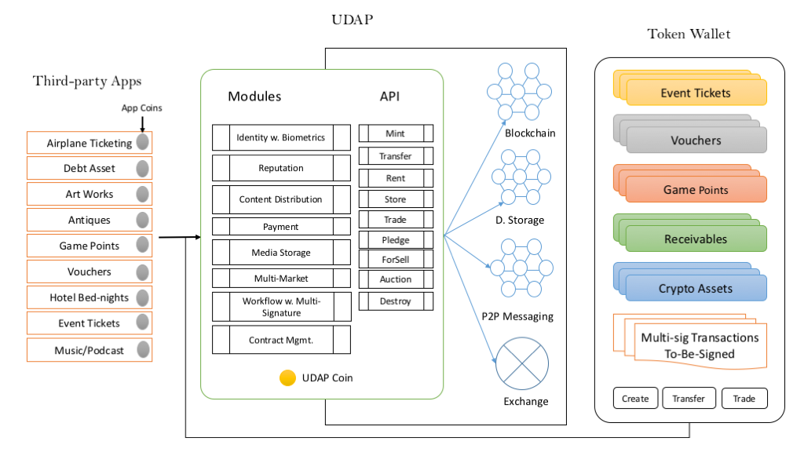
 </p>


In what we call a "Asset Oriented Programming" model, app developers take advantage of the traditional Internet application architecture and use UDAP as a layer of

1. asset tokenization;
2. transaction notarization; and
3. contract adjudication in case of dispute.

Technically UDAP provides multiple modules to speed up app development, such as:

1. **Token service**, to manage the full life-cycle of asset-backed crypto-tokens. Applications can immediately register token-based assets on chain and offer built-in marketplace to their customers.
2. **[State channels](https://www.jeffcoleman.ca/state-channels/) service**, to allow applications to conduct transactions mostly offline and secured by public blockchains, such as Ethereum. 
3. **Data obfuscation service**, to hide the ownership of assets, using *[Ring Signature](https://en.wikipedia.org/wiki/Ring_signature)* technology.
4. **Secure content distribution** for digital content assets, using *[Proxy Re-Encryption](https://en.wikipedia.org/wiki/Proxy_re-encryption)* technology. 
5. **Exchange service**, for decentralized asset trading, including app-currencies and asset tokens. 
6. **Universal wallet** for versatile mobile user interface to deal with any token-backed assets that UDAP has helped to maintain. 

UDAP implements state channel technology to solve some of the most challenging issues with developing and running Blockchain-based applications:

1. **Scalability**: blockchains only can do that much of scalability because it needs to balance between factors of decentralized security, data liveness and finality.  Using blockchain blindly as a data store and generic computing platform would not scale. State channel technology treat blockchains as the dispute adjudication layer, or court system that usually is not involved in the minute-by-minute operations, but only plays its role when contracts need to be enforced and critical assets need to be secured. 
2. **Cost**: blockchain transactions are expensive, many thousands times more expensive than centralized architectures. State channel allows transactions to run locally off blockchains, thus carries a cost model comparable to traditional Internet applications.   
3. **Privacy**: data on public blockchains is public by definition and open to any curious eyes. Some applications may choose to keep the transactions in private unless the users choose to go to public blockchains for higher level of assurance and interoperability.  Even in the case of going to blockchain, UDAP provides technology to let users control the visibility of their assets. 
4. **Responsiveness**:  dApps as most people have experience with are slow-paced and usually are an order of magnitude slower than the commercial Internet applications that people have been used to. State channels would enable blockchain supported applications to offer best possible UX together with unique features of decentralized ledgers.  

To accomplish these promises, UDAP on the backstage provides a set of smart contract (initially based on Ethereum) templates that is configured by applications before deployment and at runtime.  We believe that the automatic templating system can cover 90% of regular application use cases. 

<!-- ## Content [TOC] -->

## 2. Background

There is this movement called "Tokenizing Everything":

* Crypto tokens represent shares of right, access to services, voting power, real world financial assets, etc.
* Tokens serve as accounting units in bookkeeping and payments.
* Tokens eliminate the requirement of intermediaries in many trading scenarios thus simplify and expedite the trading process at very low cost. Fungible tokens are very easy to trade *en mass*, while none-fungible tokens can help to track the asset flow in an economy and to help people understand the dynamics of the economy.
* In short, crypto-tokens are the private money for applications.

Tokens have been used in crowdfunding a new wave of innovative applications based on blockchain and related technologies. It has disrupted the startup model based on VC funding.  On one side startups can receive funding much earlier in their product development. On the other side, everyone can invest in projects they believe in and gain the potential for investment return which used to belong to the privilege of so called "accredited investors".

Tokens are the tickets to the next wave innovations.

In the beginning, there was Bitcoin, as touted the "digital cash" system.

But adopting Bitcoin beyond crypto-currency has proved to be difficult because it is first and foremost designed to work as a fungible currency system; and lack of smart contract support has not been helpful either.

Ethereum has emerged from the crowd initially as “programmable money”, then as a general blockchain based “world computer”.

The most challenging issue posed to Ethereum is how to represent the "values" beyond currencies.  As of today, like almost all the other open ledger platforms, Ethereum is most about handling digital currency transfers, as Buterin put in one of his podcast in early 2018:

>"The very first vision was basically a general purpose platform for financial contracts. If X happens then send $5 to account Y, if Z happens send $5 to account B. That was basically what I thought Ethereum would be for"<sup>[\[4\]][vitalik-buterin]</sup>

Ethereum’s model of "asset" is primitive, as the account carries a balance only. In spite of the effort of standardizing non-fungible tokens, such as ERC721 and derivatives, there is still huge room for improvement that UDAP can contribute to. 

The three-year-old smart contract in Ethereum, though having attracted vast number of development teams to deploy applications on the platform, is far from being mature and productive:  

- Limited in language features. 
- Slow performance. The EVM is not really a modern virtual machine like JVM or V8 JavaScript engine. It’s an interpreter that parse the smart contract opcode and run the underlying supporting libraries.  The EVM is at least an order and slower than regular system programming languages. The total throughput of the blockchain is directly impacted by the slow performance of the virtual machine. There are many reasons that faster and mature virtual machines cannot be used in the current version of Ethereum.  A lot of efforts have been made in development to enhance the performance of the virtual machine.
- Large attack surface. The general purpose computing power in the  current version of EVM has rendered itself vulnerable to many security breaches, as documented by Making Smart Contract Smarter<sup>[\[5\]][making-smart-contract-smarter]</sup>. It's very hard for relatively inexperienced programmers to get any smart contract beyond "Hello world!" right. Considering the smart contract are handling millions of dollars of assets, customers would take a huge risk in moving forward with a strategy centered on smart contracts.

If we can draw some analogies between web application development and blockchain application development, smart contract is to blockchain development what CGI is to web app development. 

Everything is rather young.

## 3. The Goals

Our ultimate goal is to build the Internet of Assets. Its value proposition has a clear boundary, and includes the following concrete deliverables:

1)  Develop an asset protocol through understanding the "assets" in our world from a blockchain perspective, and create abstraction of the general behaviors of assets; Define convenient APIs for traditional vertical applications to integrate with blockchains, which would not require application developers to have a deep understanding of blockchain and decentralization technologies.

2)  Provide a reference implementation of UDAP protocol, on top of Ethereum initially. We abstract the most central part of decentralized computing, decentralized storage technology and decentralized messaging mechanism into a concise and effective API. 

3) Implement a Universal Asset Wallet(UAW) for end-users. The UAW will capture the most useful interaction patterns with assets that allows users to store, copy, transfer, sell/buy, and trade a variety of assets deposit from third party applications in one place. Such a design for third-party application development, in fact, is a very favorable news, because the third-party platforms can focus on the current core business logic without having to figure out how to build their own assets blockchain and user Interaction.

4) Engage cloud service partners to offer Asset Blockchain as a Service (ABaaS) so that organizations can easily create their own private or consortium asset chains that can connect to the UDAP public chain for value exchange.

5) Build a global C2C marketplace to enable asset trading and exchange without intermediaries.

6) Support business to transform to token economy as a technology enabler through
 - a highly scalable architecture that allows for linear scalability and supports thousands of applications and near one-second response with finality, with a total throughput of 10k~100k TPS.
 - an end-to-end privacy protection mechanism that may handle highly sensitive asset information for their customers.
 - a unique security model to reduce attack surface.


## 4. Value Proposition

For app developers:

1) Great decentralized features without investing heavily in underlying technologies.  
2) Fast, cheap and secure integration with public blockchains, without specific lock-in. 
3) Great user experience with the UDAP wallet. 
4) App-economy with in-app currency and asset tokenization and trading capability.

For public chain vendors:

1) Great tool to attract developers to build new applications.
2) Easier integration with "legacy" Internet applications. 
3) Less burden in supporting developers. 


## 5.  Asset Protocol
A protocol is a specification of and a normative guide to the exchange and communication of information between and within systems. UDAP's asset protocol regulates how asset are presented, stored, communicated and interacted on the blockchain, how authenticity of assets is verified, and how consensus is reached.

The following diagram demonstrates how an application is integrated with Ethereum through UDAP. 

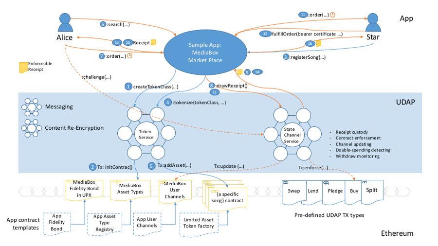

In the middle of the diagram is the UDAP layer, which offers asset model implemented in pre-built contracts. On top of that it offers token service and state channels for managing application assets efficiently and securely at low cost.  

We start with the asset account model. We present two lines of asset models, based on ERC721 and UDAP Singular respectively.

#### 5.1.  On-Chain Asset Model, based on ERC721

Traditional ERP systems have established their asset models based on centralized storage and computation. The asset model is an abstraction of the assets created by their issuers, which governs how the systems manage the attributes, operations, and security of assets. Unlike traditional ERPs, UDAP's asset model focuses on an on-chain standardization of the description, interaction, security, privacy, and authenticity of assets.

> Why assets need to be tracked and managed on the blockchain? In general, Crypto assets have the following advantages over digital assets (in this case, traditional ERP-managed assets):
>
1) Clear ownership: The rights and interests of asset issuers, asset owners and transaction signers can all be clearly defined and cryptographically protected. Asset owners can easily provide irrefutable proof of their rights and interests; without the consent of the transaction signers, the assets can not be exchanged and traded on the blockchain; meanwhile, asset issuers have the rights to determine some of the basic attributes of the assets, for example, an asset issuer can restrict the transfer and trading of assets.
>
2) Information Permanence: Digital assets requires a permanent storage to manage their lifecycle. The advent of blockchain and decentralized storage finally gives us confidence that we can save information for a long time.
>
3) Anti-counterfeiting and anti-tampering: Once the assets are on the chain, the relevant data and transaction records can be effectively protected. Anti-counterfeiting and anti-tampering goals can be achieved, and thus moral hazard and financial risks can be reduced.
>
>4) Liquidity Demand: The relationship between value and liquidity is inextricably correlated. Liquidity is the term used to describe how easy it is to convert assets to cash. The more liquid the assets are, the easier their values are to be recognized. So liquidity has a very important influence on asset's value. Money, as medium of exchange, has a very high liquidity. In facet, it is the most liquid asset compared to everything else. Assets with fair liquidity includes cash equivalents such as stocks, bonds and options. And assets such as houses, cars, or farms, factory equipment, etc., have relatively low liquidity and are difficult to value. Therefore, their market values may differ significantly. Traditionally, liquidity and value realization are implemented through intermediaries like eBay and Taobao, however, through tokenization blockchain has more potential on liquidity optimization.
>
>
In addition to the above requirements, privacy is also a mandatory need that crypto assets must meet.

Most of the so-called crypto assets in current blockchain world are aimed at a special kind of fungible assets, that is, crypto-currency. Blockchain-based application protocols or platforms are mainly to facilitate the creation, distribution and exchange of crypto assets. Protocols that govern crypto-currencies include ERC20 and some of its simple extensions. For example, one famous third-party trading protocol for fungible assets is 0x protocol. This protocol assumes that digital currencies have been fully distributed among different owners, and that the problem this protocol addresses is to become a decentralized digital asset trading venue, especially for transactions between fungible assets.

Various efforts have been put on standardization and specifications of non-fungible assets, such as ERC721 protocol, which was implemented in the popular CryptoKitties game and its various clones.

UDAP defines a conceptual model based on the analysis and abstraction of various real-world assets in combination with efforts and achievements by MediaChain<sup>[\[9\]][mediachain]</sup>, Digix<sup>[\[10\]][digix]</sup>, BankEx<sup>[\[11\]][bankex]</sup> and other blockchain projects<sup>[\[12\]][the-building-blocks-of-digital-asset-management-interoperability]</sup><sup>[\[13\]][adopting-blockchain-for-enterprise-asset-management]</sup>:

<p align="middle">
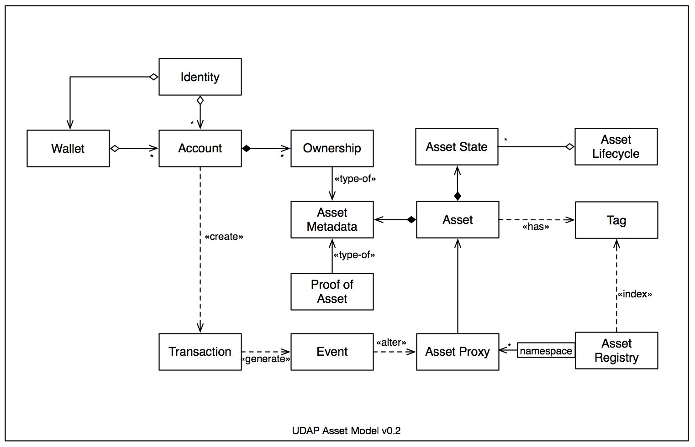
</p>

This on-chain asset model defines assets and related objects, as well as the relationships between these objects. This asset model is compatible with ERC721 but offers a richer set of attributes and operations as described below.

###### 5.1.1 Asset

Anything that is capable of being owned or controlled to produce value, is considered asset. For example, goods, services, trademarks, securities, warehouse receipts, purchase agreements, licenses, copyrights, music, videos, games, loyalty program points, game equipment, event tickets, collectibles and other physical assets and digital assets. Currency (including cryptocurrencies) is also an asset. When you see "asset" in the white paper of a blockchain project, it most likely refers to cryptocurrency.

Assets have attributes. Some common attributes, for example, asset identifier, namespace, issuer, fungibility, transferability, etc., are determined by asset issuers and can not be modified after assets are issued. Other attributes, such as name, description, owner, and states, can be modified during the life cycle of assets. Based on the fungibility of assets, UDAP presents a hierarchical model as described in the following diagram, which defines a standard interface, an abstract type that provides basic attributes and operations, and multiple derived asset types.

<p align="middle">
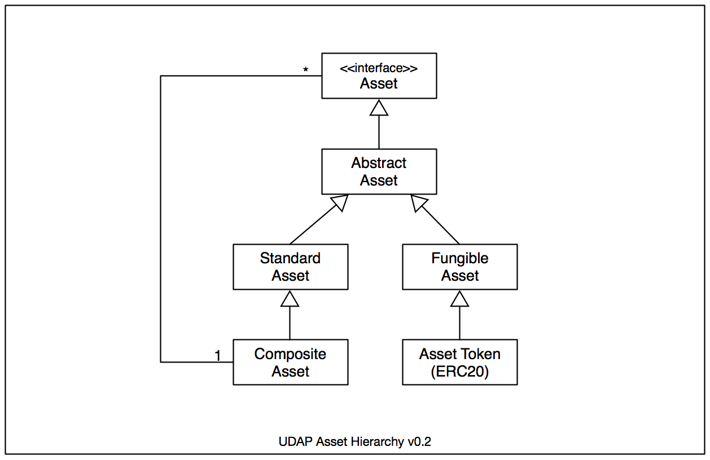
</p>

The UDAP asset protocol itself does not specify any implementation details, however, to better describe the model Solidity is used to illustrate the components and their relationships. We may use a more implementation-neutral interface description language to describe the component model in a later version of the protocol.

```
contract Asset is ERC721 {
  event AssetCreated(address indexed _asset, uint indexed _id);
  event AssetTransferred(address indexed _to, uint indexed _id);
  event AssetDestroyed(uint indexed _assetId);

  function id() public view returns (uint);
  function issuer() public view returns (address);
  function owner() public view returns (address);
  function namespace() public view returns (bytes);
  function transferrable() public view returns (bool);
  function fungible() public view returns (bool);
  function metadataHash() public view returns (bytes);

  function transfer(address _to) public;
  function destroy() public;
}
```
The asset component described in the component model have the following attributes:

* Asset Issuer

  An asset issuer in UDAP refers to the address of a UDAP account that issues and registers assets on asset blockchains. This is a immutable attribute.

* Asset Owner

  An asset owner refers to the address of a UDAP account that owns crypto assets registered on the asset blockchains.

* Fungibility

 Fungibility refers to interchangeability of assets with the same amount and of the same type. Based on asset fungibility, assets are usually classified into two categories: that can be replaced and that can not be replaced. In the asset model, the two types correspond to FungibleAsset and StandardAsset, respectively. An non-interchangeable asset means that although both individual assets have similar attributes and external behaviors, their possession is not replaceable for a particular owner because they have different identities. This is analogous to the fact that although both have iPhones, there is no substitute between an iPhone and another iPhone because each iPhone has its own unique attributes that make it disappear if the iPhone is switched. Each iPhone has its own unique phone number and a unique purchase time, so between the two iPhone they are not interchangeable with each other, at least in most cases.

 In the physical world, there are a large number of assets that can not be easily interchanged. For example, most of the real estate properties can not be replaced during the transaction. Other examples include financial assets such as stocks and debts, which are non-fungible assets in many business scenarios.

 The most common of what we call fungible assets is money or digital currency (AssetToken in UDAP term, which is also an ERC20 token). In most cases, one hundred dollar bill is completely equal to and replaceable with another one hundred dollar bill because the main purpose of using one hundred dollar bill is to use one of its most prominent attributes, medium of exchange. Although each bill has some special attributes, such as its unique serial number printed on the the paper bill, it has no specific significance or influence in most cases. Therefore the two hundred-dollar-bills are completely replaceable. Another example of fungible assets is commercial goods, such as apples in a warehouse. Although apples have some special attributes, such as origin, variety, grade, size, color, etc, however, when we say that we have 600 tons of Yantai-produced first class Red Fuji apples with a size of 85mm, these 600-tonne apples are traded as fungible assets because the 600-tonne apples are classified as one group according to industry specific standard. There is no difference to the buyers in the trade.

 One special type of non-fungible assets, which is referred as CompositeAsset in the asset hierarchical model, is composite asset or asset portfolio. This type of assets typically contains a number of other assets, for example, asset portfolio in the financial sector, warehouse receipts in the supply chain, and many asset bundles that require the packaging of different assets as a whole for trading. Below is the definition of the interface.

 ```
 contract CompositeAsset is StandardAsset {
   function getAmount() public returns (uint);
   function getAsset(uint idx) public returns (address);
 }
 ```

* Transferability

  The transferability of assets determines whether an asset can be transferred to other institutions or individuals after being issued. Transfer of asset can be done either by direct sale or through exchange. If an asset is not transferrable, then its ownership cannot be changed.

* Resellability

  Resellability is a special attribute that asset issuers can use to restrict the resale of assets. Although in most scenarios assets are re-sellable, in certain special cases, such as shopping vouchers, issuers can restrict the resale of vouchers. In this way, the vouchers can not be transferred or sold after the vouchers have been issued to them, thus limiting the circulation of such assets in the secondary market and ensuring that such assets are available only to recipients designated by the issuer.

* Namespace

  An asset namespace refers to the naming rules for asset classification and grouping so as to facilitate the distinction between different assets. Namespaces are commonly structured as hierarchies to allow reuse of names in different contexts, for example, a warehouse receipt can be identified via udap://xinong/wr/WR-12345678, where "xinong" is the registered app name (or chain name), "/wr/WR-12345678" is the namespace id given by the app (or chain) to identify a warehouse receipt coded as WR-12345678.

* Asset Identifier（AID）

  Asset identifiers are unique identification codes set by the UDAP platform for assets and are automatically created for each asset during asset registration process by a standard algorithm as follows:

  ```
  AID = uint(keccak256(issuer_address, namespace, metadata_multihash))
  ```
  This algorithm generates a unique AID for an asset with its issuer's account address, its namespace, and the hash value of the asset metadata description file in IPLD<sup>[\[14\]][ipld]</sup> or JSON-LD<sup>[\[15\]][json-ld]</sup> format. Once AID is generated for an asset, it cannot be modified anymore. Assets issued by different asset issuers, or assets issued by the same asset issuer but with different namespace id, or different asset metadata descriptions, will always have different AIDs.

* Metadata MultiHash

  It refers to the content-addressable MultiHash value that is generated from asset metadata to uniquely address the asset's metadata. See 5.1.2 for details about asset metadata.

* Other Attributes

  In addition to the above attributes that usually can not be changed once identified, assets also have mutable attributes that can be updated after issuance, such as the amount of fungible assets (e.g., 1 kg of gold, or 500 tones of apples), the state of the asset (leased, unused, listed, etc.), ownership, proof of assets, description, etc.

###### 5.1.2 Asset MetaData

Metadata is commonly referred to as "data about data." In UDAP asset metadata refers to the descriptive information applied to assets and is defined by asset issuers. The structure and meanings of these metadata are known to asset issuers and the associated applications. In UDAP, asset metadata is presented as JSON data in conformity with JSON-LD specification, and is stored off-chain, while on-chain crypto assets must hold Multihash values of their off-chain metadata. Smart contracts can obtain the multihash value through the metadataHash() method to address and retrieve the related asset metadata.

````
  function metadataHash() public view returns (bytes);
````
> JSON-LD, or JavaScript Object Notation for Linked Data, describes how linked data is represented in JSON as a directed graph, and how to represent interlinked and non-interlinked data in a single document. For example, metadata about a recipe asset can be recorded in JSON-LD format (shown below) and published to IPFS or other P2P storage. Typically, asset metadata can be encrypted before posted to P2P storage to enforce data privacy.

````
{
   "name": "Mojito",
   "ingredient": [
     "12 fresh mint leaves",
     "1/2 lime, juiced with pulp",
     "1 tablespoons white sugar",
     "1 cup ice cubes",
     "2 fluid ounces white rum",
     "1/2 cup club soda"
    ],
   "yield": "1 cocktail",
   "instructions": [
      {
        "step": 1,
        "description": "Crush lime juice, mint and sugar together in glass."
      },
      {
        "step": 2,
        "description": "Fill glass to top with ice cubes."
      },
      {
        "step": 3,
        "description": "Pour white rum over ice."
      },
      {
        "step": 4,
        "description": "Fill the rest of glass with club soda, stir."
      },
      {
        "step": 5,
        "description": "Garnish with a lime wedge."
      }
   ]
}
````
> The above metadata can be recorded as a merkle-link on the blockchain so that applications can address through merkle-link to obtain the relevant off-chain asset metadata.

```
{"md",{"/","QmdnuRNwdmZzHfHVUMVHZFXKXAe6DjvBvPdKy27HpJUN9H"}}
```

> UDAP adopts a simple method to record only the multihash value on the blockchain which points to the off-chain metadata. The specification defines how to obtain content-addressed objects through the hash value.

```
{"metadataHash","QmdnuRNwdmZzHfHVUMVHZFXKXAe6DjvBvPdKy27HpJUN9H"}
```

>Usually applications need to address each item of metadata to obtain the resolution of the related data. Therefore, the content-addressable network data model is used to address the asset metadata through the merkle-path. For example, IPFS DAG's javascript interface (ipfs.dag.put) can be used to upload metadata of the recipe asset to the IPFS so that each metadata item is available by invoking "ipfs.dag.get".

>Metadata on IPFS as DAG node:
```javascript
  ipfs.dag.put(metadata, { format: 'dag-cbor', hashAlg: 'sha3-512' },
    (err, cid) => {
      console.log(cid.toBaseEncodedString())
    // zdpuAz4HbUHTKQbdpnn42Zo4GUsU7yrBpvb2W9BF2NwvBaLn6
  })；
```
>DAG node through merkle-path:
```javascript
 ipfs.dag.get('zdpuAz4HbUHTKQbdpnn42Zo4GUsU7yrBpvb2W9BF2NwvBaLn6/name',
  (err,result)=>{
    if (err) {
      console.error('error:'+ err);
    }
    else {
      console.log(result.value);
    }
 });
```

###### 5.1.3 Ownership

The ownership of an asset is a type of asset metadata that tracks who owns an asset. An asset can have multiple owners. The ownership of assets can be changed over their lifecycle, for example, when an asset is transferred to another person from current owner, the ownership of this asset is changed. In UDAP asset protocol, while asset ownership belongs to a type of metadata, UDAP manages asset ownership as an independent attribute that can be tracked by a smart contract defined as follows:

```
contract Ownership {
  function ownerOf(address asset) public view returns (address);
  function ownerOf(address asset, uint asOf) public view returns (address);
}
```

The above interface gives the caller the capability of obtaining current owner account of an asset as well as the owner account as of a given time in the past.

###### 5.1.4 Asset State and Lifecycle

Asset states can be used to accurately track assets at a detailed level. In addition to a few pre-defined asset states such as CREATED, TRANSFERRED, PLEDGED, LEASED, applications can define and name their own states according to business needs and record asset states on the blockchain via UDAP.

The life cycle of an asset refers to asset state at different points in time. One of the main functions of UDAP is to provide asset lifecycle management APIs on the blockchain that allows applications to track the entire lifecycle of assets from issuance to destruction to meet various business needs.

Asset lifecycle can be represented with a smart contract as follows:

```
contract Lifecycle {
  // returns current state of a given asset
  function stateOf(address asset) public view returns (bytes32);
  // returns the state of asset at given asOf time
  function stateOf(address asset, uint asOf) public view returns (bytes32);
}
```

###### 5.1.5 Proof of Asset

Proof of Asset (PoA) is an important concept of the UDAP asset model. It is one of the key elements in determining the authenticity of assets. It is also a type of asset metadata in the UDAP asset model, represented as an array of JSON objects in JSON-LD or IPLD format. Each of the JSON objects defines a proof including name, description, and a content-addressable linkHash value of the "proof". The "linkHash" represents a MultiHash value that can pinpoint this proof, which may be a digitally signed PDF file or a scanned shopping receipt. Proofs are stored off-chain and can be obtained through the metadata's merkle-path.

```
"proofs":[
  {
    "name":"Storage Contract",
    "description":"Storage contract for warehouse receipt #123456",
    "linkHash":"QmWwr4ZfeLJfbWNAuCQfefwo1aHtxC5yjyU8C5WG4DYrYe"
  }，
  {
    "name":"Purchase Receipt",
    "description": "Purchase receipt for warehouse receipt #123456",
    "linkHash" :"QmXF4LR4QkuRVh3WQbB56seTX2aPm3Tz7b4Y8heoLAiTkk"
  }
]
```

Proof of Asset is an optional but important attribute of crypto assets. Usually asset buyers will require some sort of proofs, however, without a proof an asset can still be traded or exchanged on the market. More discussions about Proof of Asset can be found in 5.3.

Proof of Asset may have different forms in different user cases. For example, in the supply chain warehouse environment, a warehouse receipt is a proof to demonstrate the authenticity of the assets. Other relevant proofs include purchase agreement, storage contract, third-party certificates, etc. Who owns the warehouse receipt owns the rights of goods stored in the warehouse; in the manufacturing sector, manufacturers can use RFID tags or two-dimensional bar codes to uniquely identify their products. In this case, RFID of a product is a proof that demonstrates the authenticity of this product. As such, proofs are data defined and provided by crypto asset issuers to prove the authenticity of assets that can be either numbers or files or images, all in JSON-LD format.

###### 5.1.6 Tags

Asset tags are keywords or labels that are attached to assets to facilitate identification, classification, retrieval, and inventory control of assets. Multiple tags can be given to an asset by its issuer or owner. Asset tags enable applications in a variety of industries to track and monitor valuable assets.

###### 5.1.7 Asset Registry

An asset registry maintains a bi-directional binding between crypto assets and real-world assets on the blockchain. All assets posted to the UDAP blockchains need to be recorded in the asset registry by its issuer. At the same time, the asset registry also maintains a number of different data structures and indexes to simplify search and retrieval of assets. Different institutions or applications have their own proprietary registry of assets. Asset issuers can broadcast their assets across the entire network or just to some designated addresses, so that a proprietary registry has access to assets registered in other registries via listeners. For example, landlords can post rental information on multiple rental sites simultaneously, and sellers can initiate auctions on both Site A and Site E. When an asset on Chain A is transferred to an address on Chain B, UDAP must ensure the removal of this asset from the registry of Chain A, and the addition of this asset to the registry of Chain B.

###### 5.1.8 Account, Wallet, and Identity

Accounts are users' address on the blockchain. A user may have multiple accounts, while an account may have multiple assets. An asset may be associated with multiple accounts. For example, an asset can have multiple owners, an issuer, and multiple signatories. An account can also play different roles in different trading scenarios, e.g., asset issuer, asset owner, or transaction signer.

> Asset signatory refers to the account that signature of transactions is required before trading the asset on the UDAP blockchains.

An asset wallet, similar to a safe or a deposit box, is a universal wallet provided by UDAP to allows tracking and management of assets associated to a user's account. An asset wallet can manage multiple accounts, each associated with multiple assets on the blockchain.

Identity refers to the user's personal or social information, for example, ID card, Facebook account, e-mail address, phone number and other information that can represent the user's identity. Blockchain accounts are anonymous, but in some scenarios users have to provide proof of identity to complete the regulatory requirements for KYC and AML. UDAP, in conjunction with a self-governed third-party identity management system such as uPort, provides the application with a mapping of identities to UDAP accounts and asset wallets.

###### 5.1.9 Transactions and Events

Transactions refers to any operation on the assets on the UDAP blockchain. For example, issuance, exchange, ownership change, minting, recasting, pledge, approval and so on are all transactions. When a user initiates a transaction on the UDAP blockchain, the UDAP generates relevant events and broadcasts to relevant listeners, who are responsible for processing the transaction.

#### 5.2. The Singular Asset Account Model

The "tokenizing everything" movement essentially deals with so called "Non-Fungible" asset tokens. There have been some work done in Ethereum to standardize the representation of such assets. The one that has got most attention is [ERC 721](http://erc721.org/).

ERC721 has gained mild success in adoption, mainly for categorized none-fungible assets such as virtual assets in gaming.  In fact some of the underlying asset manage capability of UDAP middle layer will be based on ERC721 or its derivatives. 

ERC721 has a few issues and limitations:

1. It’s a collection first all, with each element bearing an uint256 ID. There is no concrete object for each of the element.  It’s up to the implementation to maintain a separate data structure to materialize the otherwise a simple number. The token in ERC721 does not have a home. It's just an index into a hashmap. We’d say ERC721 is very weak in expressing an element of token.  
2. The addressing of elements is composed of  Therefore the absolute address for a specific token is something like: `{ethereum network id}.{contract address}.{token id}.` We think it can be shorter. 
3. The API looks complicated since most of the API functions deal with a single token, and the ID of the token has to be specified each time the API is invoked, such as:

```javascript
balanceOf(address _owner);
ownerOf(uint256 _tokenId);
safeTransferFrom(address _from, address _to, uint256 _tokenId, bytes data);
safeTransferFrom(address _from, address _to, uint256 _tokenId);
transferFrom(address _from, address _to, uint256 _tokenId);
approve(address _approved, uint256 _tokenId);
setApprovalForAll(address _operator, bool _approved);
isApprovedForAll(address _owner, address _operator);
```

4. It offers no api to find out all the tokens owned by a specific person. A separate indexing service is required for enumerating a person’s asset. 
5. And all the variants of `transferFrom(...)`s require a handy manual to remind developers of there meanings and nuances.  
6. It tried to be ERC20 compatible, but semantically some of the ERC20 functions do not carry the same meaning for none-fungibles, such as:

```
balanceOf(...)
approve(...)
transferFrom(...)
```

7. It does not allow setting operator on individual item. It has to be all or none, therefore lacking fine control of delegated ownership. In fact adding the operator feature to the protocol has made it unnecessarily bloated. It should separate the concerns.  
8. It has to deal with receivers of either EOA type or contract type.  Although the contract receiver may reject the ownership transfer, EOAs do not have such options. 
9. No natural type safely for element tokens.  Since each element is just an index number, there is no type information about it directly.  A separate array list must be maintained to keep  type information.  Working with the multiple arrays are awkward. 

##### 5.2.1 Goals of Singular

UDAP has the vision that 
> every single thing in the world should have a unique account on the blockchain.

In UDAP we are proposing a new account model specifically to represent a single unique asset in a very expressive way. We want to achieve the following goals when designing the model:

1. Dealing with single asset token is very intuitive. 
2. The API must be clean, simple without ambiguity.
3. There should be strong type safety. 
4. Properties of the token can be made as static as possible. 
5. Wallet API should be made very simple.
6. It should support using an operator to control the ownership transfer on the real owner’s behalf. 
7. It should support a time-lock mechanism that offer a guarantee of ownership to the receiver within a defined period of time. 
8. It should support simple atomic token swap between two tokens owned by different accounts. 
9. The token should work with state channel mechanisms, which is very important for scalable applications.

##### 5.2.2. Designs

We call our basic asset contract `Singular` and the design decisions are:

1. A piece of asset is uniquely associated with a smart contract account. As a result, the full token identification is the account address, such as `/eth-chain-id/0xa1a1a1a1a1a1a1a1a1a1a1a1a1a1a1a1a1a1a1a1`. The account is the **home** for the asset. People can easily scan the information about this token thru public services like [Etherscan](http://etherscan.io/).
2. The owner of the `Singular` token must be another smart contract account, named `OwnerOfSingulars`. There is no direct way for EOAs to own `Singular` tokens. This design is largely in the same direction of Ethereum’s [account abstraction model](https://github.com/ethereum/EIPs/issues/859) ([discussion](https://ethresear.ch/t/tradeoffs-in-account-abstraction-proposals/263))that might be deployed in a future version of Ethereum. 
3. It should support `push` ownership transfer and `pull` ownership transfer patterns. In so called one-step transfer, the current owner can pass an offer of the token ownership to the receiver account and the receiver account can choose to accept or reject the offer *in the same transaction*. In a two-step ownership transfer, however, the current owner reserves the token for the next owner in a transaction. The address of the token is passed to the receiver out-of-band. The receiver issues a separate transaction to accept the offer, once it determines that the offer is in its interest. 
4. Operators. The `OwnerOfSingulars` account can assign operators to help with ownership transfers. Having an operator to manage the asset token on the owner’s behalf is a pattern that has been accepted by some other proposals, such as ERC721 and ERC777.  People have found it convenient in handling token trading. The current token owner can appoint an operator for the *next* ownership change. But setting the operators on the token directly is polluting the token interface. 
5. Timelock. When an owner make an offer of ownership to someone else by calling the `approveReceiver()` function, there is a required argument for expiry time, during which period the receiver can take the ownership at will by invoking `accept(...)`on the token, which will in turn send a notification to the previous owner for it to any state update it wants, or even chain to another action. A critical design is that the owner cannot change his mind during the offer period. This is essentially a time-lock for the transaction. In contrast, neither ERC20 nor ERC721 or any of their derivatives offers built-in time-locks for ownership trading. 
6. A feature is under consideration to provide for fast token swap between two accounts with a hashlock:

```
// offer from Alice: 
    AliceToken.offerToSwap(BobToken, hashLock);
// Bob takes offer:
    BobToken.swap(AliceToken, hashLock);
```

Here is the interface definition for Singular:

```javascript
pragma solidity ^0.4.24;
import "./OwnerOfSingulars.sol";
interface Singular {
    /**
     * When the current owner has approved someone else as the next owner, subject
     * to acceptance or rejection. 
     */
    event Approved(address from, address to, uint expiry);
    /**
     * the ownership has been successfully transfered from A to B.
     */
    event Transferred(address from, address to, uint when, bytes32 note);

    /** 
     * get the current owner
     */
    function currentOwner() view external returns (OwnerOfSingulars);
    
    /**
     * There can only be one approved receiver at a given time. This receiver cannot
     * be changed before the expiry time.
     * Can only be called by the token owner (in the form of OwnerOfSingulars account or 
     * the naked account address associated with the current owner) or an approved operator.
     * @param to address to be approved for the given token ID
     * @param expiry the deadline for the receiver to the take the ownership
     * @param reason the reason for the transfer
     */
    function approveReceiver(OwnerOfSingulars to, uint expiry, bytes32 reason) external;

    /**
     * The approved account takes the ownership of this token. The caller must have
     * been set as the next owner of this token previously in a call by the current 
     * owner to the approve() function. The expiry time must be in the future
     * as of now. This function MUST call the sent() method on the original owner. 
     */
    function accept() external;
  
    /**
     * reject an offer. Must be called by the approved next owner(from the address 
     * of the OwnerOfSingulars or OwnerOfSingulars.ownerAddress()). 
     */
    function reject() external;
  
    /**
     * to send this token synchronously to an AssetOwner. It must call approveReceiver
     * first and invoke the "offer" function on the other AssetOwner. Setting the
     * current owner directly is not allowed.
     */ 
    function sendTo(OwnerOfSingulars to, bytes32 reason) external;
  

/// ownership history enumeration

    /**
     * To get the number of ownership changes of this token. 
     * @return the number of ownership records. The first record is the token genesis
     * record. 
     */
    function numOfTransfers() view external returns (uint256);
    /**
     * To get a specific transfer record in the format defined by implementation.
     * @param index the index of the inquired record. It must in the range of 
     * [0, numberOfTransfers())
     */
    function getTransferAt(uint256 index) view external returns(string);
    
    /**
     * get all the transfer records in a serialized form that is defined by 
     * implementation.
     */
    function getTransferHistory() view external returns (string);

}

```
The following is the interface definition for the `OwnerOfSingulars`

```javascript
pragma solidity ^0.4.24;
import "./Singular.sol";

/**
 * A contract that binds an address (EOA/SC) to a list of Singular tokens. The 
 * owner account may not have the ability to handle the Singular tokens directly, 
 * thus they can take advantage of this contract to achieve the effect. 
 * 
 * All the tokens MUST have this account as the owner of them. It's up to the implemntation
 * to ensure the synchronization. 
 * 
 * The majority of token ownership management takes place in the `Singular` token. 
 * 
 * 
 */
interface OwnerOfSingulars {

    /**
     * get the owner address. 
     */
    function ownerAddress() view external returns(address);
    
    /**
     * to find out if an address is an authorized operator for the Singular token's 
     * ownership.
     */
    function isAuthorized(address, Singular) view external returns(bool);
    
    /** 
     * @dev invoked by Singular.accept() to notify the ownership change has completed.
     * The previous owner should remove the asset for the asset list to synchronize
     * the ownership relation with the token. 
     * @param token the token that has been sent to a receiver, which MUST be the 
     * current owner of this token.
     */
    function sent(Singular token) external returns(bool);

    /**
     * @dev to receive a token that has been assigned to the receiver as the next owner. 
     * The receiver must decide to take it or not. If this account decides to accept 
     * the offer, it MUST call the `accept()` on the token and return `true` If this account will not 
     * accept the offer, it can ignore the offer by returning `false`;
     */
    function offer(Singular token, string note) external returns(bool);

/// enumeration of the owned tokens    
    /**
     * retrieve all the Singular tokens
     */
    function getAllTokens() view external returns(Singular[]);
     
    /**
     * get the number of owned tokens
     */
    function numOfTokens() view external returns(uint256);

    /**
     * get the token at a specific index.
     */
    function getTokenAt(uint256 idx) view external returns(Singular);
 
}
```
As mentioned before, we don't want to squeeze all convenient things into the token API and make it bloated.

The operator management is such a case. The `OwnerOfSingulars::isAuthorized(address, Singular)` is a function that a `Singular` can invoke to find out if the current message sender is authorized to act on behalf of the token owner. The API give great flexibility to create sophisticated permission schemes. 

The following diagram shows how the ownership can chain mutiple contract together to form an ownership chain:

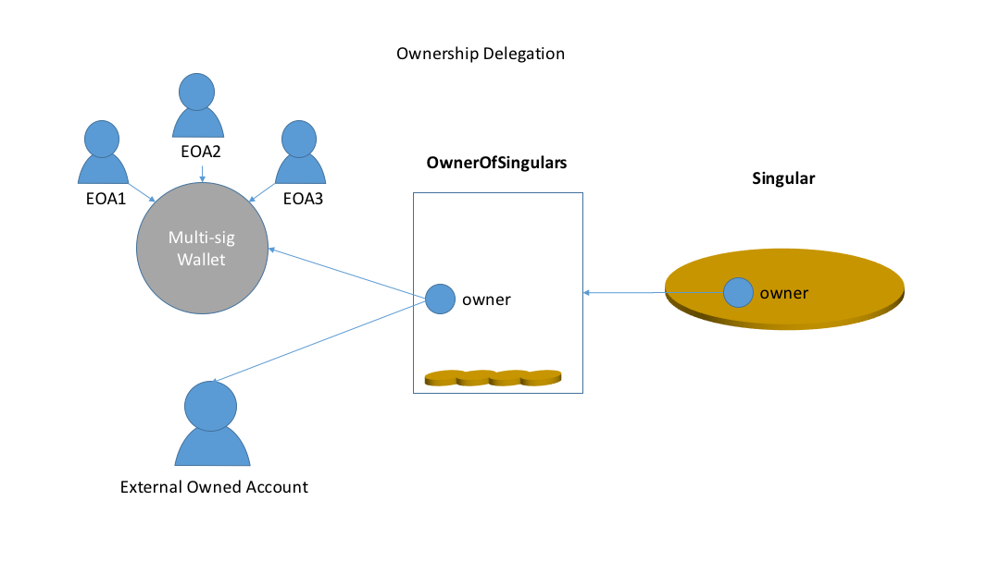
 
The owner of the `OwnerOfSingulars` can be an EOA, or any smart contracts such as a multi-sig wallet. Flexibility is all there for creative delegation schemes. 

Another interesting way to use the above interfaces is to combine the two interfaces to create a *composable* token, as shown below:

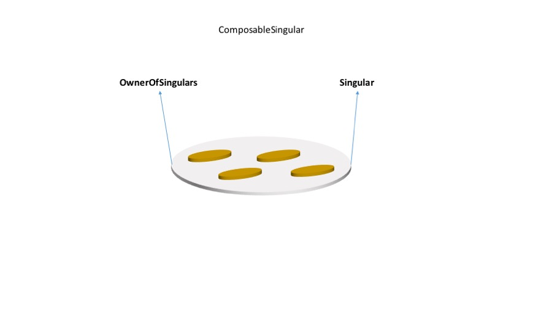

This pattern can be used to create a tree of objects that are organized by the ownerships. 

*Inter-operability with ERC721*: With some twicking, Singular can become an element of ERC721 container. Conversely, a Singular can be used to wrap an ERC721 token. More detail to be added here.  

*Wallet*: the `OwnerOfSingular` is just such as convenient place for implementing the backend of a UDAP wallet. Since all the assets are directly enumerable from this account, the API is vastly simpler than any other wallet API. 


##### 5.2.3. Security Analysis

Some Convenient Assumptions:  

- UDAP applications users do NOT control the source code of the smart contracts. 
- All the smart contracts are created and managed by UDAP operators.
- All the smart contract code will be fully open-sourced and audited before being used in production.   

Smart  contracts in general can malfunction or can be attacked by numerous ways. 

1. Most of the attacks come from inter-contract invocations, because most of the contracts do not come from a single source and may contain malicious code in the worse case or unintended side-effects.  The most problematic pattern is synchronous invocations between untrusted contracts. The untrusted contracts may not do what they are documented to do; They may not follow the exception handling logic that invokers have expected of; They sometimes can call back to the same function that they’re invoked from and cause reentrancy race-conditions. The time-order may be messed up in an indeterministic way. They may call out to other malicious code and the impact would come up to the topmost layer in the calling stack.  

2. If coded carelessly, some contracts can go into the state of being dead-locked or live-locked, resulting in the fund or asset being locked up forever. 
3. Integer overflow or underflow can happen and proper checks must be in place to prevent that. 
4. Blind type conversions/coercions may turn disastrous. 
5. Gas fee can be exhausted if multiple synchronous invocations are chained together. 
6. Funds or tokens may be sent to invalid recipients and get lost forever. 

It’s usually suggested that applications favor the `pull`  model against `push` model to avoid calling into untrusted code. In the `pull` model, transaction initiators set up proper conditions in the contract under his control in one transaction. The transaction counter-party would call into the same contract to retrieve or update some state in a separate transaction. They usually communicate offline to agree on the order of actions.  The downside of `pull` model is it requires two separate transactions and usually requires the attentions of application users by communicating offline.  The `pull` model is basically an asynchronous model that offer better safety but requires more complicated setup. 

In the `push` model, on the contrary,  the transaction initiator call out to smart contracts not under his control and probably under the counter-party’s control to complete transactions in one-step. This is a synchronous model that offers faster transaction rate and lower transaction fees, at higher risk of attack.  

Smart contracts can’t truly be trusted unless their source code is available. Just as we would inspect them line by line in real-world (meaning untrusted) business transactions, applications must meticulously inspect target smart contracts before invoking any functions on them. Unfortunately there is no standard introspections for Ethereum implementation of smart contract as of now.  We’ll need to acquire the source code (the contract documents in real world transactions) from the third parties and use the same compiler and compiler settings to generate the bytecode to compare it with the online versions. We wish that Ethereum would standardize on some mechanism for contract verification, but until that happens, we’ll have to follow some tedious steps of code verification. 

Aware of most of the vulnerabilities, UDAP has intentionally separated the applications from coding any smart contracts directly.  UDAP provides a suite of standard smart contract templates that can be configured when the applications are registered with UDAP. There are limited number of ways that those templates can be customized and all of them have been carefully designed and tested. By doing this we can eliminate most of the malicious code attacks arisen from untrusted code, and in the meantime implement the most clean and efficient transaction patterns in the simplest API. 

Take the synchronous `Singular::sendTo()` for an example.  The intentions of this function is to change the owner of a `Singular` token in one-step. When the function returns the transfer must have been completed. A naive implementation of this function might have been changing the owner state variable directly be done with it.  In fact the [Ownable](https://github.com/OpenZeppelin/openzeppelin-solidity/blob/master/contracts/ownership/Ownable.sol) interface in the Open-zeppelin library gives no other options than this. There are two issues with this simple but crude approach:
1. No respect to the recipient.  Sending tokens to receivers is like sending emails to other accounts. Most of the traffic of the current email system are attributable to spamming.  Tokens, like messages, can be of no value to some accounts. Sometimes owning something objectionable might be a liability. 
2. The receiving address may be invalid, resulting in permanent token losses. 

UDAP has designed the `Singular` to adapt to both *push* and *pull* token transfer patterns. The core is the asynchronous  `offer/accept` pattern, which is an interactive process:
1. The sender makes an offer to transfer the ownership of a token to a receiver with `approveReceiver` on the `Singular` token, with a *timed lock*.  The time lock is an 
2. The receiver, after leaning the above fact, will verify the content of the contract and the check the current state, such the current owner, the intended recipient and expiry date. More often than not, the recipient will also check the metadata associated with token before taking any further action on the offer. Once everything looks good, the recipient issues `accept()` on the `Singular`to complete the transaction. 

The following diagram shows how to transfer a token in a synchronous `push` model:
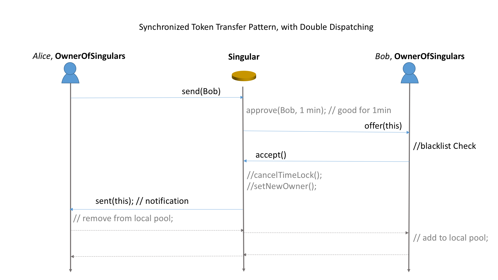

The following diagram shows how to transfer a token in an asynchronous two-step `pull` model:
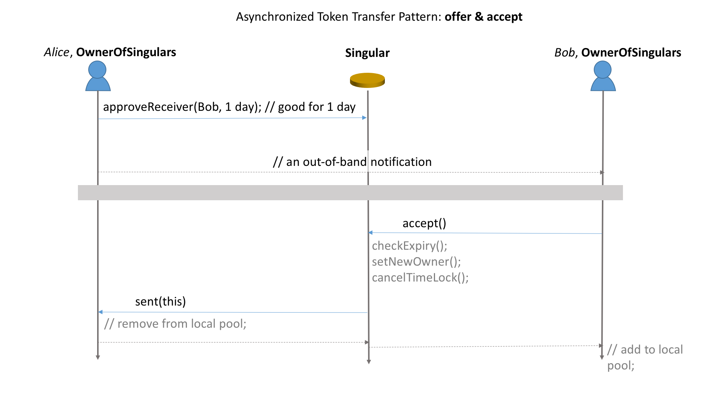

As secure as it can be, the *pull* model requires online/offline arrangement. The process is interactive and elongated sometimes.  In many situations the one-step `push`gives users the best experience, with some degree of safety.  The technique that UDAP employs is bridging the above `offer/accept`steps with a synchronous `send`method, in the following sequence:

1. `aSingular.send(Bob)`, which internally invokes:
    1. `approveReceiver(Bob 1min)`, 
    2. send a synchronous message to Bob: `Bob.offer(this)`, which internally invokes:
        1. check with blacklist/whitelist and such.
        2. Make a call back to the token: `aSingular.accept()`,  which set the owner to Bob thus conclude the transaction. 

The reason the token calls out to Bob contract (an `OwnerOfSingulars` instance) is to make sure Bob is a valid recipient and he is willing to take the offer.  

Upon careful inspection, the `push`model does not impose high risk.  As long as we make sure the ownership transfer has been properly authorized, the token is properly protected.  The best attack the recipient can mount to the token is a "griefing" attack that spends excessive gas in the `offer()` function.  This can be alleviated by 1) check the source code of the Bob contract, or 2) make sure the Bob contract has been deployed by a trusted party, such as UDAP.

**Contract verification** can be done manually (perhaps with the help of [ConsenSys Bytecode Verifier](https://github.com/ConsenSys/bytecode-verifier)) or thru third party services such as that offered by [http://etherscan.io/]. 

#### 5.3.  Tokenization Services

On top of the asset model, UDAP has defined a service model for asset operations and management.  Common services are exposed to application developers through micro-services (REST APIs and WebSockets). Unlike the traditional centralized cloud service model, UDAP provides a decentralized service architecture. In this decentralized service architecture, the API gateway and service host are a special type of miners that provide the host container for running UDAP asset services. The gateway is the entry point for third-party applications to connect to the UDAP blockchain, and is responsible for automatic routing application requests, and provides service metering capability as a basis for service charges. At the same time, the nodes that provide the service gateway and the service container are also rewarded by the network. Hosts providing asset services need to deposit a small amount of locked-in tokens and need to broadcast their identities to the UDAP blockchain. UDAP chooses the node serving the service based on the proof of the node.

###### 5.3.1 User Registration
User registration establishes the mapping between the user space in the application domain and the user space of UDAP blockchain. User accounts from different applications are completely isolated. Applications are responsible for registering their user accounts with UDAP blockchain to create a mapping. See 5.4 for more description.

###### 5.3.2 Application Registration

A UDAP-based application has either an independent asset chain (deployed and owned by application vendor) or a virtual chain sitting on top of UDAP main chain. These two deployment settings support both private/consortium and public blockchain configuration. In either case, applications need to connect to UDAP main chain and register themselves with the Application Registry on the UDAP main chain. When applications are registered, each application is given a unique App Id and a unique App Name. App Name is used as the level 0 namespace id of the managed assets. In the registration process, each application also receives an App Key and an App Secret that are used to securely connect to the UDAP main chain.

<!-- figure to illustrate two configurations-->


When application prefers a private or consortium configuration for asset lifecycle management, it can leverage UDAP's Asset Blockchain as a Service (ABaaS) to deploy a private or consortium asset chain. This UDAP-enabled permissioned blockchain is specific to this application and is by default automatically registered with the UDAP main chain. Transactions on the app chain are stored locally in a private ledger on the ABaaS managed nodes. This configuration gives the app chain the capability of broadcasting asset information to or communicating with other UDAP-enabled chains through an Inter Blockchain Communication protocol. If an application doesn't want to have an independent network, it can choose a virtual private chain configuration, where application's ledger is stored and managed on the validator nodes of on the underlying main chain.

**Note**: We will not offer private chain configuration in the near future, since we're going to run UDAP nodes on top of the public Ethereum chain or similar public chains. Private deployment might be an option further down the road. 

###### 5.3.3 Asset Registration
Assets need to be registered on the UDAP blockchain for applications to query and manage their states on the blockchain. In the meantime, applications receive asset registration information broadcast by other applications, enabling cross-application and cross-chain asset transfer and trading. Assets registration is a two-way binding process between real world assets and crypto assets. Asset metadata is identified and uploaded to off-chain P2P storage network at this stage, and a hash value of the off-chain metadata is stored and associated to the crypto assets. In this process, asset issuers need to make detailed configuration of asset attributes, for example:

-   Transferability：an asset can be either transferable or non-transferable. If an asset is not transferable, the asset is usually a warrant asset. The only meaningful operation is "delivery", which means that the warrant owner delivers to the original issuer the promised product or service.

-   Sellability：an asset can be either sellable or non-sellable, which defines the ability to be sold. If the asset is configured to be non-transferrable, the asset is essentially non-sellable.

-   Multi-signature requirements: A multiple signature (or multi-sig for short) requirement represents that a transaction requires multiple approvals from different participants. Multi-signature addresses and transactions broaden this model by creating identities on the chain which are managed collectively by multiple parties. UDAP uses “m-of-n” bitcoin-style multi-signatures, in which a multi-sig address A is defined as: Given n regular addresses, at least m of the private keys corresponding to those addresses must sign a transaction to perform an action for A.

###### 5.3.4 Tokenization

The purpose of asset tokenization is to make asset transfer and trading easier. This is a fairly frequent operation that the asset issuer completes mapping from the real world to the crypto world after registering a real asset attached to the application context to UDAP. Token issuance allows assets to be traded in part rather than as a whole. For example, a painting can be tokenized as a certain amount of tokens through what is sometimes called "tokenization" (sometimes referred to as "minting,") so that the painting can be sold to multiple owners, where each owns a portion of the rights and interests of the painting.

As seen from the UDAP asset model, tokens are fungible assets. Fungible assets are usually tokenized at the time of registration, whereas non-fungible assets are traded as a whole in most scenarios and therefore do not require the issuance of tokens. It is only necessary for issuers to mint tokens when they want to trade their assets partially.

###### 5.3.5 Asset Recast
Recasting refers to the process of burning tokens for the rights to redeem goods or services, which creates new proof of asset for the token owner. This process is usually valid for physical assets in specific scenarios. This is because tokens themselves do not necessarily have the associated attributes of physical assets and the tokens are issued by the asset owner to enhance liquidity. When the physical asset is in the custody of a third party, the tokens issued by the asset owner may not always be accepted directly by the custodian of physical assets. Therefore, in many cases, tokens can not be used to directly redeem physical assets and new crypto assets need to be generated through the process of "recasting". For example, after Alice registers her 500-tonne apple on the blockchain to form a crypto asset (crypto warehouse receipt), Alice can issue a token per tonne. Alice then transfers 100 tokens (corresponding to 100 tonnes of apples) to Bob. After Bob receives 100 tokens, he can submit the tokens to the UDAP recast contract to generate a certificate to redeem asset (e.g., bill of lading) and destroy the corresponding tokens. Then Bob can redeem goods with this bill of lading. After redemption, the related crypto assets (warehouse receipts) are automatically destroyed on the blockchain to prevent double spending.

###### 5.3.6 Multisig
Multisig is an additional security protection mechanism in the process of asset trading. It refers to the process that multiple accounts digitally sign the same transaction before it is executed. Only when required signatures are collected will the transaction be broadcast to the chain. In many scenarios multiple signatures are required to complete a specific asset operations, for example:

- Registration: For expensive assets, the application may require signatures of the designated accounts be provided at the time of asset registration in order to prove the authenticity of the asset. Auditors and witnesses are possible co-signers in this process.
- State Change: Some key state changes may need to be confirmed by multiple parties.
- Trading: Co-ownership of assets requires the signatures of multiple owners when assets are transferred or sold to a third party.
- Pledging: Pledges usually require multiple approvals to ensure authenticity of assets, accuracy of price, and security of transaction.
- Asset freeze (冻结): The asset freeze may require the signature of the court and the parties involved.
- Asset write-off (核销): This operation usually requires the approvals from multiple supervisors. For example, reimbursement process requires the signatures of direct managers and CFO to complete expense reimbursement.


###### 5.3.7 Base Coin Issuance

App chains may need to issue their own tokens as utility tokens for users to use their services or as base coins for pricing managed assets. For example, if a person wants to use event ticketing application to sell an event ticket, he may need to price the ticket with the base coin and pay the service fee with the base coin. UDAP supports application to issue base coins just like Ethereum supports Dapps to issue ERC20 tokens. As base coins are also assets, they can be traded against UDAP token (UP) or other application-specific tokens through an exchange.

###### 5.3.8 Other Asset Services

In addition to the basic services described above, UDAP provides the following services:

- transfer
- rent
- buy and sell
- C2C trade
- pledge
- auction
- escrow
- redemption and destruction

#### 5.4. State Channels Service

Let's use the perfect definition of [State Channels by Jeff Coleman](https://www.jeffcoleman.ca/state-channels/)

>The basic components of a state channel are very simple:
>
>1. Part of the blockchain state is locked via multisignature or some sort of smart contract, so that a specific set of participants must completely agree with each other to update it.
>2. Participants update the state amongst themselves by constructing and signing transactions that could be submitted to the blockchain, but instead are merely held onto for now. Each new update "trumps" previous updates.
>3. Finally, participants submit the state back to the blockchain, which closes the state channel and unlocks the state again (usually in a different configuration than it started with).


A typical Internet application is composed of multiple user account which contains the user assets defined in the scope of the application. 

The state channels terms, those accounts are state channels. An application's state is the sum of each user/app state channels. 

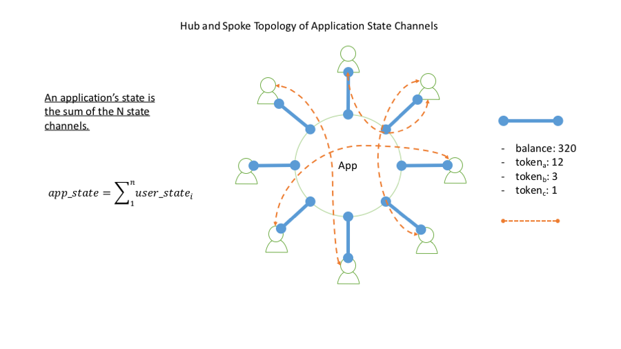

UDAP provides smart contract templates that are deployed, on demand, to the blockchain once a new user is registered with an application. These processes are managed by the UDAP nodes. App developers do not be concerned with the detail. The following diagram shows the relationships:

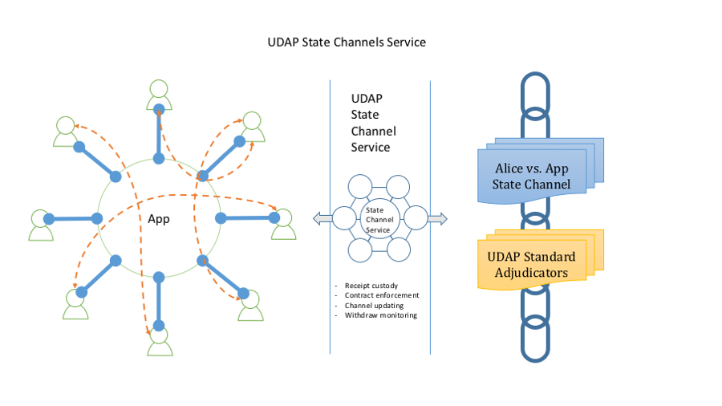

The channel service provides services in:
* Receipt custody
* Contract enforcement
* Channel updating
* Withdraw monitoring

Think of it as the legal service for corporations. On daily basis a commercial company does not involve lawyers for regular transactions. The lawyer prepares standard, enforcible business contracts to establish the business processes, but they don't get into the detail of each transactions, until a customer/business partner has problem executing the contract. In a dispute situation, lawyers would help to collect evidence and present in the court of law. In the world of blockchain, the court of law is the root blockchain, and in our case, would be the Ethereum chain. The difference between a court and a blockchain is that a court requires a judge to make arbitration and police to enforce the verdict, whereas on the blockchains, the smart contract can be made as the adjudicator and enforcer both at the same time, a tremendous value at a very reasonable price. 

Writing enforcible contract is a delicate job. UDAP contract templates handle that, as shown below:

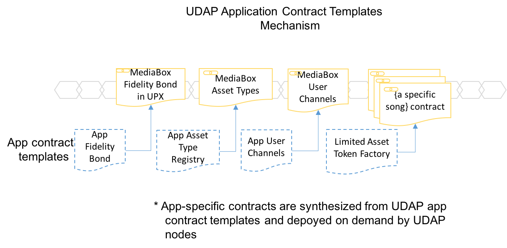 
The application is named Mediabox and contracts are code-generated from pre-built templates and deployed on demand. 

The major contribution of UDAP to app developers is that UDAP gives them the scalable technologies wrapped in simple API, such as `registerApp()`, `registerUser()` and `registerAsset()`. 
 

#### 5.5. Counterparty Risk and Proof of Asset

All the tokens on the UDAP chain are tied to assets. Tokens and assets are the counterparties of the bonding. Since we are dealing with real world situations, anything can happen to the assets without being noticed by the token system. This is the counterparty risk.

UDAP assumes a few basic principles about the authenticity of assets, the counterparty of the token system:

- Authenticity is not provided by the UDAP protocol.
- Authenticity is only valuable in its application context.
- The authority and authenticity of assets can be confirmed through a mechanism that is considered to be reliable and adequate by specific applications.

UDAP is a distributed system. It does not have a single operating entity to verify the authenticity of assets. While asset verification may be done in a distributed and decentralized manner, UDAP currently does not design such mechanism.

However, if a person claims a crypto asset that he owns on the UDAP network is backed by a real-world asset, how could he prove this claim? UDAP proposes following schemes and all the primitives are supported by UDAP:

1）Proofs of Asset

Under normal circumstances anyone can issue assets on the blockchain via an app. At the time of asset issuance, the issuer has to provide a detailed description about the asset in the form of texts, images and other media. The issuer may also present some real-world confirmation of the asset, for example, a certificate of property, an impartial letter, a warehouse receipt, a purchase receipt, and so on. All of these supporting documents do not necessarily guarantee the authenticity of the assets, but these additional attributes to a certain extent increase the authenticity of the assets. The specific scheme is application specific.

2）Guarantee or Insurance

Asset issuers or owners can guarantee the authenticity of the assets by providing some form of guarantees or insurance.

3）Multi-Sig Protection

Asset issuers can leverage the multi-sig mechanism in the registration process to enhance the authenticity of assets. In this process, multiple proofs from related parties are usually required.

The first step to enhance the credibility of assets is when assets are mapped from the real world to the crypto world, which is what we mean by registration. With support of UDAP, a multi-party signature must be provided when an issuer declares an asset on blockchain. The signature comes from the current owner of the asset. Other signatures may be obtained from current custodian of the asset, the notary, and the third party auditor who verify and confirm the ownership of the asset.

If a third-party application considers that the registration of a user's asset is important, it can leverage the multi-signature mechanism provided by UDAP to allow the relevant guarantor (including asset custodian, notary and auditor) of the asset during asset registration to submit proofs of asset and sign the transactions. For example, if a person claims that he owns a gold bar himself, the application requires that the user must, at the same time as the declaration, submit a gold asset certificate issued and signed by a custodian that certifies such ownership, as well as the digital signatures and associated certificates from other third party auditors. The absence of any of these digital signatures will result in the denial of asset registration.

4）Escrow

The ultimate value of assets is achieved through circulation. Escrow is a common method of trading assets between untrustworthy individuals. The owner of an online store may claim to own any goods. The platform does not recognize the credibility of such claims. Instead it offers a custodian mechanism that usually holds temporarily assets that are easily deposited by both parties in the transaction, for example, purchases of ordinary merchandise from an e-Mall, the money paid by the buyer does not go directly to the owner of the goods, but goes into the escrow contract first, and then the buyer must confirm the authenticity of the goods after the buyer receives the goods. The traditional e-commerce platform basically adopts this kind of mechanism. For example, on the localbitcoin.com<sup>[\[16\]][local-bitcoin]</sup> platform, the escrowed objects are the commodities to be traded, that is, bitcoin, while the money to buy bitcoin is paid offline.

5) Staking

An application may choose to require the users to put in a stake in the system before registering the assets. The stake is in the form of in-app currencies or UDAP tokens. The stake is used as the collateral in case of malicious behavior.

For those products that are very expensive, the applications may choose to deploy multiple protection layers, for example, a combination of above mechanisms, which prevents possible fraudulent activity during asset trading. UDAP provides API for third-party applications to establish a flexible mechanism to ensure the authenticity of assets and to ensure the reliability of the transfer process.

#### 5.6. Identity Management

The main purpose of UDAP is to manage real-life assets with blockchain technologies, and to use these technologies to increase their liquidity and thus enhance its permanent durability. At the same time, one important goal of UDAP is to allow these real world assets in the form of crypto-assets to be easily transferred between owners.

The first and foremost problem is the identity of the participants in the asset related transaction. For real-world asset transfers, it may not be good enough to know only the account numbers. Because the conversion of these assets may involve the requirements of the real identity, for example, a contractual relationship established by the two sides through the asset network, if traceability is important, then the identities of the parties have very clear requirements. The two parties to the contract need to know each other very well, i.e., the individual that he/she wants to transact with. If the contract have issues during execution, there are always ways for the contract party to track and confirm the problem in the real world. Considering again that if the third parties' law enforcement agencies are able to participate in this process, the identification of both parties to the contract is a prerequisite for their participations.

Each application will determine how much they need to be aware of the identity of the user in the real world. In more stringent cases, they may need to be fully aware of the ID of the user of the application in the real world, his address, and his contact details. For example, a cryptocurrency exchange may require users to submit their own proof of identity in real life, such as ID cards, passport photos, and to verify their phone numbers and EMAIL addresses. Moreover, proof of their places of residence may be required to be fully verified. In fact, this is the basic verification process that most of the major crypto exchanges are conducting. Other applications may not have such KYL requirements. They may just need to know the registered user's EMAIL address, or they are not interested in knowing any of those information.

There are several types of identity management systems on the Internet:

- Fully centralized identity management system, such as citizen ID card system.
- Fully siloed authentication system, for example, each application has its own authentication system.
- Federation Identity System: Internet applications that provide authentication for other applications through OpenID, OAuth, or similar mechanisms. The provided process can add user's confirmation of identity and additional property exposure.
- Self-Sovereign Identity Management.

Given that UDAP provides an open ledger service to third-party applications, we decide to adopt an evolutionary path for UDAP to transition from a siloed identity system to a Self-Sovereign identity system:

- A person's identity is provided by a third-party application. There is no abstract identity outside of the application. That is, each application corresponds to a persona. UDAP does not pursue as a single identity provider. The independence of application identity can provide privacy protection and account security.
- Applications are responsible for user account setup. But the process to create a public/private pair in creating an account on the chain is executed by UDAP and the private keys are not supposed to be touched by the applications. Private keys are never stored in applications. They must be kept in the mobile phone in an encrypted form.
- UDAP provides a key ring to securely store the private keys of the accounts in each of the applications that a user choose to register.
- Private keys are mainly used to sign transactions initiated by a user, either from the application plugins in UAW, or from standalone mobile apps.


In the second phase of UDAP Identity Management:

- UDAP provides a decentralized PKI interface (dPKI) to third party apps.
- UDAP integrates a Self-Sovereign identity system that allows users to have multiple identities and have full control over the use of their identities across applications.
- Asset Wallet (UAW) provides Hierarchical Deterministic account creation and management mechanisms.
- UDAP supports account recovery to prevent users from losing their identities if their devices or passwords are stolen or lost.

We are looking closely at the development of some third-party identity management systems and will consider the possibilities of integrating their services into UDAP network. These systems include (but not limited to) uPort, ShoCard, Civic, Mooti, ​​and others.

#### 5.7. Secure Content Distribution

In many application, distributing content in the format of text file, pictures and audio/video files protected by copyright is common and requires platform support. 

In a blockchain based music store for example, each customer will get a special copy of a music file while can be opened only with the cutomer's private key. It's also called blockchain-based DRM (Digital Right Management).

UDAP employs [Proxy Re-Encryption](https://en.wikipedia.org/wiki/Proxy_re-encryption) to make customized copy of media files, as shown in the following diagram:

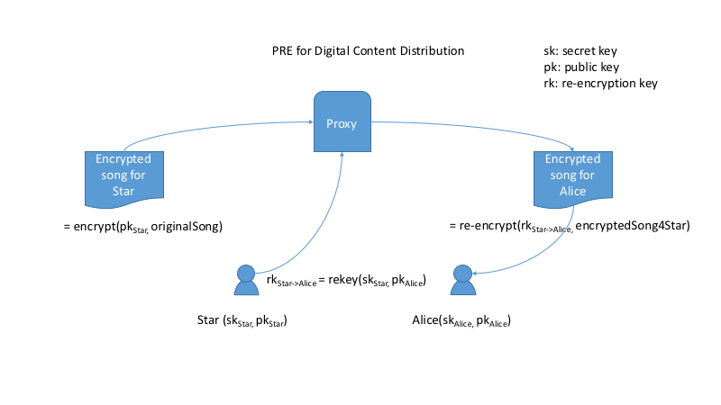

The above diagram is conceptual, while the real implementation is lot more involving, including mechanisms to prevent node collusion. We will have separate document for this feature.  
   
## 6.  Universal Asset Wallet

As a very important part of the platform, wallet plays a key role in the interaction between applications and users. 

The usual crypto-wallets are a single-function wallet that shows the amount of particular cryptocurrencies.

As a general-purpose assets wallet, UAW's role has been significantly expanded. Think of it as a personal safe on one's cell phone. It can contain any stuff you would put in a safe, such as certificates, important documents, diamond rings, antiques, securities, IOUs, etc. In fact the asset wallet stores the unique tokens that cryptographically represent the assets. These asset-backed tokens are created by various applications running on the UDAP chain.

Moreover, UDAP Wallet supports assets in different level of scopes:
- asset on the Ethereum public chain (ERC721 and UDAP Singular style)
- asset in application state channels. 

The asset in state channels can be "upgraded" to be certified by Ethereum, at a cost of gas consumption. 

The following diagram shows the concept of UDAP Wallet. 

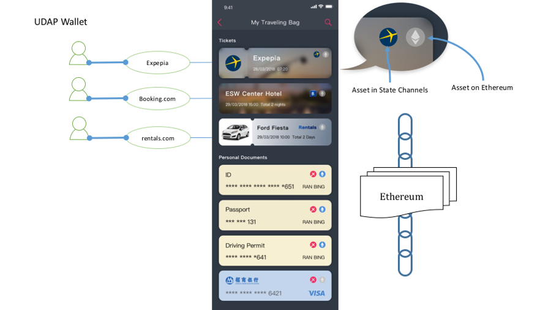

General Assets Wallets are more than just the storage of assets, but are also very handy for supporting common operations on assets such as asset transfers, sales, trading, auctioning, cancellation and more.


#### 6.1.  Asset From Third Party Apps

UAW is the user of the assets obtained in a variety of third-party applications. Each application has its own unique user management system that generates user accounts that correspond to a unique account on the blockchain, with the help of UAW. Obviously account will not be shared or reused among applications.

An account has security significance and identity only in the context of third-party applications. The purpose of doing so is to ensure that the user's privacy. In this context, a wallet, in fact, must import the assets from each application. After the account is imported, the assets of the corresponding user in the third-party application are displayed in the general-purpose assets wallet in different groups. Users can interact with the asset in a generic way, such as transferring, submitting to markets, auctioning and sending copies to third parties.

#### 6.2.  Personal Assets

UAW not only imports assets from third-party applications, it also allows users to create personalized digitally encrypted assets directly in the wallet. In fact this feature is also an application from the architectural point of view.

One scenario is that users can create IOUs. The purpose of IOUs in daily life is to show that a person owes a particular piece of asset to another person and he/she promised to return/pay back at some time in the future. People used to write down IOUs on a piece of paper. Now UDAP client gives users an easier and securer way to write Crypto-IOU, with support of voice, pictures and even videos, tamper-proof and irrefutable, no worry of loss.

<!-- img src="media/contract.png" alt="Employment Contract" style="float:right; width:200px;height:400px;padding-left:5px"/ -->


In the process of personal loans or IOUs, one can also use the wallet to conduct multi-sig signing. For example, in the process of creating an IOU, a third-party witness may be required to witness the contract. The borrower can send the original IOU to the witness, who then signs it and sends it to the creditor.

User can even introduce the [guarantor] role. Unlike the [witness], the guarantor has to assume the corresponding obligation of security if the debtor can not execute the contract in the agreed time for debt repayment, then the guarantor must bear the repayment obligations.

In summary, crypto-IOU is extremely powerful.

     a. Saving notarization and costs
     b. Very convenient to keep safe
     c. Personal debt can further be traded.

In other scenarios, a user of UAW can register any personal belongings through the description of words or pictures or videos. Once tokenized, the person belongings can enter a market for trade.

#### 6.3.  Debts

UAW manages assets in the financial sense while also managing liabilities, or "negative assets."

Often times, what we mean by assets is something that is valuable to ourselves. In many scenarios though, we not only need to know how much assets we owns, we also need to manage liabilities and the reimbursement requirements and conditions for those liabilities.

The most common example of "negative assets" is the various types of "utility bills" that arrive on a monthly basis: water / electricity / gas / telephone bills.

Of course there needs to be an application that connects the utility companies to UAW. Once we have it, users can use the wallet to pay directly in the UAW, or the user can ask someone else to pay for them.

Universal Asset Wallet is a very powerful tool for everyone to manage their finances. Not only can it handle some of the personal lending activities of everyday life just as it is, it can also be used by small businesses such as family hotels or family restaurants as a tool for offering discount coupons or vouchers.

#### 6.4. Multi-Sig Support

<!--
<p>

</p>
-->


UAW supports multi-sig transactions.

When a transaction is made and requires multiple signatures, UAW will send a message to the appropriate signer's wallet and prompts the designated signer to review the transaction details and then "agree" or "reject" the transactions.

The UAW message queue presents the list of transactions that need to be signed. The history of the signatures will also be preserved.

Initiation of the transaction can be from another UAW user, or from a UDAP-enabled application. This is very convenient for third-party APPs, since they do not need to build their own multiple-signature workflow.

#### 6.5.  App Store

UAW is a powerful and extensible plug-in architecture, and its main purpose in fact is to support a large number of third-party apps that can generate a wide range of assets. It provides a unified user experience integration with UDAP's ability to provide background integration for third-party apps. The plug-ins for these clients constitute the ecology of the entire Asset Internet. All third-party applications appear in the App Store of the UAW for the users to choose from.

Technically UAW is a hierarchical architecture, and a considerable part of the user experience has been built in the UAW. Applications from third-parties range from ticketing, memberships, financial assets, health records, academic records, IOUs and crypto-contracting.

Not all third-party applications provide a UAW plug-in. An App can have its own native app, or a web application.

UAW is an eco-system. It provides a programmable UI for third-party applications to develop a complete user experience. The UAW itself provides a series of built-in features that save the time it takes for a large number of third-party applications to reach their own user base.

1.  Simple Asset Transfers: Users are like sending emails, or as usual Crypto Currency. Encrypted assets are sent from one account to another.

2.  Obtain permission to transfer: In order to prevent the rubbish assets from flooding wallets, users can set to require other parties to obtain permissions to send any transfers.

3.  Ticketing: This is the _deliver_ tool that comes with the UAW. Event tickets are in fact the promise of services provided by asset issuers who will deliver the final product or service within a certain period of time. The redemption process is actually transferring the tokens back to issuer.

4.  Market: UDAP comes with market tools for asset owners to sell their assets.

5.  Multiple Signatures support.

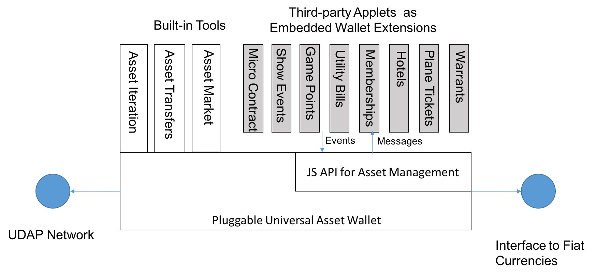

UAW offers JavaScript APIs for third-party application developers. Some of the functions are as follows:

1.  getCurrentUser: Get the current user's identity information, including the chain address.
2.  getAssetCollection: Get the current user's list of assets.
3.  initTransfer：Transfer specific assets. Activate UAW's multi-signature mechanism if asset transfer requires multiple signatures.
4.  offerToSellInMarket：Offer to sell an asset in the market.

More API will be provided in the future, including various auction methods, escrowed P2P transactions and decentralized exchanges.


## 7.  Implementation

We would like to discuss some of the implementation details.

#### 7.1 Protocol Implementation

As mentioned before, UDAP at the highest level is a conceptual model of real-world assets. The following section provides the descriptions of the ongoing implementation of the model. It may change as the development work moves along.

UDAP addresses are divided into account address, asset address, and assetProto address. Where account represents the actual account of the user, organization, service provider, etc. Asset represents an asset, AssetProto is a prototype of a type of asset, and an asset must be associated with an asset prototype in a one-to-one correspondence.

These three types of address have a versionHash and lastCommitTimestamp property. VersionHash represents the changing status of this address. Each change of an address will generate a new random and never duplicated versionHash value. The lastCommitTimestamp will record the last point in time when an address was received after the transaction was processed.

UDAP transactions are always

A transaction usually includes the following data

-   The originator of the transaction
-   Recipient of the transaction
-   The method of trading
-   Trading method parameters
-   The digital signatures required for the action
-   versionHash, optional transaction acceptor versionHash.

The originator of the transaction must be an account address, and the recipient of the transaction can be an asset address or an assetProto address.

When the UDAP accepts the transaction, the rule matcher verifies whether the signature is of the transaction request, whether the signature is out of date, whether the signature time is later than the lastCommitTimestamp of the transaction acceptor, and if the versionHash of the transaction acceptor is given if the versionHash is given Given conditions and all legitimate signers would meet the signature rule. If so, UDAP API then accepts the transaction request to complete the operation and generate a new versionHash.

The signature includes the time of signing, the signature's validity period, and the versionHash that may contain the current asset. When the app collects enough required signatures, it initiates the transaction to UDAP, which verifies that the provided list of signatures satisfies the rule by interpreting the method parameters. If so, it changes the state of the asset, generate a new versionHash and record the latest lastCommitTimestamp in all signatures as the signature is for the transaction method parameters. UDAP creates an optional versionHash and lastCommitTimestamp Time guarantee to prevent replay attack. VersionHash transaction request and digital signature are optional. It is designed to ensure that the asset data will not be phantom read, similar to what optimistic locking does. Whether you need to verify that versionHash is in the hands of the originator of the transaction.

#### 7.2. State Channels

UDAP does not try to be a generic State Channels framework, like [counterfactual](https://counterfactual.com) or [Perun](http://perun.network/). Instead, UDAP is an implementation of State Channels that are tailored to the applications that deal with non-fungible assets. 

UDAP provides a set of *enforcible* contract templates that can be deployed on demand, such as contracts that covers "buy", "swap", "split", "rent" and "pledge". We also provides templates for state channels in a hub-spoke topology, which is the majority of application model. 

More implementation will be available in later version of this document. 

#### 7.3. Performance

Performance in UDAP comes from two layers of support:

1. The core of public chain. In the case of Ethereum, layer 1 technologies such as POS and sharding will bring the throughput of the entire chain to the hundreds/thousands TPS in the next year or two. 
2. Layer 2 technologies such as Plasma can increase the general throughput further up to millions TPS. 

State Channels is also a type of layer 2 technologies, which is the most practical answer to the scalability challenge. 

We are going to explore COSMOS and Tendermint as another public chain provider in addition to Ethereum once they become stable.
 

#### 7.4 Privacy Protection

State Channels provide a good level of privacy if the states are kept in the channel scope. Using state channel helps asset privacy in two ways:

1. The current state is only visible in the application and the application can employ all sorts of ways to protect privacy. 
2. The transaction history is never revealed out of the application scope, even when the users have updated the state repository on the chain, since the user will update the state repository with the latest statement only. The transaction between state updates are never revealed on chain. Hiding the transaction log makes asset tracing vis log analysis impossible. 

On top of the channel scope is the blockchain scope. The higher the scope, the more challenge on keeping asset private. In the "worst" case of every transaction hitting the chain, we employ two approaches to protect data confidentiality:

1. Asset ownership obfuscation. In the case of `Singular` and `OwnerOfSingulars`, all the addresses associated with owner and singular tokens must be encrypted.
2. All the ownership transfer transactions must be mixed up with other transactions to remove the transfer traces. 

We will share our design in later versions of this document. 

#### 7.5 Key Rings and Identity

Today’s cryptocurrency wallets put too much burden on end users in managing their accounts/passwords. People feel so much pressure in keeping the account credentials in safe place and in the meantime still feeling convenient to use them.


We believe a key ring technology similar to Apple’s iCloud key ring is required to make a first class secure experience with the asset wallet. UDAP Key Ring should:

- Have a single lock key to protect all the accounts/passwords.
- All the private keys must not be saved to the network.
- Two factor authorization must be tuned on. UAW will provide TFA service to all the applications registered with UDAP.
- In case of password loss, a combination of email and cell phone is required to recover the parent account with UDAP.

User accounts are application specific. Any account is associated with an app. Different apps don’t share accounts. But account registering needs the help from the Universal Asset Wallet, for absolute security.

Private keys are created in the UAW. They never should be exposed to applications. Once the public/private key pair is created, the public key is presented to the application's account creating process which may require more information from the users. The private key is encrypted and stored in UAW key ring.

Each application must repeat the above process to acquire new customers. A UAW user will have as many identities as the number of applications he/she uses.


#### 7.6 Data Storage Strategy

Every transaction on the blockchain incurs a fee. This is partly due to the fact that the public blockchain is a public support resource, which requires some incentive mechanism to encourage the voluntarily provision of public blockchain computing and storage infrastructure. On the other hand, transaction fees can greatly limit any malicious attacks on the blockchain network, because such attacks are economically unrealistic. So while we believe the transaction costs on the blockchain will decrease dramatically with the performance improved and scalability issues of the blockchain resolved, as a decentralized asset chain on which, the entire lifecycle of assets is required to be managed, it is impossible for us to store all the data related to managed assets on the blockchain. Therefore, an important architectural decision is what kind of data needs to be stored on chain and what kind of data needs to be stored off-chain. Such an architecture decision needs to be considered in many aspects such as context, processes, costs, performance, and realizability.

From the perspective of business, costs, and performance, blockchain is not suitable for storing frequently updated data and large volume of data. Any changes to the data may trigger commitment of transactions and data replication on each node. Through the analysis of the on-chain asset model, we believe that the basic attributes and the metadata of assets can be separately stored. The basic attributes and transaction data of asset management are stored either on the blockchain while the metadata is stored off-chain. For example, for a Multiple Listing Service (MLS) in the real estate industry, metadata about a property such as description and pictures are stored on cloud storage or P2P storage, however, owner information and transaction history are stored on the blockchain. Therefore, a UDAP full node has two logically isolated "nodes" (a blockchain node that stores transactions and assets, and a storage node for asset metadata storage). Assets have access to their related metadata via merkle-link. Application developers don't have to understand where the data are stored.

In general, there are two options for metadata storage: a centralized cloud storage such as Amazon S3 and a decentralized P2P storage like Swarm, IPFS, StorJ, or MaidSafe. Both options have their own advantages and disadvantages, but for an asset of great economic value, it may be more reassuring to have a decentralized storage that does not rely on any centrally managed storage services. Although UDAP prefers a decentralized storage to offer a comprehensive decentralized service with a decentralized computing infrastructure, this protocol does not directly define a physical P2P storage technology. It only requires the data is presented as merkle-link and merkle-dag, so that the application can address and query any relevant data via merkle-path. This merkle-link represents a link between two objects, which maps the cryptographically hashed values ​​of the target object's content to the source object, and therefore allows us to get the target object through this link. This approach has at least four advantages.

- data can be easily presented in JSON-LD format
- data encryption and integrity check are supported
- data is immutable
- data is addressable through merkle-path

These advantages are particularly well suited for the management of asset metadata, as most metadata items are static and descriptive data with few changes over the life of an asset. And in many scenes, once metadata is uploaded to storage it is not allowed for modification, for example, university diploma, license agreement, and contracts and so on. Even a slight change on the metadata will lead to an obvious change of the hash value of the metadata. Therefore either the hash value on the blockchain needs to be updated, or a naming service such as IPNS is required as a tag of the metadata. The former needs to submit a transaction on the chain, which incurs a small amount of costs. The later needs to introduce a new level of data abstraction. In either case it is transparent to applications. Services provided by UDAP allow application developers to completely ignore the underlying storage logic and operate directly on assets.

In addition to asset metadata, applications often have large volume of business data that are usually stored in their own databases. While decentralized storage may not be a good place for storing large volume of frequently changed business data, from the application point of view, many business systems need to adopt a hybrid storage model through careful data analysis. Business systems need to put some of their data on the chain (including decentralized storage). Meanwhile,  business systems also serve as off-chain Oracles that provide data services to smart contracts. For example, in the case of warehouse receipts as collaterals in supply chain finance, after warehouse receipts are registered as crypto assets, their market values are calculated by smart contracts with real-time price data obtained from business systems or third-party Oracles via Oraclize<sup>[\[20\]][oraclize]</sup> service. The price data is then signed and recorded on the decentralized storage as a basis for future value verification. The following is an example of an infrastructure deployment view from one of our demos, where xncang is a business system that manages warehouses and inventories, which connects to a PoC blockchain via an API gateway.

<p align="middle">
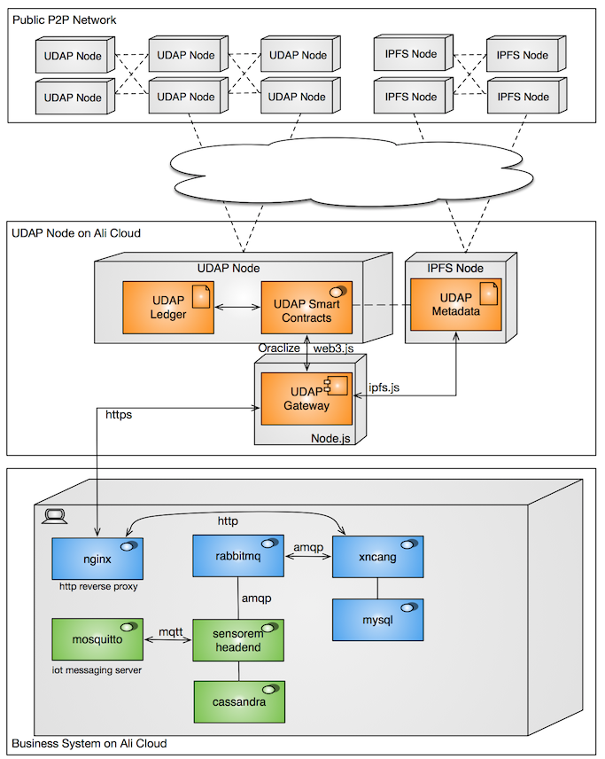
</p>

## 8. Related Work

The year of 2018 is an important year for non-fungible crypto assets. The world is in a transition from cryptocurrencies to crypto assets. A lot of efforts have been done to make this transition into reality. We have reviewed related blockchain projects and summarized our key findings as follows:

**BankEx** is a blockchain project that targets financial asset management and offers "Bank as a Service" cloud service. This project builds permissioned blockchains on Ethereum and creates smart contract based static asset model. New asset types are manually registered through a centralized approval mechanism.

**Digix** is a blockchain project specialized in tokenization and trading of gold. It uses gold as collateral to create crypto gold. It creates "recast" concept adopted by UDAP to handle redemption of physical goods or services.

**AChain** <sup>[\[19\]][achain]</sup> is a platform that offers token issuance, smart contracts, and Dapps development. It creates a multi-chain architecture through a forking mechanism.

**Bytom** <sup>[\[20\]][bytom]</sup> is an exchange protocol for diversified byte assets that uses POW as a consensus approach, supports limited asset types and mainly focuses on the financial aspect of the assets (in other words, tokens without asset metadata).

**0x Project** <sup>[\[21\]][0x]</sup>is a decentralized exchange for cryptocurrencies. It has a very interesting exchange model that UDAP may adopt to create a C2C exchange for assets.

**Bitshares** <sup>[\[22\]][bit-shares]</sup>is an exchange for trading cryptocurrencies and assets. It is a permissioned blockchain with a single chain architecture.

**WAX** is a marketplace for virtual game assets exchange and trading.

**MediaChain** is a singular data fabric for open-first media applications. It is a decentralized blockchain for applications and users to publish, discover, and collaborate on media metadata. It is built on Ethereum and IPFS.

**[Counterfactual](https://counterfactual.com)** is a generalized framework for native state channels integration in Ethereum-based decentralized applications. They may also provide pre-audited modules for developers to adopt. 

**[Perun](https://www.perun.network)** is a framework that supports off-chain protocols for simple payments and generic smart contract off-chain execution. Perun's channels can be virtual, which means that off-chain transactions do not require interaction with intermediaries thereby further reducing trust, latency and costs. In additional Perun offers strong security guarantees backed up by scientific methods from cryptographic research

**[Nucypher](https://www.nucypher.com)** helps dApp developers store, share, and manage private data on public blockchains with decentralized proxy re-encryption as a service.

We have also reviewed and researched a few key blockchain projects that focus on multi-chain architecture with inter-blockchain communication. These projects include Plasma, Polkadot, Aion Network, Wanchain, and Cosmos.


## 9.  Use Cases


Most of the Internet applications deals with data. Most of the informational data contains intrinsic values to the data owner hence is valuable asset to the owners. 

UDAP can be immediately used to upgrade those applications to a blockchain-based decentralized model and bring incredible new user experience to the customers. The following use cases just scratch the surface and are by no means exhaustive. 

#### 9.1 Event Ticketing

This use case includes performances, live shows, sporting events, ticket management for various gatherings.

A third-party event ticketing platform that focuses on ticket issuance, distribution and marketplace services. It is often the case that event ticket holders may not be able to attend a event for whatever reason, and that they need to be able to transfer the tickets to others in the best way possible. In the opposite direction, some people may have missed the ticket sale event and thus lose a reasonable and convenient way to get tickets for the event. Indeed this type of assets lacks a convenient secondary market. The performance market is still a relatively good market, because in private, scalpers play a liquidity role. Though not through a formal channel, they indeed improve the liquidity, help balance the supply and demand and consequently receive reward.

By tokenizing event tickets, tickets can be easily sent to or transferred among friends, or put on a secondary market through UAW for resale. In the process of trading, the original issuer can put control over the trading frequency, liquidity, and price range. They can also set restrictions on whether an asset is allowed to be resold or transferred. This provides an extremely handy feature for ticket management apps with unparalleled security and liquidity. Our universal asset wallet (UAW) can be used directly to execute operations such as ticket transfer, trading or on-site check-in, which are common to concerts, movies, and other types of events.

#### 9.2 Brand Valuation

In the crypto world, people are gradually realizing that tokens are a brand new economic model. The essence of tokens is actually to digitize all kinds of accessible and inaccessible assets in the real world and to manage them with cryptographic and blockchain technologies. Tokens corresponding to these assets can make full use of the high liquidity brought by blockchains and cryptocurrency exchanges to form a brand new token economy. One of these very innovative ideas is the emergence of a new possibility for everyone to issue tokens that represent their reputation and brand. Imagine that in the future, everyone will be able to issue their own crypto currency which is backed by their personal image and reputation, credibility, and promises. This type of tokens represents some kind of credit and commitment individuals make to the world and other people. Because of the liquidity of tokens, values of individuals can be more accurately represented. With the support of our platform, individuals can easily build their fan clubs and control issuance and distribution of membership cards. Those who can provide services could tokenize their services and issue tokens for trading on the market. When demands for their services change, the value of their tokens changes accordingly. This scenario offers an unprecedented possibility of fullfillment and customer satisfaction.

#### 9.3 Supply Chain Finance

Nearly 82% of businesses fail because of cash-flow problems, however, the complexity and scale of existing supply chain finance (SCF) solutions has posed major challenges in ensuring adequate funding and efficient operations. Finance instruments in SCF include factoring, reverse factoring, payables financing, inventory finance, and dynamic discounting. The following figure illustrates the transaction flow of a typical inventory finance solution (source from Global SCF Forum)

<p align="middle">

</p>

UDAP will essentially enable all parties in SCF solutions to act on a shared ledger, where suppliers and manufacturers, along with every other participant, will solely update their parts of the transaction, enabling efficiency and an “unprecedented” level of trust and transparency on a ledger record that is immutable.

#### 9.4 Marketing and Promotions

In the retail industry, cash vouchers, discount coupons, membership vouchers and promotional certificates can all be tokenized for monetization to create a more convenient and more liquidity asset. With the support of UDAP, these assets from different issuers can be easily exchanged, traded, transferred, and redeemed. Like event tickets issuers can also set resale rules on the crypto assets to protect or increase their interests.

#### 9.5 Sharing Economy

UDAP enables businesses to quickly build decentralized marketplaces on the blockchain for a sharing economy. Buyers and sellers of decentralized "airbnb" or "uber" like car-sharing or home-sharing could transact on a decentralized and open platform without traditional intermediaries. All facility sharing rules are transparent to customers. A decentralized arbitration mechanism resolves disputes fairly and grow a network of mediators through incentives. In some scenarios, reservations can become assets. When buyers have to cancel the bookings for some reasons they may face penalties at present, however, with UDAP it is possible for buyers to resell their reservations on the marketplace to reduce loss.

#### 9.6 Game Assets

Black markets exist for exchange and trade of digital assets (e.g. equipment, resources, accounts, points) in all kinds of e-sports games. Game developers may be reluctant to allow the players to freely trade the game equipment and resources, so that players have to obtain new equipment and resources through in-game purchase. However, there are quite a few games realizing that providing an open marketplace for game props is a way to enhance the user experience, attract more users, and increase revenues via the resell of game resources. UDAP offers APIs that enable game developers to register certain types of crypto assets they issue and manage the trading rules for those types in trading and exchange. At the same time, the ecology of asset trading conforms to the dynamic model expected by game designers.

#### 9.7 Arts and Collectibles

Spot trading of collectibles is a very promising application of our asset management network. Our platform not only provides basic computing functions, but also the file storage and multimedia storage capabilities required for the preservation of art collection information. Therefore, all kinds of digitization, encryption and tokenization required in the circulation of artwork can be used to directly manage the trading. There are two main types of transactions that existed in the past: antique and art shops with direct acquisitions from individuals, which then offered to consumers for purchase. In addition, A trading model takes place in the private, free-market model where art owners and potential buyers make deals directly; a common selling model for art is the auction model because artwork is usually an asset of insufficient liquidity and lacking consensus on its pricing. The trading of art work is sometimes used for money laundering and improper business activities. Blockchain technology will help eliminate frauds and provide traceability and authenticity guarantee with a flexible transaction model.

#### 9.8 ICO

UDAP supports applications to issue their own tokens as utility tokens for exchange of services or application specific base coins for asset pricing. The application tokens can be exchanged with other tokens. This will help transform business into a token economy.

<!-- -->

## 10. Conclusion

Capital market is an engine for economic growth, both for business entities and individuals. Monetization is the main way to profit from the economy.

In the next few years, world economy will be reshaped greatly by token-based businesses. The nature of the "universal assets" that we are advocating here is to store and to realize the value of the assets.

Blockchain supports permanent retention of asset information through its tamper-proof feature. In a sense, it is the permanent proof of assets.

At the same time, the blockchain-derived token economy and the liquidity as the core of the token economy provide the key channel for the value recognition of assets.

The relationship between liquidity and the health of the entire industry is like a human blood circulation system and human health. Much of what is studied in economics as a whole is actually about how to improve the liquidity of a local system. Although trading liquidity is frequently over-estimated, which is referred as "liquidity illusion", a closer look at various industries around us reveals that lack of liquidity is almost always a continuing challenge for all industries. Even if we are already satisfied with current liquidity provided by a system, at a higher level and in the future, this liquidity may become inadequate again. So in current reality, increasing liquidity is always of importance.

Liquidity is not a panacea. In fact, liquidity itself may also bring system instability and even harm. Just like our blood circulation system, smooth blood circulation does not mean that there is no control of blood circulation. Therefore, controlling and optimizing liquidity throughout the market is actually the second challenge for asset owners.

Many industries face a big challenge that asset issuers lack control over liquidity of assets. In the past there was no good solution to this problem, but with the advent of distributed ledger technologies we are able to overcome this challenge for the first time.

This white paper is about an ongoing project claiming having the power of "tokenizing anything", which we are trying to make our unique contribution in three main technology areas:

- Blockchain-based Asset Lifecycle Management, with a unique "everything has an account" model of world assets, in the name of "Singular" 
- State-channels based layer-2 scalability solution
- Decentralized C2C Exchange for Assets
- UDAP Wallet, a universal asset management tool for the best possible UX. 

UDAP offer exceptional values to application developers and public chains alike. Together we are going to create a fast-growing eco-system where everything is tokenized and innovative applications will emerge at scale to fulfill the promise of blockchains.   


## References
\[1\]: http://www.omnilayer.org/

\[2\]: https://counterparty.io/

\[3\]: https://prism.exchange

\[4\]: http://unchainedpodcast.co/vitalik-buterin-creator-of-ethereum-on-the-big-guy-vs-the-little-guy

\[5\]: https://www.comp.nus.edu.sg/~loiluu/papers/oyente.pdf

\[6\]: https://theinternetofmoney.info

\[7\]: https://github.com/ethereum/wiki/wiki/Design-Rationale

\[8\]: https://blog.ethereum.org/2018/01/02/ethereum-scalability-research-development-subsidy-programs

\[9\]: http://docs.mediachain.io

\[10\]: https://digix.global

\[11\]: https://bankex.com/en/whitepaper

\[12\]: https://www.cmswire.com/cms/digital-asset-management/the-building-blocks-of-digital-asset-management-interoperability-021996.php

\[13\]: https://www.ibm.com/developerworks/cloud/library/cl-adopting-blockchain-for-enterprise-asset-management-eam/index.html

\[14\]: https://ipld.io

\[15\]: https://json-ld.org

\[16\]: http://www.localbitcoins.com

\[17\]: http://cosmos.network

\[18\]: http://www.oraclize.it

\[19\]: https://www.achain.com

\[20\]: http://bytom.io

\[21\]: https://0xproject.com

\[22\]: https://bitshares.org

[the-internet-of-money]: https://theinternetofmoney.info

[design-rationale]: https://github.com/ethereum/wiki/wiki/Design-Rationale

[ethereum-scalability-research-development-subsidy-programs]: https://blog.ethereum.org/2018/01/02/ethereum-scalability-research-development-subsidy-programs

[json-ld]: https://json-ld.org

[ipld]: https://ipld.io

[llc-rights-reference]: http://www.linkedcontentcoalition.org/phocadownload/framework/The%20LCC%20Rights%20Reference%20Model%20v1.0.pdf

[linked-data-signatures]: https://w3c-dvcg.github.io/ld-signatures/

[json-ld-building-meaningful-data-apis]: https://blog.codeship.com/json-ld-building-meaningful-data-apis/

[the-building-blocks-of-digital-asset-management-interoperability]: https://www.cmswire.com/cms/digital-asset-management/the-building-blocks-of-digital-asset-management-interoperability-021996.php

[adopting-blockchain-for-enterprise-asset-management]: https://www.ibm.com/developerworks/cloud/library/cl-adopting-blockchain-for-enterprise-asset-management-eam/index.html

[redefining-the-meaning-and-scope-of-digital-assets]: http://digitalassetmanagementnews.org/features/re-defining-the-meaning-and-scope-of-digital-assets-part-1/

[what-are-asset-types]: https://docs.oracle.com/middleware/1221/wcs/develop/GUID-D76319B9-602D-44F0-8C05-1D4660EC4B7C.htm#WBCSD1365

[asset-models]: https://snipe-it.readme.io/v3.6.2/docs/asset-models

[bankex]: https://bankex.com/en/whitepaper

[bytom]: http://bytom.io

[digix]: https://digix.global

[0x]: https://0xproject.com

[achain]: https://www.achain.com

[self-sell]: https://www.selfsell.com

[bit-shares]: https://bitshares.org

[linkeye]: https://www.linkeye.com

[fusion]: https://fusion.org

[oraclize]: http://www.oraclize.it

[coin-spark]: http://coinspark.org

[mediachain]: http://docs.mediachain.io

[cosmos]: http://cosmos.network

[plasma-project]: http://plasma.io

[solidus]: https://eprint.iacr.org/2017/317.pdf

[local-bitcoin]: http://www.localbitcoins.com

[omni-layer]: http://www.omnilayer.org/

[counterparty]: https://counterparty.io/

[prism]: https://prism.exchange

[vitalik-buterin]: http://unchainedpodcast.co/vitalik-buterin-creator-of-ethereum-on-the-big-guy-vs-the-little-guy

[making-smart-contract-smarter]: https://www.comp.nus.edu.sg/~loiluu/papers/oyente.pdf


