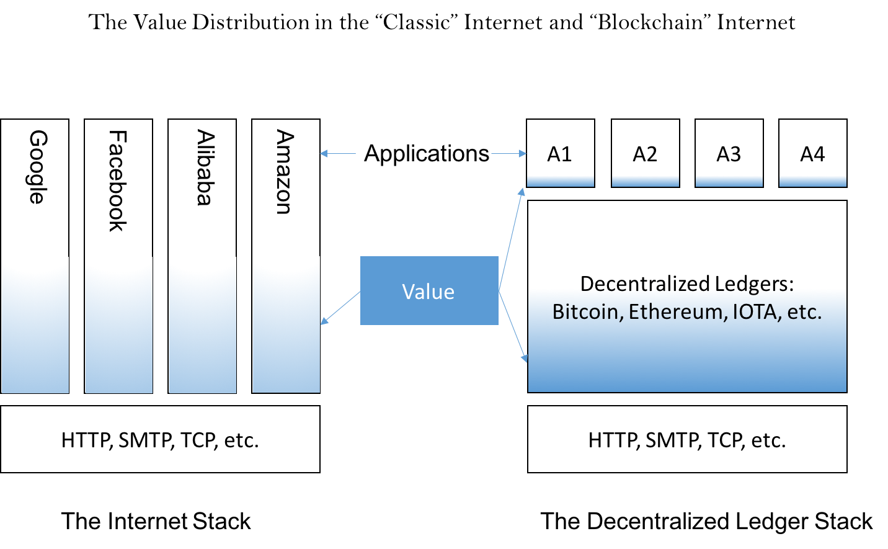
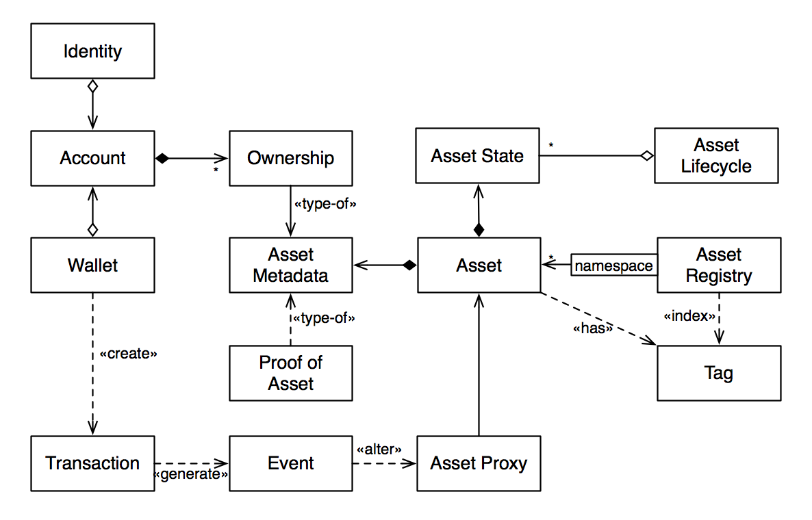
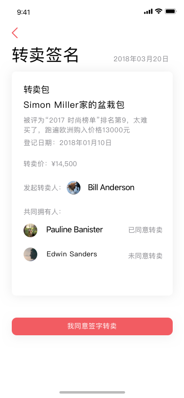
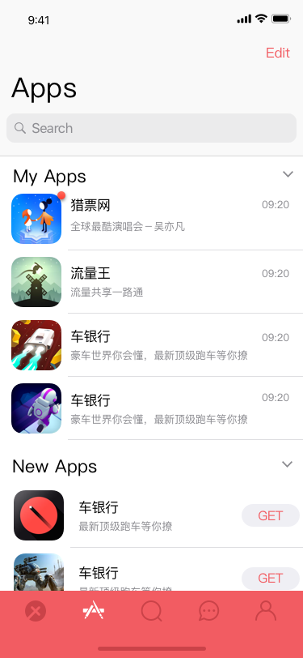

# Universal Decentralized Asset Protocol(UDAP)

A White Paper

通用分布式资产协议

白皮书

Version 0.6

**UDAP Foundation， 1/19/2007**

## 1.  背景

一直以来，区块链被广泛认为是在互联网基础上构成的一个价值互联网（The Internet of Value），但是我们仔细考察了区块链目前所承载的价值转移的载体，实际上99%的应用还是局限在流动性最好的，也最容易解决的一类资产，那就是加密货币。所以对当前区块链更准确的描述是货币互联网("The Internet of Money")\[*The Internet of Money*, A.M. Antonopoulos\].

但是我们周边有着大量的、可触及的或者不可触及的，可以拥有、交换并产生价值的资产，例如，货物、服务、商标、证券、仓单、许可证、版权、活动门票、积分、游戏装备、债务、应收账款等。这些资产能否利用区块链技术或者相关的去中心化的记账技术，得到很好的价值，发现和价值确认以及价值转移呢？答案毫无疑问是肯定的。目前已经有一些基于区块链技术的项目，在试图解决现实生活中的非货币类的资产，如何在去中心化的网络中得到表达、认可和交换[参考文献]。但是我们发现这些协议产品和平台，都是基于现有的区块链，以货币转移为基础的第二层级的结构。2014年左右，在比特币技术得到大多数人认可的时候，不少的项目提出了有颜色货币的概念，也就是在通行的可置换的价值对象------货币之上嫁接一层独特的识别技术，使得我们可以用货币的符号来代表现实生活中的可触及的资产以及不可触及的资产。

早期的"颜色货币"靠在比特币网络传输的协议中增加交易的顺序来进行特殊含义的赋予。这种方法，当然是对比特币协议的特殊扩展应用。当然因为比特币独特的简化协议，使得任何第三方的应用想对自己的资产进行数字化、加密以及货币化都需要比较大的工作量和一定的技术门槛。以太坊作为另外一个主流的区块链网络，一开始的初衷，就是希望能够把区块链的网络变成一个高度可编程的、可应用于对现实世界的价值节点进行确认、传输转移和交换的平台，它的目的是建立一个通用的、去中心化的计算平台，同时，也逐渐的加入了去中心化的存储功能（Swarm），虽然这两种功能尚未在以太坊主网上发布。

以太坊所体现的我们称之为颜色货币的概念，是通过智能合同来进行的，在常见的智能合同的应用场景中，外部世界的资产被智能合同中的电子对类型的数据库来进行存储，通过用户自定义的一些基本逻辑和安全机制来管理这些资产的登记、发布和流转。在一定层度上，以太坊的智能合约简化了对现实世界中资产在区块链上表达的实现，同时，一些在特定领域的资产相关的开源项目【参考文献】得到了以太坊社区的支持，包括一些拟议中的协议，例如，ERC721。然而，这些项目并没有提出一种通用的资产协议，来支持不同领域的资产在区块链上的发布、转移和交换

我们也看到，以太坊这两年在逐渐成熟的过程中，已经产生了非常大的性能问题和安全隐私问题，例如，2017年底在以太坊主链上发布的加密猫（一种虚拟资产）游戏的流行导致了以太坊全面的网络拥堵，以至于以太坊上Ether的转移和确认时间急剧增长。因此，以太坊核心开发团队当前的主要工作方向并不在于提供一套便捷的可供任何现实世界的各种应用所利用的资产发布、管理和应用平台，而是把注意力集中在更底层的性能吞吐量和安全隐私等更为基础的环节，这些都是非常有必要的，因为如果没有这些最基础的非功能性需求指标，那么在链上建筑的任何具有真正意义上的杀手级的应用，都会导致整个系统的性能迟缓和用户体验的急剧下降。

同时，智能合同的编程语言的成熟性远不如传统应用使用的编程语言的功能强大，同时在健壮性方面还处于童年时期。对大多数没有多少智能合同编写经验的程序员而言，编写智能合同可能是一个安全和性能上的"nightmare"。

## 2.  目标

UDAP基金会的目标是建设一个"资产互联网"（The Internet of Asset），在这个资产互联网上，无论是企业还是个人，都可以方便地发布、转移和交易各种虚拟的以及实物的资产。因此，我们对拟议中的资产互联网制定了一个明确且清楚的边界，包括以下三个目标：

1.  制定一个从区块链的角度理解和认识现实世界中的"资产"的概念，从中抽象出各种资产在区块链上的数字表达，以及各种资产的一些主要行为，从而制定出一种通用的、去中心化的资产协议，包括一个通用的资产模型以及一整套面向应用开发者的API。这样的API不要求应用开发者对区块链技术和去中心化的技术有较为深刻的认识和较为熟练的编程经验。

1.  提供一个资产互联网协议的参考实现，让应用开发者能够在不改变现有应用架构的情况下，搭上去中心化的计算和去中心化存储的快车。 我们把区块链上对资产的操作、去中心化的计算、去中心化的存储技术和去中心化的信息机制中最核心的部分，抽象成简洁有效的API供他们使用，这样可以大大弥补目前区块链技术和去中心化的一整套技术对应用开发者的巨大的技术障碍和挑战。并且，考虑到去中心化的计算和存储技术目前还处于不成熟的阶段，还处于快速发展的时期，我们认为这样的技术平台会给第三方应用开发者带来巨大的价值。

1.  提供一种“资产链作为服务”的私有资产链或者联盟资产链的云服务

1.  提供一个面向终端用户的通用资产钱包的参考实现。在这个通用资产钱包中，我们把一般性资产管理所面临的主要的问题都做出足够理性的抽象，并且把一些基本的对资产的处置方式和手段都集中在里面。这个通用资产钱包为个人用户提供了极大的便利和统一的接口来管理自己所拥有的代币、各种有形和无形资产以及钱包内第三方插件式应用。这样的插件式设计提供了类似于微信小程序以及脸书的插件式应用的能力，第三方应用开发平台可以把应用的某些功能整合到这样的插件式应用里，从而增强用户的黏性，加强应用和平台之间的交流。

## 3.  设计理念

资产互联网协议的基本理念是建设一个"厚协议层"，支撑"薄应用层" （Thick Protocol + Thin Application）。

应用层主要关心的问题是和自己所在的特殊人群的交互行为，而这种行为的有些通用的资产处置部分，实际上也是可以由通用资产钱包来帮助解决的，所以，我们给第三方应用开发者提供的一个愿景就是，第三方应用开发者只需要对自己所垂直的行业有足够的知识和认识，那么基于我们的厚协议层就可以迅速开发出自己客户所需要的功能，并且以最短的时间投入市场，产生自己想追求的商业效益。

用Ethereum区块链来作为参照的设计是我们的起点。 我们的设计思维和Ethereum 最大的差别是关于"Feature"。 Vitalik Buterin 认为Ethereum 的设计思想之一是Ethereum 是一个 "Feature-less" 的计算平台。

**We Have No Features**: as a corollary to generalization, we often
refuse to build in even very common high-level use cases as intrinsic
parts of the protocol, with the understanding that if people really want
to do it they can always create a sub-protocol (e.g., ether-backed
subcurrency, bitcoin/litecoin/dogecoin sidechain, etc) inside of a
contract.  \[ <https://github.com/ethereum/wiki/wiki/Design-Rationale>\]

以太坊的主要目标是建设成一个通用的、支持智能合约的区块链平台。 任何有针对性的高层次的功能性抽象都被推给了用户自定义的智能合约中。这种理性的有节制的目标是令人赞同的， 它给予社区足够的空间去设计应用层面的协议，但是却不是我们构思的"资产互联网"协议以及参考实现追求的方向。 智能合同因为其"图灵完整"的计算能力为DAPP开发者提供了相对而言的极大的灵活性, 但是也带来明显的技术障碍和安全风险。智能合同的开发语言虽然支持“图灵完整"，但是提供的编程能力还是有较大的局限性，对于普通应用开发者而言有很多"坑"需要绕过，用户自定义的智能合约可能会暴露出很大的受攻击表面， 就像以太坊近两年所发生的几起造成严重的经济损失的安全事故所展现的一样。比特币网络拥有非常有限的智能合同能力，但是说到底，这并不一定是比特网络的一个明显的局限性，实际上很多比特币网络的忠实粉丝认为这种有限的设计是一种非常好的措施来防止比特币网络受到各种各样的攻击。比特币网络引以为傲的一个非常重要的指标就是，一段时间来比特币网络经受了无数的冲击，但是，比特币网络从本质上来说，还没有出现一次真正的巨大的漏洞。

"资产互联网"从目标而言并不是一个通用计算平台，而是一个专门从财务角度和更一般的角度处理现实资产和加密资产的平台，是一个"功能丰富的区块链". 从协议的角度来看，它是一个更丰富和更专门化的协议。这个协议内置支持资产的代币化和通用的资产行为，例如存储、转移、交易和销毁等等，面向的是一般软件开发者。并且我们希望在这个垂直领域中，我们能为我们第三方的客户提供一个健壮的、高性能的、持续有效、并且不会出错的一个全资产（而不仅仅是虚拟货币）管理和交易平台。为了达到这个目的，更为了从安全和性能的角度实现这个目的，我们甚至考虑不支持智能合约（或者至少不把智能合约的能力暴露给终用户）。也就是说我们不惜牺牲掉通用智能合约或者通用计算能力，直接把资产管理的能力的安全性和性能作为平台最主要的发展方向。这个实现级别的考虑也许会在项目进展中仔细推敲。

我们认为这种"Thick Protocol + Thin Application"的模式将是区块链应用的核心架构模式，它将极大地为互联网的新型应用带来极大的繁荣。这种模式从技术说有革新性的意义。从价值上分析，它会让互联网的价值从应用层下沉到协议层，让协议层变成一个跨应用的大数据沉积层。客观的结果是协议层变得更有战略价值和投资价值。

## 4. 对应用开发者的价值陈述

<!-- -->

1.  区块链带来的坚不可摧的数据库能力。这种数据库能力，是过去传统的数据库体系里面梦寐以求的，并且可能是需要非常昂贵的设置和管理才能带来的效益。因为这其中牵涉了很复杂的数据库同步、备份、灾难恢复等等关键性的技术。这些能力在过去都是需要高级的数据库管理人员专注才能够得到较为妥善解决的技术能力，维护成本极为高昂。如果考虑到区块链本身能够提供一个全球性的覆盖的话，那么相对于传统的数据库技术，这种优势就更为明显。

1.  第二类的价值发生在，当区块链的应用不仅仅局限于自己所在的用户范围内的时候。因为区块链技术提供的是一个有保障的，公开的记账体系，天然的适用于一个企业在自己所属的产业链中的上下游的整合。产业链中上下游数据的整合是过去传统应用中持续会面临的技术挑战。在上下游整合的过程中，由于缺乏互相之间的信任，如果没有一个较为复杂的商业协定，或者双方都可信任的第三者商业体（有时候是政府机构）来推动的话，这种整合的周期往往遥遥无期，并且整合中的责任和成本都很高昂，而区块链技术提供了这种不信任的商业环境中无需第三方信任实体的存在，又能提供数据价值整合的能力。

1.  为第三方应用提供立即的实现应用内经济代币化的手段。第三方应用可以把应用类的经济流动时所需要的手段使用加密货币的代币模型进行重新规划。应用内的市场营销手段，激励手段，用户付费的新模式，甚至包括利益分配的新模式。用以太坊的标准的手段来建立自己的经济货币的时候，需要较为熟练的智能合同的编程能力或者是雇佣具有这种编程能力的咨询团队来建立自己的应用内加密货币的智能合同提供的能力，我们的协议能够使用户只需要配置一些标准化的参数，就可以发行能够在自己的经济体系中使用的加密数字货币。这样的加密货币将立刻能够在我们提供的通用数字资产钱包中得以展现。不仅如此，通用资产协议本身还提供资产的分布是交易(Decentralized Exchange)的能力，这种能力能够把用户发行的自定义加密数字化资产和目前加密数字资产行业主流的加密货币建立交易对，能够让App内数字资产立刻产生流通性和流动性，极大地激活在应用内的经济体中较为复杂和多变的灵活的金融手段。这种应用内的代币满足ERC20协议，所以也能在绝大多数的兼容ERC20的钱包中存储。

1.  提供交易的缓冲和性能的提升。第三方应用利用区块链使的性能和吞吐量的支撑在现在能够支持智能合同的最常见的平台，也就是以太坊。Ethereum网络现在每天处理能力达到百万级，但是这个能力相对传统集中式的大型应用还是有极大的差距。 性能问题在未来2到3年里面，才有可能逐步地得到解决。[https://blog.ethereum.org/2018/01/02/ethereum-scalability-research-development-subsidy-programs] 对于立刻需要这种高吞吐能力的区块链技术的第三方应用来说，我们的通用的资产互联网将提供这种能力。这是如果用户绕开我们的资产互联网直接使用底层的已开放的智能合同的技术所不能达到的。

1.  用户的身份管理。区块链技术是基于最主流的密码学技术，在很大程度上，为第三方的应用提供新的安全的标准。它要求所有用户的行为都是安全的，经过认证的，每一个用户都通过自己的密钥为自己的行为进行签字，承担相应的责任。但是管理自己的数字身份本身是一个相对较为复杂的过程和计划，需要缜密管理的一套编程的方法学。我们资产管理协议，能够把较为复杂的，在区块链上的身份管理的工作，提供一个简化的包装。第三方的应用程序使用这样在保证安全性的基础之上的第三方应用，能够充分享受到区块链加密技术提供的方便。身份管理，第三方应用内用户的身份，在过去的世界中往往都是只在自己的应用内的上下文中有意义。进入区块链事件以后，所有用户的资产行为必须和区块链中的一个或者多个账号产生绑定关系。

1.  隐私管理。资产互联网协议，将为使用本协议的第三方用户所管理的各类资产提供加密。用户可以完全控制自己的资产在网络中的存储，去控制自己资产的信息向特定的人群或者应用开放。用户可以控制自己资产的转移路径是否公开，或者享有完全的隐私。在资产户联网的层面上，每一个应用内的用户和应用之间是互相隔离的，这样做的主要目的是为了保证用户的隐私。我们的通用数字钱包能够同时导入多个第三方的应用。因为每一个应用之间的互相隔离，实际上一一为着一个钱包可以同时导入用户所知道密码，多个第三方应用所对应的区块链账号。从用户的角度看来，这些账号都隶属于用户自己。能够从统一的资产钱包中，观察自己所拥有的所有的各类和现实世界绑定的加密化资产，以及那些纯粹的加密货币资产。

1.  工作流支持。工作流的支持，主要体现在多重签名的支持上。关键性的资产的动作，例如资产的转移，资产的交换和资产的销售，往往需要多重签名的保护。应用可以非常简单的设置对关键性动作的签名保护，策略和规则。一旦受到保护的动作被发现或者调用的时候，用户所持的通用资产钱包会自动提示用户进行签名的处理。我可以在自己的资产钱包中实时地对其他人发起的需要多重签名对资产的操作，进行签字或者拒绝的处理。这种工作流，不仅仅可以简单的在持有通用资产钱包的个人用户之间进行，也可以在第三方的应用的界面和拥护者通用钱包之间进行。这一类的多点信息的交流和沟通，是由资产网络底层的基于P2P的消息协议所支持的。

1.  立即的流动性。 协议和实现中将提供同类资产和跨类资产交易的能力， 特别是提供和成熟加密货币交易的能力。

<!-- -->

## 5.  协议

#### 5.1.  资产模型

现实社会的资产为什么需要上链成为加密资产？

1）权属清晰：资产的发布者、拥有者以及交易的签署者的权益都可以被清晰地定义。资产拥有者可以方便地提供无可辩驳的证据证明自己的权益，而没有交易签署者的同意，资产是不能在区块链上交换和交易，而资产发布者可以确定资产的某些基本属性不可更改，例如资产发布者可以限制资产的转移和交易。

2）信息的永久化：存储数字化资产需要一个永久的方式。区块链和去中心化存储经济的到来终于让我们有信心能长久保存信息。

3）防伪以及防篡改：资产一旦上链，那么相关的数据及交易记录可以得到有效地保护，实现防伪以及防篡改的目标，减少道德风险。

4）流动性需求：资产价值和流动性具有密不可分的联系，流动性越高的价值产品，越容易被人接受。一个价值对象的流动性越高，那么这个价值实际上就得到了更多的确认，能够被广泛的接受，所以流动性对于任何价值具有非常重要的作用。货币这一类价值载体，具有极高的流动性，所以货币毫无疑问是所有价值中最乐于被人接受的财产，另外具有高度流动性的还包括股票，债券等价值载体。而类似于房屋汽车，或者农场，工厂设备等这样的资产，流动性相对较差，它的定价和能够被市场所接受的价格，因为流动性的不足，使得可能具有较大的差异，所以拥有这一类资产，就面临着流动性不足，资产价值难以确认的局面。更多的我们周边所知道的资产，包括普通的物件等，实际上已经通过我们现在已经习以为常的网络平台，例如一倍，淘宝网，以及各种二手商品市场具有了流动性，因此能够产生价值的确认。

以上需求同时还要保证不能牺牲用户的隐私。 这是一种不言而喻的的需求。

区块链世界中的所谓加密资产目前基本上都是针对可置换资产，也就是加密货币。这一类应用协议或者平台主要是方便加密资产产生分发交换。规范这一类协议有，ERC20以及一些简单的延伸协议。第三方的较为著名的可置换资产交易协议有0xProtocol。这个协议假设数字货币已经被完全的发布，分布到了不同的拥有者的手中，那么这个协议所解决的问题就是，成为一个去中心化的数字资产交易场所，尤其用于可置换的资产的数字化交易。

针对那些不可置换的数字化的资产目前开始出现一些标准化的努力和规范，例如ERC721规范，体现这个规范的是最近在网络上流行的加密小猫，以及后来的各种各样的拷贝复制者。

下面是本协议抽象出来的概念性资产模型及其描述：

- 资产（Asset）： 任何可以拥有、交换并产生价值的东西，例如，货物、服务、商标、证券、仓单、购买协议、许可证、版权、音乐、视频、游戏、积分、游戏装备、活动门票、收藏品等实物资产及数字资产。货币（包括加密货币）也是一种特殊资产。资产的一些基本属性，例如，资产标示码、资产名、是否可置换、可转让、可再销售、资产状态，是由资产发布者决定的。在资产发布后，这些属性就不可以修改。资产的这些基本属性是由资产发布人确定的，发布之后这些属性就不可以改变。

 - 根据资产的可置换性，我们通常把资产分为个体可置换的资产和个体不可置换的资产。个体可置换的资产是指，虽然两个个体的属性和外部感官都相似，但是因为他们有自己不同的身份，所以他们的拥有对于特定的拥有者而言是不可置换的。这类似于说，虽然两个人都拥有iPhone手机，但是一个iPhone和另外一个iPhone之间是不可替换的，因为每一个iPhone都有它独特的一些属性，使得如果iPhone交换以后用户的使用就消失了，每一个iPhone都有自己的独特的电话号码也有独特的购买时间，所以两个iPhone之间是无法做到自由交换的，至少在大多数情况下如此。

 - 在现实生活中存在大量的不可简单置换的资产，除了大部分的不动产在交易的环节不可置换以外，现实生活中还有非常多的票券系统和对未来的服务的预期的信用债务资产以及股票债务期权等金融资产，在很多技术背景的场景下是不可置换的资产。

 - 而我们称之为可置换的资产中，最常见的就是货币，我们说一百美元的货币和另外一张一百美元的货币，在大多数应用场景里，他们之间就是完全可置换的，因为人们使用这类资产的主要目的是使用它的一个极为突出的属性，也就是它的货币所代表的流通价值，而每一个货币所含有的某种特殊的属性，例如货币上印刷的独特的序列号，对于人们使用这个物品而言是没有特定的意义和影响力的，所以在两张一百美元的纸币之间是完全可以兑换的。

 - 资产的可转让性决定了资产在发布后是否可以转让给其他机构或个人。这种转让的方式可以是以出售的方式转让，也可以是无交换的直接转让。如果某个资产不可以转让，那么这个资产就只能属于资产发布者。

 - 资产的可再销售是一种特殊的属性，资产发布者可以用来限制资产的再销售。虽然大多数场景资产是可以再销售的，但是，在某些特殊应用场景里，例如，购物代金券，发行方可以是限制代金券的再销售。这样，在发放代金券给某人后，代金券就不能再转让或者出售了，这样就限制了这种资产在二级市场的流通，确保只有发行方指定的接受人才能使用这样的资产。

 - 除了以上的不可更改的属性外，资产还有一些属性属于可更改属性，例如，未来交割的资产。这一类资产，是某种服务或者产品的提供方答应给顾客或者消费者在未来的某个时间提供这种产品或者服务的承诺，这种承诺被数字化和加密化以后，成为一类加密资产，它可能具有明确的现金价值，但是这些资产，它的拥有者和属性都是有特定的关联，并且不是随意可置换。这些资产在转移的过程中并不是转移简单的票面价值，而是转移这种对未来的某种服务或者产品的拥有权力。最简单的例子是一场演唱会门票，它是活动的主办方对未来的某个时间点，允许持票者进入特定的场所，然后得到演出表演服务的这么一种信用的承诺的具体体现。这种资产有一个发生，转移，交换，流通，最后交割的这么一个过程。如果拿金融市场的产品比喻的话，它类似于期货产品，可惜的是，这种在现实生活中大量发生的资产却是没有通过金融手段形成良好流通性的一个市场。

 - 我们称之为期货类的资产有非常大的潜力能够在区块链或者是去中心化的记账系统中得到非常好的应用，并且能够促进所在行业的经济流转、价值提升。一个典型的应用场景，就是我们日常交通中所购买的飞机票或者火车票，这一类的资产每天都在产生。一张票所代表的是航空公司或者轨道运输公司对某一个消费者承诺的在某一个时间，把他从特定地点运送到另外地点的一种服务的承诺。这一类资产具有极大的体谅，但是我们考察后却发现这些资产的流动性还是远远不足。实际上，乘坐飞机或者火车这一类主流交通工具所遇到的麻烦和不方便，都是因为这些资产的流动性严重不足。另外的例子，是旅馆的房间，旅馆房间这种资产目前的销售渠道主要是在线订阅。这些资产实际上并没有得到完全的抽象化和数字化，其重点并不在于数字化，而是进行抽象化，把他这种日常生活中似乎可以触及和使用的资产变成一种具有流通性的资产。资产的流通性，能够为整个市场带来活力。需求和服务方的完全的对接，降低整个供应链中的损耗，对行业的发展起着非常重要的作用。

 - 债权资产，包括公司债权和个人债权，以及应收账、可质押资产等许多金融资产，也都属于未来交割的资产。

- 资产元数据（Asset Metadata）：元数据一般被称为“关于数据的数据”。在UDAP里，资产元数据是指关于资产的描述性信息，包括上述的资产的基本属性。资产元数据是由资产发布者定义的，在UDAP里，资产元数据是用一个存放在区块链里的IPFS或者HTTP地址所代表，这个地址对应了网络上的一个以JSON方式记录的资产描述文件，例如，对于一个用IPFS文件记录的资产元数据，我们可以通过这个文件的IPFS地址（/ipfs/QmYwAPJzv5CZsnA625s3Xf2nemtYgPpHdWEz79ojWnPbdG）来获得资产的相关的资产元数据，例如用/ipfs/QmYwAPJzv5CZsnA625s3Xf2nemtYgPpHdWEz79ojWnPbdG/name来获得资产名，其他元数据可以用同样的方式获取，而资产描述文件的结构以及数据的含义是由具体的应用来解释。这样的一个包含资产描述信息的文件通常以加密的形式存放在区块链外，由应用来决定谁可以查看这样的资产描述信息。

- 资产权属（Ownership）：资产的权属是资产元数据的一种类型，它记录了某个资产的拥有者信息。一个资产可以有多个拥有着。资产的权属在资产的生命周期里是可以改变的，例如，当资产被当前拥有人转让给其他人后，资产的权属就发生了改变。

- 资产状态（State）: 资产的状态代表着资产在生命周期的某个阶段。

- 资产证明（Proof of Asset）：资产证明是UDAP资产模型的一个重要概念，是确定资产的真实性的关键要素。同时，资产证明也是资产元数据的一种数据类型。在不同的应用场景里，资产证明可能有不同的形式，例如，在供应链仓储环境，仓单就是存货人所拥有资产的证明，谁拥有仓单，谁就拥有仓单所代表的仓储货物；而在生产环节，生产商可以采用RFID标签来唯一地标示它生产出来的商品。因此，资产证明是由资产发布者定义，由相关的应用来解释。资产证明不是资产元数据的必然要素，是由资产发布者独立决定的。即使没有资产证明，资产也仍然可以进行交易。资产证明的几种场景及解决方案见5.3。

- 资产标签（Tag）

- 资产生命周期（Asset Lifecycle）

- 资产注册表（Asset Registry）：资产注册表维护了一个区块链上加密资产和资产ID之间的加密绑定。所有到UDAP区块链上发布的资产都需要记录在资产注册表里。同时，资产注册表也维护了多个不同的数据结构和索引方式来简化外部应用对资产的查询和检索。

- 账号（Account）：账号是指用户在区块链上的地址。一个用户可以拥有多个账号，一个账号可以拥有多个资产，而一个资产可以关联多个账号。例如资产可以有多个拥有者、一个发布者以及多个交易签署者。而一个账号在不同的交易场景也可以扮演不同的角色，例如资产发布者、资产拥有者或者交易签署者。资产发布者是指发布资产到UDAP上的账号，资产签署者是指资产在UDAP上交易时所需要获得的签名账号，资产拥有者则是指资产拥有人的账号。

- 钱包（Wallet）：

- 交易（Transaction）：

- 事件（Event）：

- 身份（Identity）：

#### 5.2.  主要API

<!-- -->

1)  **用户登记**：建立应用的用户空间和公开账本用户空间的映射关系。不同应用之间的用户账号完全隔离。

2)  **应用登记**：应用登记的主要目的是获取应用使用UDAP的App Key以及App Secret，同时，注册的应用名也可以用来作为其发布的资产的命名空间的组成部分。

3)  **资产类型登记**：资产的原型（prototype）决定了资产的一些基本操作，例如 fungible asset 和 none-fungible asset
    的数据结构和操作方式有非常大的区别。 前者就像货币一样，只有其balance 有意义，并且使用数量可以有分数。后者是按单个数量进行操作， 最小"balance"为1， 不可再分。

4)  **资产代币发行**：代币化的目的是为了让资产可以更容易地转移和交易。这一步操作是最为频繁的操作步骤，也就是资产发行方把隶属所在应用上下文的一个实际资产登记到UDAP后，完成从现实世界到加密资产世界的映射。资产登记过程调用资产登记API。 这个过程有时被称之为 "Tokenization"，有时被称之为"Minting"。资产创建者可以对资产属性做细致的配置， 例如：

-   是否可以转让：一个资产如果不能转让，那么这个资产通常只能是权证资产，其唯一有意义的操作是"交割"，也就是权证拥有者向原始的签发方进行交割获得被许诺的产品或者服务。

-   是否可以公开销售：是指是否允许标价投放到UDAP提供的公开市场销售。如果资产被配置为不可转让，那么这个资产本质上也就是不可销售。用户通过其他的手段和另外的用户达成交易，资产也无法在账本上过户。

-   配置资产操作所需要的多重签名规则。一个签名要求代表着调用资产操作时所附带的签名列表必须匹配的数字签名的清单。 一个特殊的签名要求是"prohibited"，其含义是资产发布者设置资产的某种操作被禁止。

5） **重铸**：重铸是指用代币生成资产证明，并且把新的资产证明和代币关联起来。这个过程通常只针对实物资产，因为代币本身没有实物资产的相关属性，所以不能用来提取实物资产，需要通过“重铸”资产证明的过程来生成新的资产证明，例如，当Alice把她的仓储苹果代币化并部分销售给Bob后，Bob可以提交代币到重铸合约，生成相关的资产证明，并以此到仓库去提货。当Bob提货后，相关的资产证明和代币就自动销毁了，从而避免了实物资产的双花。

下面是一些可设置多重签名要求的资产操作：

    -   资产登记：对于价值昂贵的资产，App 可以选择要求在做资产登记的时候需要提供指定的账户的签名。 这些共同签名者可能是资产审查人， 见证人。
    -   属性修改：描述性属性的修改
    -   资产转让：资产装让给第三方。
    -   资产出售
    -   资产抵押
    -   资产冻结
    -   资产核销

6)  **其他服务**
   - transfer
   - rent
   - buy and sell
   - exchange
   - destroy
   - pledge
   - auction
   - escrow
   - destroy

#### 5.3. 资产的真实性

UDAP对于资产的可信性有几个基本的原则：

- 资产的真伪（authenticity）不是由UDAP协议层来进行保护。
- 任何资产的真实性必须在管理这种相关应用中的上下文里谈论才有意义。
- 资产的权威性和真实性可以由第三方的应用通过他们认为可靠的和足够的机制来确立。

UDAP本身是一个分布式的体系，UDAP网络本身并没有一个单一的运营实体来进行资产真伪的核查。虽然资产的核查工作也许可以通过一种分布式的、去中心化的方式来完成，但目前UDAP并不包括这样的机制。

如果某人在UDAP上声称他拥有现实世界的某种资产，那么他需要怎么证明他拥有这种资产？

1）资产证明

一般情况下任何人都可以在区块链上通过一个应用发布他拥有某种资产。在做这个资产发布的时候，他可以提交这个资产的详细描述，包括这个以文字、图片以及其他的媒体的形式表示的描述。他也可以在描述这个资产的时候，同时提交现实世界中第三方对这个资产的某种确认，例如，证明书、公正信、仓单、购买收据等。所有的这些辅助的文件并不能完全担保资产的真实性，但是，这些附加的属性在一定程度上增加了资产的真实性。

2）担保或保险

资产发行人或拥有者可以通过提供某种形式的担保或保险，以此来保证资产的真实性。

3）多重签名

资产发布者可以利用资产注册过程中的多重签名机制来增强一个资产的真实性。在这个过程中，通常也会要求相关方提供不同的资产证明。

资产的可信性加强的第一个环节就是当资产从现实世界映射到加密世界的时候，也就是我们所说的注册的时刻。在UDAP的支持下，应用可以要求用户做某类资产的声明的时候必须提供多方签名。这个签名一方面来自于当前资产的拥有者，另外的签名可能来自于这个资产的当前的保管人、公证人以及证明这个资产拥有权的第三方的审计人。当然这个前提是。我们对多重签名的签发者本身的身份信息有充分的认识。

如果一个第三方应用认为用户资产的登记过程非常重要，那么它可以利用UDAP所提供的多重签名机制，在资产登记过程中，让资产的相关担保人（包括资产保管人、公证人以及审计人）提交资产证明并签名。例如，某人在一个黄金资产管理的应用中声称他自己拥有一个金条，那么应用要求声明自己有黄金资产的用户在声明的同时必须提交能够证明这种拥有权的的保管机构的黄金资产证书和数字签名，以及第三方核查人员的数字签名及相关证书，缺少其中任何一个数字签名，都会导致资产登记被拒绝。

4）托管

资产最终的价值是通过资产的流通来实现的。托管机制是不信任个体之间进行资产交易的常见手段。 网络商店的店主可以声称自己拥有任何商品，平台并不对这种声明的可靠性进行确认， 但是提供托管担保机制，通常把交易双方中容易托管的资产在交易中暂时保管，例如在购买普通商品的电子商城中，买方支付的货币不是直接进入到货物拥有者的账户中，而是首先进入托管合同，然后必须等到买方收到商品后，由买方来确认商品的真实性。传统的电子商务平台基本上都是采用这种托管的方式，例如在类www.localbitcoins.com平台上，被托管的对象则是交易的商品，也就是比特币，而购买比特币的资金是通过线下的方式支付。

而对于那些价值非常昂贵的产品。有可能需要多重保护机制，也就是上述几种机制的混合使用， 使得资产交换过程中可能出现的诈骗行为得到防范。UDAP提供API让第三方应用建立灵活的多层面的机制，来保证财产的真实性和保证财产转移过程的，可靠性。

#### 5.4. 身份管理

UDAP主要目的是管理现实生活中的资产，以及如何这些资产通过加密，技术能够，增强它的流动性，和增强它的永久的可保存性。同时，UDAP很重要的目标是允许这些通过加密代币来指向的现实资产，能够非常方便的在拥有者之间进行转移。

首当其冲的第一个问题就是资产转移交易中的参与者的身份问题。对于现实世界的资产转移而言，仅仅了解或者知道对方的一个在应用中的账号可能是不够的。因为这些资产的转换有可能牵涉到对真实身份的要求，例如。双方通过资产网络建立的一个合约关系，如果要产生任何可追溯的意义，那么，对合约双方的身份具有非常明确的要求。合约的双方，需要非常清楚的知道对方，就是，自己想要做交易的，那个个体，一旦合约在执行中出现麻烦。那么总有办法应该让合约的一方能够在现实世界里追踪和确认出问题的另外一方。再考虑到如果第三方的法律执行机构能够参与到这个过程中， 那么对合约双方身份的确认，是他们能够参与的前提。

每一个应用的会判断它们对用户的现实世界中的身份所需要掌握的程度。在比较严格的应用中，他们可能需要完全的知道应用的用户在现实世界中的身份证明他的地址，他的联系方式。 例如加密货币交易所可能需要用户提交自己在现实生活中的身份证明，例如身份证，护照的照片。以及要验证他们的，手机号码，和EMAIL地址。甚至要提供证明，对他们的居住地，要进行完全的确认。实际上目前世界上最主要的加密财产交易所对注册用户的要求一般要达到这样的程度。 另外的应用可能并不要求这一种程度的对用户的了解。也许他们只需要知道注册用户的EMAIL地址就完全能够达到使用应用的需求。对用户身份确认更为放松的应用，可能连一要求都不需要， 对于现实世界的可追踪性， 应用完全不提供这样的能力，也没有这样的兴趣。

在互联网上的用户身份系统存在一下的几种形式：

- 完全中心化的身份系统， 例如公民身份证系统。
- 完全独立的（siloed）身份验证系统， 例如每一个application拥有自己的身份验证体系。
- 联盟身份认证系统： 已经形成巨大规模的互联网应用通过 OpenID， OAuth 或者类似的机制为其他应用提供身份鉴定。提供的过程可以加入用户对身份和附加属性暴露的确认。
- 用户自我主权（Self-Sovereign）的身份管理。

考虑到UDAP是为第三方应用提供Open Ledger的服务， 我们为UDAP安排了一个从Siloed身份体系向Self-Sovereign身份体系过渡的演化路径：

第一阶段UDAP 身份原则如下：

- 一个人的身份由第三方的应用所确定。在应用之外没有抽象的身份。也就是每一个应用对应于一个 persona。 UDAP 不追求作为单一的identity provider。 应用身份的独立性能够提供隐私保护和账号的安全。
- 在应用级别的用户的创建是应用自身的工作， UDAP不参与。 
- 应用用户需要注册到UDAP体系中也是通过相应的应用完成。
- dentity认证过程和资产认证一样留给应用或第三方认证机构。identity认证对某些场景来说是必须的，但是不是UDAP的责任，应用只需要保证提交给UDAP存放的hash和提交给第三方认证的是一致的，这样一旦第三方认证机构认可了用户的identity，那么UDAP就可以确认这个用户是他所申明的身份。

第二阶段UDAP的身份原则是：
- UDAP提供去中心化的PKI体系(dPKI) 供第三方app使用。
- UDAP是一个Self-Sovereign 的身份体系， 用户可以有多个身份， 并且完全控制自己的身份在各个应用的使用和控制。
- 资产钱包UAW提供Hierarchical Deterministic 账户创建和管理机制。
- UDAP提供由用户授权的第三方提供的账户找回机制 （Account Recovery）以防用户丢失设备， 或者丢失自己的密码。 

我们同时也在观察第三方专注于身份管理的体系的演化， 考虑利用其服务的可能性。 这些系统包括（不限于）：uPort, ShoCard, Civic, Mooti, 等等。

## 6. 通用资产钱包(UAW)

作为平台的一个非常重要的部分，钱包扮演了一个整个协议和系统和用户之间交互的关键角色。一般加密货币的钱包是单一功能的钱包，展示的是某一种特定的加密货币的数量。多功能的钱包同时能够支持多种数字加密货币的结余展示和资金发送和收取。

UAW作为通用资产钱包，其职责被更加的扩大。我们可以把它想象成是一个个人的保险箱，其中不仅有各种各样的货币，同时还有各种各样的有价证券、文件、贵金属、珠宝以及任何被个人认为有价值的东西。通用资产钱包不仅仅是资产的“保险箱”，同时也可以用于支持对资产的一些基本的操作，例如资产的转移、销售、交易、拍卖、注销等。

UAW包含以下资产内容：

- UP代币
- 个人拥有的、第三方发布的资产，例如各种票券、各种权证、各种契约、单据等。
- 个人发布的加密资产，例如个人契约、准备拍卖的商品等。
- 账单和债务： 例如各种应付账单、借债。

#### 6.1. UP代币

UP代币是使用UDAP所需要支付的加密货币，可以通过交易所或者挖矿的方式获得。钱包里记录了个人所拥有的UP代币的数量。

#### 6.2. 第三方发布的资产

UAW沉淀的是用户在各种第三方应用中得到的资产。
各种第三方应用中都有独特的帐号， 账号之间没有关联。这被称之为账户隔离。
每一个应用自身有一个独特的用户管理体系，它所产生的用户账号对应于区块链上的一个独特的账号。账号在应用之间不会重用。
一个账号只在第三方应用的上下文环境中才有安全意义和身份，这样做的目的是保证，用户的隐私。在这样的前提下，一个钱包，实际上必须从每一个用户所使用到的第三方应用中导入自己的资产。导入资产的过程。和支持ERC20协议的Ethereum链上的发行的加密货币的原理是一样的。导入账号以后，在第三方应用中对应用户的资产，会，分门别类的呈现在通用资产钱包中。用户可以理解使用第三方应用资产发售者所许可的各种操作，例如转移，提交到市场销售，竞价拍卖，或者给第三方发送拷贝。

#### 6.3. 个人发布的资产

UAW不仅仅从第三方的应用导入各种用户的在第三方应用上下文中积淀的资产，同时它允许用户直接在钱包中创建个人化数字加密资产。

个人创建资产分为两类：

1)  一种场景是用户可以直接在通用资产钱包中创建[借条]{.underline}或者[欠条]{.underline}这一类的"[加密合同]{.underline}"或者"加密契约"。借条和欠条在日常生活中的目的是表明A用户因为借贷的原因欠B用户某种特定的资产，并且相约在某个时间可以进行偿付。在现实生活中，可能人们会在一张纸上写下这种关于资产的约束和承诺。它的法律意义是由这种签名所决定的，一旦出现争执，需要进行权威机构的验证和仲裁。通用资产钱包是基于区块链的取证和仲裁，从钱包中开出的借条和欠条，因为其无法篡改和无法凭空捏造的能力，其证据能力实际上优于现实生活中的手写的欠条或者借条，字据的真实性一目了然，所以加密合同是更为方便和更有约束力的契约。

创建用户打开个人功能然后点击书写借条或者欠条。描述发生的借贷关系和偿还安排。然后就可以发送给债权人。债权人确认签名后就成为自己个人资产的一部分。等到未来的某个时刻交割，就完成了这个借条或者欠条的生命周期。

在个人打借条或者欠条的过程中，还可以利用钱包所提供的多重签名的属性。例如在做一张借条或欠条的时候，可能需要一个第三方的见证人见证这张欠条额内容有增强的，这个可靠性和有第三方的在场，那么在书写欠条借条的过程中，他可以把原始的欠条发送给见证人，然后见证人进行签收以后，最后发送给债权人。

甚至引入[担保人]的角色。和[见证人]不同，担保人和，债务人，要承担，相应的担保的义务，如果债务人不能。约定的时间进行债务的偿还，那么担保人要负连带的偿还义务。能和通常的。见证人的多方签名的流程相似，使用的都是相似的机制。从侧面表明了通用资产钱包所自带的多重签名的功能的强大性。

如果合同的资金交付方式选择系统支持的加密货币，那么合约的交割方式更为便捷，用户只需向合约汇入相应的款项，合约即可自动执行完毕，债务债权关系自动解除。基于加密货币的偿还安排还可以支持利息处理，合约会按照双方约定的利息在触发条件（例如，出现偿还逾期）满足以后， 自动开始计息。

加密契约可以是高度格式化的， 也可以是用高度灵活形式，例如除了文字以外， 可以使用图片， 语音甚至视频。所有的这些媒体形式都会被签名加密，具有高度的隐私和高度的安全性。

仔细思考这个功能， 这是一个极为强大的功能设计，

    a.  节省了公证的繁琐和成本
    b.  保存极为方便
    c.  个人债务可以转让流通
    d.  合约交割及其简单。

2)  个人物件资产代币化。 此种模式下，用户可以自己通过文字或者图片或者视频的描述，产生一个用户资产登记卡。完成以后可以把它进行转移，或者放到市场进行销售，就和普通的电子商务平台的产品上架的过程一样。个人用户完全可以把，通用资产钱包，当成一个电子商务平台来对待。

#### 6.4. 负债：the Bills

UAW除了管理财务意义上的资产，同时还管理负债， 或者称之为"负资产"。

通常我们所说的资产一般是指的对自己有价值的部分，但是在很多场景下。一个人不仅需要知道自己拥有多少资产，同时也需要拥有多少负债，以及这些负债的偿还要求和条件。从严格的意义上来说，UAW呈现的不仅仅财务记账中的体现"资产"的一半，而且体现了自己的整个财务状况，包括资产和负债。

当一个人向第三者开出一张借条，或者欠条的时候，对方作为债权人拥有的是正资产，而己方作为债务人拥有的是负资产。作为负资产，虽然你希望它消失，或者倾向于把它忘掉，但是实际上债务人需要经常提醒自己不能违约。

在UAW中，当使用者开出一张欠条或者借条的时候，他/她会在钱包中看到一个代表这个债务的负资产。

负资产最常见的例子就是每月如期到来的各种"utility bills": 水/电/气/电话账单。 电力公司， 电话公司，甚至信用卡公司通过我们标准的借口，可以把用户的各种账单直接投资到用户手中。用户可以利用钱包自带的支付能力（法币的或者加密货币的）直接在UAW中支付，或者可以转给其他人代为支付， 例如夫妻之间可以商量选择支付人，孩子可以让父母为自己的电话或者信用卡支付账单。

不仅如此， 电子商务网站产生的支付账单也可以被导入到钱包进入支付流程，虽然可以想像法币的电子商务网站可能不愿意这么做，因为通常他们已经有自己的支付通道， 例如PayPal或者Alipay。

通用资产钱包，即使在没有第三方应用的上下文中，也是各人处理自己财务的一个非常强有力的工具。它不仅仅像刚才一样可以处理一些日常生活中的个人的借贷行为，同时也可以供小型企业，例如家庭旅馆或者家庭餐馆作为发送折扣卷或者代金券的一种工具。

#### 6.5.  UAW的其他功能

##### 6.5.1 多重签名（Multi-Sig）

UAW内置多重签名所需要的用户界面的支持。

但一笔交易被提出并且需要多重签名，UAW 会发消息到相应的签名者的账号，提示相关的签名者审核交易细节，然后作出"同意"或者"拒绝"的动作。UAW消息队列中会呈现需要签字的交易清单。签字的历史也将被保留。

交易可以通过UAW发起，也可以由已经加入UDAP生态的第三方APP发起。 钱包内置对交易的审批对第三方APP来说是非常方便的功能，用户不需要进入第三方应用就可以对交易进行审批。

##### 6.5.2. 插件式应用（Plugins）

UAW是一个功能强大的可扩展的插件架构，实际上它的主要目的是支撑大量的由第三方开发者提供的插件式应用。它在UDAP为第三方App提供后台整合的功能上提供了一个统一的用户端体验的整合。这些用户端的插件构成了用户能体验到的整个资产互联网的生态。例如，一个公管度假公寓网站可以开发一个小巧的UAW插件，支持它的用户通过这样的插件去完成入住和退房的操作。

##### 6.5.3. 应用商店（Plugin Store）

所有的第三方应用集中地出现在UAW的Plugin Store中，用户可以通过应用商店安装插件式应用。

技术上UAW是一个分层的架构体系， 相当多的用户体验部分已经固化在UAW中，另外的可展示部分由第三方plugin 提供。 例如演出票务是一个plugin，个人资产管理是一个plugin，微合同是一个plugin，甚至个人所拥有的大宗商品资产是plugin。

并非所有的第三方开发者都会为其开发的应用提供一个UAW的插件，也并不是所有的插件都可以替代第三方的原生应用。一个原生应用可以是一个移动应用，或者是一个Web应用。这个在UAW的插件可以使用UDAP提供的API和UDAP的计算和存储发生关联，或者通过它的后段服务器和UDAP发生关联。

UAW 是一个生态系统。他提供可编程的借口让第三方的应用可以开发完整的用户体验。当然UAW本身提供内置的一系列的功能能够节省大量的第三方应用推向自己的用户群所需要的时间。

1.  简单资产转移：用户就像发送email一样， 或者像通常的转移Crypto Currency一样吧加密资产从一个账户发送到另外一个账户。

2.  获得接受许可的转移： 为了防止垃圾资产充斥钱包，用户可以设置自己的账号要求发送方在获得许可的情况下才能发送资产。

3.  检票： 这是通用资产钱包中所自带的[交割]{.underline}工具。
    所为交割是指一些资产发行方提供的未来的服务的许诺，他们都需要在一定的时间内进行最终的产品或者服务的兑现。一个对未来的资产承诺书的兑现过程，实际上是承诺的回收的过程，我们简单称之为"检票"。一旦交割发生完毕以后。一个在"期货"形式资产就完成了它的生命周期。这样的场景，非常适用于例如演出会的门票电影票，餐馆的优惠券折扣券以及个人的债务。

    某种票证的持有人，在进行服务的兑现的时候，点击，对线或者验票的按钮，出示给服务厅工整，服务提供者使用验票或者验证的按钮，就完成了，对这笔债务的回收，然后他可以在线下提供，这笔债务的纸面所指定的服务，或者产品。也就是说，通用资产钱包也可以拿来作为演出会的门票，或者电影院工作人员使用的验票工具。

4.  售卖： UDAP自带市场工具，提供资产拥有者在市场销售资产。
    交易使用的货币可以是任意的加密货币，这是所谓的[场内交易]{.underline}。市场同时提供线上交易和线下交易混合的模式，使用escrow服务来促成使用法币购买资产的交易，这和 localbitcoins 这样的[场外交易]{.underline}模式类似。

5.  多重签名：检测操作的签字需求，并且自动推送签字通知到相应签字人的钱包消息队列。

UAW为第三方的应用使用系统提供的标准plugin 的JavaScript API，主要函数如下（都在操作都在App沙盒上下文中）：

1.  getCurrentUser: 获得当前用户的身份信息， 包括链上地址。
2.  getAssetCollection: 获得当前用户的资产列表。
3.  initTransfer：转移特定资产。激发UAW的多重签名机制，如果资产转移需要多重签名的话。
4.  offerToSellInMarket：在market中挂价销售，指定货币类型。
5.  offerToSellInExchange: 在exchange 中挂价销售。

用户的购买行为统一发生在UAW中。 一个用户在某个 App plugin中发现想购买的资产，点击详情后统一进入UAW提供的详情页面并且下单购买。

更多的API将分批提供， 包括各种auction方式，escrow 方式的P2P交易。

## 7.  实现

### 7.1 资产操作权限规则

在UDAP中，address分为account address，asset address和assetProto address。其中account代表现实中的用户，组织，服务方等的账户。Asset是代表一个资产。AssetProto是代表一类资产的原型。一个资产必须和一个资产原型做一一对应的关联。

这3类address都具有具有一个versionHash和lastCommitTimestamp属性。 versionHash代表这一个地址的改动状态，一个地址的每一次改动都将产生一个新的随机且永不重复versionHash值。lastCommitTimestamp则记录一个地址最后一次接到交易处理后完成的时间点。

UDAP的交易总是关联着规则(rule)。规则是寻求一系列满足给定address的数字签名的逻辑。UDAP的各种操作都有着权限管控，权限的管控就是由规则来实现的。在UDAP中，需要对地址进行一系列的操作，等同与对地址发起一系列的交易。

一个交易，通常包括以下数据

-   交易的发起者
-   交易的接受者
-   交易的方法
-   交易方法的参数
-   满足条件的数字签名，以及
-   可选的交易接受者的versionHash。

其中交易的发起者必须是account address，交易的接受者可以是asset address或者assetProto address。数字签名的签名人通常情况下是account address，但也可是是自己设置的虚拟签名地址。数字签名是针对包括交易的发起者，交易的接受者，交易的方法，交易方法的参数，签名时间，签名有效期和可选的交易接受者的versionHash在内但不限于其中的摘要的签名。

当UDAP接受到交易时，规则匹配器会校验签名是否是对该交易请求的签名，签名是否过期，签名时间是否晚于交易接受者的lastCommitTimestamp，若给出versionHash则交易接受者的versionHash是否满足给出条件，所有合法签名的签名人能否满足规则等等。如果满足，则接受这次交易请求，完成操作，交易接受者的lastCommitTimestamp改为该次交易结束的时间，并且产生新的versionHash。如果不满足，则驳回。

例如，某个资产的所有者O需要将该资产抵押给A，抵押资产这种操作的权限对应的规则是需要B，C，D这3个人物中至少2个人的签名。发起这个请求的是app应用。App将这个请求交易的发起者，接受者，以及所有方法参数设置完毕，然后将这段数据求情的发送给B，C，D三人展示意图并请求审批。其中交易的发起者为O，交易的接受者为资产A，方法是抵押，参数依照方法而定。B，C，D三人审阅后决定是否就批准该交易请求的摘要进行数字签名。

签名里包括了签名的时间，签名的有效期，以及可能包含当前资产的versionHash。当App收集齐足够的签名后，就向UDAP发起交易，UDAP通过解读方法参数，验证列出的签名是否满足规则。若满足，改变资产的状态，将资产抵押出去，同时生成新的versionHash，所有签名时间里最晚的时间记录为新的lastCommitTimestamp。因为签名是针对交易方法参数，可选的versionHash，又有lastCommitTimestamp在时间上保证，故签名一次使用就作废，为Replay Attack做出了充分的保证。versionHash在交易请求和数字签名内是可选的，它的设计是为了保证资产数据不会被幻影读，是一种类似的乐观锁。是否需要验证versionHash的主动权掌握在交易的发起方，并需要批准人的认可。

我们的使用者要注意的是，作为我们的概念网络，我们第一期的产品推出的时候，将以Ethereum作为基础的依托架构， 集合Tendermint 作为consensus机制。虽然我们的计划建设一个体现以太网或者比特币关键属性的一个崭新的资产网络，这个属于中期的目标。在我们第一期推出给用户使用的环境中，我们的运行环境将主要依赖于现有的以太网环境所能给我们提供的能力，取决于和以太网的智能合约环境相兼容的一些其他技术的发展和成熟的速度，我们也不排除我们第一期的目标考虑使用和以太坊兼容，或者相似的其他的平台技术。

### 7.2 资产隐私

自区块链诞生起，隐私保护一直是区块链技术普及的一大阻碍，传统的区块链技术，做的更多的是加密匿名技术，在保护交易的数据隐私上显的心有余而力不足。近些年，随着达世币，门罗币，ZCash的发展，区块链数据加密也一步步被开发人员重视且完善。

UDAP为资产拥有者和资产数据本身进行隐私保护。

-   对于保护资产拥有者，UDAP不像常见的区块链，需要对交易进行签名，而是对交易内包含的资产操作权限规则进行数字签名。而规则是可以改变的，一个资产的拥有者完全可以产生任意对公私钥，将任意的公钥用于规则的创建。甚至公钥可以变成一次性的使用，让调用者在区块链的交易记录上无所跟踪。资产交易的调用者通常是资产原型的创建者，或者可以设定为不收任何性质的约束。这样起到了类似代理服务模的作用式，跟踪代理开放服务的代理节点是无法推断出资产真正的拥有者或是交易包含数字签名的签名者。UDAP通过中间层RESTFul来代理提交交易，隔绝了IP记录,使得传统的社会学分析难度也陡然加剧。

-   对于资产数据，UDAP预备采用零知识证明来对Merkle-trie进行整个资产的记录加密，进而加密资产的所有信息。零知识证明(zk-SNARK)是最近被证明的实现效果最优的方案，原理在此不做赘述。零知识证明不像之前的混币方案或是环签名方案，二者更多的是实现了数字资产拥有者的匿名性，而非数字资产本身属性的加密。利用零知识证明，UDAP可以将资产所有的私密属性保护起来，除了仅必要的对外属性。在零知识证明和资产操作权限规则的配合下，加密的资产只有给出真正的数字签名才能对其进行后续操作。鉴于零知识证明的开销相对较大，不排除对资产隐私保护进行一定的限制，在隐私保护与性能速度上做出折中方案。

我们的使用者要注意的是，作为我们的概念网络，我们第一期的产品推出的时候，可能还未实现对资产的隐私保护，后期也有可能改变隐私保护的实现方案，但针对资产的隐私保护的设计初衷则不会改变。

## 8.  和类似平台比较分析

|       | UDAP  | BankEx | Bytom | Digix | 0x    | Achain | Selfsell | Linkeye |Bitshares| WAX |veritaseum|fusion|
|-------|-------|-------|-------|-------|-------|-------|-------|-------|-------|-------|-------|-------|
| 简介  | 一个专精于实现广义资产管理的区块链 | 银行资产管理服务区块链 | 包含资产业务逻辑的重量级资产链 | 只做黄金资产管理平台 | 基于ERC20的资产交易协议 | 和以太坊类相似的图灵完整区块链 | 针对个人能力投资的区块链，基于AChain | 针对征信业的区块链应用 | 虚拟货币及资产的交易所|网络游戏虚拟资产交易市场|自由资本市场|包容性加密金融平台|
| 支持智能合约 |  | ？  | Yes  | Yes  | Yes  | Yes | Yes| Yes | N.A.| Yes|Yes|Yes|
| 能否接受通用型资产 | Yes |    | Yes   |       | ERC20 | Yes   |       |       |Yes|  | | Yes|
| 支持分布式文件存储 | Yes | ？ |       | Yes   | N.A.  |       |       |       | | | | |
| 链属性 | 联盟链 | ？  | 公有  | 公有  | 公有  | 公有  | 公有  | 公有  |私有| 公有 | |公有|
| 共识  | PoS   | 特有  | PoW   | 特有  | PoA/PoS | DPoS  | DPoS  | DPoS  |DPoS|DPoS|  |PoC|
| 固化常见抽象方法 | Yes | Yes |      |       | N.A.  |       |       |      |Yes| | | |
| 第三方提交代码 |  | Yes   | Yes   | Yes   | Yes   | Yes   | Yes   | Yes   | Yes   |Yes| | Yes|
| 原生Multisig | Yes |       |       |       |       |       |       |       |类似  | | | 类似|
| 资产存在形态 | 地址 | ？ | UTXO | 合约内token | 合约内token | 合约内token | 合约内token | 合约内token |?| 合约内token| |合约内token|
| 双花保证 | 资产地址nonce | ？ | UTXO特性 | 地址nonce | 地址nonce | 地址nonce | 地址nonce | 地址nonce |?|地址nonce | |地址nonce |

## 9.  应用案例分析

<!-- -->

1.  各类演出、实况表演、体育活动、线下的各种聚会的票务管理。
    一个第三方的专注于各种票务发行流转服务提供等完整的票务，全生命周期的第三方应用平台。经常会发生这样的情况，持有演唱会票的观众可能因为什么原因不能出席演出，他需要能够以最能体现票面价值的方式把票转移给他人，反方向来说，另外一类人在他们看到某个演唱会的时候，可能已经错过了演唱会门票发售的时间，他们没有一个合理便捷的方式能够获得这个活动的门票，就是说这一类资产缺乏一个便捷的二级市场。演出市场相对而言还算一个较好的市场，因为私下里，我们称之为黄牛的人扮演了一个流动性的角色，虽然不是通过一个正规的渠道，但是他们的确起到了通过流通性来确认特定的活动的价值和满足供需对接的目的，他们从中获得了中间的差价。

    可以利用我们提供的API为他们每一次活动数字化和加密资产化或者代币化后的，各种票券可以在朋友之间赠送、转让，也可以放到资产钱包所提供的标准的资产市场，进行二级市场的交易。在加密化资产的交易流通过程中，资产的原始发行方可以控制资产交易的频率，流动性，以及在资产交易中价格的浮动范围。他们还可以控制每一个资产是否允许进行转手、转让等刺激市场的交易。这为票务管理的app提供了极为方便的特性，同时有一般的票务系统中不可比拟的安全性和流动性。我们的数字资产钱包，甚至包括了灵巧的资产转移的功能，完全可以直接用来完成演出演唱会，电影票等票务所需要的现场验票和交割环节的基本手续。因为我们的资产钱包把这一类资产所需要的交割，或者称之为已资产支付进行了抽象化。这样第三方应用叫至需要进行数字资产的铸造代币化。并且对这些资产的二级市场流通性进行配置，以后的后续工作都可以被消费者试用数字资产钱包。

2.  个人形象，品牌代币（或者叫个人品牌"上市"）。
    在加密数字资产世界中，人们逐渐意识到，代币是一个崭新的经济模式。代币的核心其实就是把现实世界中形形色色的各类可触及的以及不可触及的资产进行数字化，并且纳入到了严格的计算机密码学和区块链技术的约束范畴。这些资产对应的代币，可以充分利用区块链以及围绕区块链的交易所所提供的巨大的流动性，形成一个崭新的代币经济。这其中一个非常有创新性的构思，就是出现了一种新的可能，让每一个人都能够发行代表自己的声誉和形象的代币。我们设想在未来的世界中，每一个人都可以发行自己的数字货币，以自己个人的形象和声誉、信誉，为自己的代币承诺。个人的代币可以代表了个人对世界及周边其他相关人群的某种信用和承诺。同时因为代币带来的流动性，能够比较准确的两个人的价值得到准确的体现。由此避免了个人自我价值确认过程中发生的自我估值过高，所带来的有价无市或者是自我估值偏低，形成的对自己的实质上的损失。有了我们平台的支持，个人非常容易的能够创建自己的粉丝俱乐部或者会员俱乐部，能够控制其所发行的会员证的数量以及流通的方式，能够为社会提供服务的个人，你把自己的服务包装成个人代币的形式，投放到市场中。并且，随着市场对个人服务需求的变化，浮动的定价。这种场景，对于服务提供方的充分就业和服务需求方的充分满足来说，都提供了一个前所未有的可能性。

3.  供应链金融。典型的供应链，b2b的商业模式中存在着大量的大宗商品仓储，转运，销售，治一治呀。等等常见的业务流程。本平台提供的API将使得供应链上下游的资产确认、公正、交易、传于、和交割真正的非常容易。尤其是，我们平台提供的有包含关系的资产管理工具和方便的多签名机制和工作流支持，能够对b2b资产的流动服务提供极为便捷的、安全的、高效率的支撑。并列的上下游以及参与到共赢流转的资金方，例如银行是资金借贷方，我可以把自己的资产形成加密数字化以后，在上面方便的进行交易。

4.  零售行业。零售行业中，经常使用的各种现金券，打折券，会员优惠凭证，促销手段均可数字化和加密货币化以后，形成更方便的，刺激流通的资产。通过平台的交易和提供的中间货币，虚拟货币的调节作用，消费者甚至可以在不同的服务提供商之间实现积分的兑换和服务的置换。

5.  旅馆行业。旅馆的房间是一个非常适合于数字加密资产化的一个应用场景。因为旅馆房间的价格的波动性随着节假日和季节，天气等因素的变化非常平凡。由于流动性不足，旅馆的房间经常没有得到充分的销售。从消费者的角度看。在突发的时间经常订不到旅馆的房间，也是一个经常面临的生活障碍。通过本平台，我们可以构建一个崭新的旅馆订阅平台。通过二级市场提供大量的流动性，使得旅馆房间的销售和消费者对于旅馆房间的需求都得到充分的准确的定价和满足。

6.  数字游戏中的虚拟资产交易。市面上流行的各种电子竞技游戏中的数字资产有一个灰色的市场，供玩家们进行道具人物的转让，游戏的发行商也许不愿意让玩家们能够自由的进行武器道具的交易，这样总能保证需要新武器和额外设备的玩家总是从游戏设计者的商店中购买。但是也有不少的游戏意识到，提供一个标准化的游戏道具的交易市场，是提高用户体验，获得更多用户的一种手段。我们的资产服务平台，能够提供标准化的API，够第三方游戏开发者登记他们所发行的数字资产的类型，管理这些类型在交易中的交易规则。同时，资产交易的生态符合游戏设计者所期待的动态模型。

7.  古董字画艺术品资产管理交易。艺术品的现货交易是我们资产管理网络的一个非常有前景的应用。我们的平台不仅仅提供基本的计算功能，同时还提供了艺术品收藏信息保存所需要的文件存储和多媒体存储能力，所以在艺术品流通中所需要的数字化、加密化和代币化的各种手段，都可以被用来直接对艺术品交易周期进行直接的管理。古董字画以及工艺和其他类的艺术品交易，过去存在着两种主流的交易方式：一种是文物艺术品商店直接向个人收购，或者滥授他们的作品，然后提供给消费者选购；另外一种交易模式发生于民间，自由市场的模型，艺术品的拥有者和艺术品的潜在买主直接进行交易和销售；艺术品还有一个常见的销售模型是拍卖模式，因为艺术品是一个流动性不足的产品，对于艺术品的定价有着巨大的分歧，而且有着巨大的灰色空间，有时候艺术品还被用于从事洗钱和非正当的经营活动，区块链技术将有助于把这些交流程中的欺诈行为去除掉，并且在满足非常灵活的交易模型的前提下，保证艺术品交易中最重要的数源保真担保。

8.  ICO。 平台支持公司通过把公司的权益或者产品使用的权利代币化，
    并且立即通过平台提供的交易能力获得流动性。

<!-- -->

## 10. 总结

资本是经济的发动机， 无论对于商业实体和个人而言皆是如此。
资产的资本化是从经济中获利的主要途径。

我们在这里所倡导的"通用资产"资产的本性是存留和价值实现。

区块链通过不可篡改的特性来支撑资产信息的永久存留。某种意义上也就是资产的永久存留。

同时区块链衍生的代币经济以及作为代币经济核心的流动性为资产提供了价值确认的关键性渠道。

资产的流动性对于整个行业的健康而言，是一个类似于人体的血液循环系统的通畅性和人体健康的关系的相等、重要的地位。整个经济学中所研究的大部分的内容其实都是研究如何提高一个局部系统的流动性，虽然有部分经济学家过分地夸大了流动性的重要性和流动性的神奇的功能，以至于被冠以流动性幻觉，但是仔细考察我们身边的各种行业，流动性的不足，几乎始终是所有的行业都面临的持续挑战，即使我们已经满足于某种体系提供的流动性，单如果考虑到更高的层面和未来，可能这种流动性又变得非常不足。所以我们认为。在现有的现实情况下，把流动性增加是无论如何也不能过分的表达其重要性的。

流动性并不是一个万能的良药。其实，流动性本身有可能会带来系统的不稳定和伤害，就像人体的血液循环系统一样，顺畅的血液流通并不代表无所节制的血液流通。所以整个市场的流动性的控制和优化，实际上是一个行业面临的第二个挑战。

许多行业的圈子内部有一个很大的课题。要让资产的拥有者，或者资产流动方能够对资产的流通有所控制，这是资产拥有者或者大批资产的登记和发布者所面临的课题。过去是没有好的手段来解决这些问题，技术或者是公开的去中心化记账技术的出现，使得这些需求第一次有可能得到满足。

本篇白皮书所描述的正在进行的项目，就是通过以下几个方面，对我们所认识的真正的我们称之为价值或者资产的互联网，作出我们独特角度的贡献，这些角度包括：

1.  现实世界的资产，如何能够非常方便的，在不需要知道区块链技术的情况下，在任何第三方的应用通过调用标准化的协议而得到定义登记和确认。我们提供的方案是建立一个把区块链以及分布式存储技术隐藏在后面的、简单的统一的API，供第三方程序调用。第三方的商业应用程序，可以在不需要知道区块链技术和分布式文件存储技术以及分布式计算技术的前提下，就像使用传统的客户服务器或者云技术一样使用我们的API，但是却获得试用去中心化的计算和存储所带来的所有的价值。

2.  我们的API把区块链、分布技术和第三方应用隔离，原因之一是，我们将提供对区块链写入确认以及各种非常昂贵操作的缓冲，使得用户的性能和简洁性有较大幅度的提升。同时，用户用于资产全周期管理的API完全可以超过现在的以太坊，这样技术智能合同提供的数据类型和有时候令人迷惑和烦恼的、不成熟性都隐藏在后面。可是登录的时候，用户在不需要自己进行更新的情况下，我们的后盾可以切换到更为先进的、随时都在发生着剧烈性能提升和架构提升的区块链或者类似区块链的去中心化的公开记账本。

3.  我们的API服务器把区块链的安全模型也转换成常见的app开发中的安全模式。

4.  作为我们中期的工作之一，我们正在建设一个原生支持公用资产互联模式的，新的分布式或者去中心化的记账和计算系统。现有的类似于以太坊这样的智能合同的模式，我们认为对编程者而言，提供了过大的随意性和暴露了大量的可被攻击的表面面积。这就导致，对于资产管理而言，产生了一个最为关心的安全性的重要隐患。我们正在设计的原生支持资产的新的网络，将我们认为资产管理的必要的功能环节完全固化在网络本身的协议之中，而不需要用户用自己书写的代码来维护各种资产。这可能在性能和安全上，都会出现一个新的飞跃。

5.  API网关将把通用型的资产生命周期管理所需要的所有的API都包括在内。这种抽象，使得用户不需要通过人工的方式，就能像使用标准化数据库一样，使用基于区块链的服务。这是对现有的区块链作为一种服务的升级，我们称之为自动化的资产管理，作为一种服务，这种模式有别于当前世界上另外一些团队所出的资产管理模型，其中包括了大量的人工审核和客户化的成分，我们的API就因为其管理的抽象性和完备性，而不需要人工的介入，使得几乎我们所知道的现实世界中处理各种形形色色资产的app，都可以像使用标准化服务一样使用我们提供的接口。

6.  Universal Asset
    Wallet。我们将创建一个我们新的资产统一接口标准。通过这个标准，我们将提供一个资产钱包。这个钱包包含了像数字货币一样的加密资产，同时可以包含符合我们定义的资产生命周期，API的各类用户自定义的加密资产。在这个钱包中，用户可以浏览使用我们的标准服务的各种API所能创建和维护的形形色色的各类加密化资产，能够通过我们的资产钱包，在不同的用户之间进行转账、转移、赠送，并且我们的钱包将支持签名和安全机制，能够把你见的牵涉到多签名的资产转移过程，内置在资产钱包中。这样第三方应用基本上就不需要再开发专门的钱包，他们的用户可以通过他们各个第三方应用的app，获得数字资产以后，直接在我们通用的资产钱包中浏览、转移甚至是交易。钱包还允许用户动态的自定义个人虚拟化资产，并且在个人之间进行转移。可以理解为，个人用户之间的应用资产的非常简便的流通平台。资产钱包同时将提供和本地化相关的直接支持国家货币的购买和交易。由于本平台所销售的资产都是现实世界中的可理解的资产，而不是在各国的政策中可能引起较大敏感度的虚拟货币资产，将能方便地接入本地化的法币支付通道，供消费者直接通过法币购买app开发商提供的满足本平台协议的数字资产的需求。

7.  我们所设计的资产网络，支撑其他所有的协议和平台所部支撑的层次化的资产复杂关系。在现实世界中，资产之间经常出现较为复杂的关系，现实世界的资产不是一个平面化的、相互之间完全独立对等的关系，我们把现实世界的资产模型化为一种树状的包含关系，我们的资产协议将原生的支持多层级的资产关系。这样在资产的转移中。可以用非常简单的API就能完成较为复杂的资产交易流程。

8.  分布式交易系统（DEX）。 应用产生加密资产后立即面临的需求是流动性。
    我们的通用资产钱包将内置资产交易能力，
    这种能力不局限在同一种性质的资产之间，
    而且支持各类资产和通用加密资产的交易， 例如和BTC， ETH，
    等加密货币资产的交易。

最终UDAP将运行一个专注于全球资产的专门化分布式计算和存储的网络，
这个网络和比特币网络， 以太坊网络等等区块链网络并存，
并且有可能通过跨链技术实现网络之间的资产的流动。

我们相信这个一个具有高度针对性的网络对于大量的能沉淀各类资产的应用领域提供前所未有的新技术平台。
